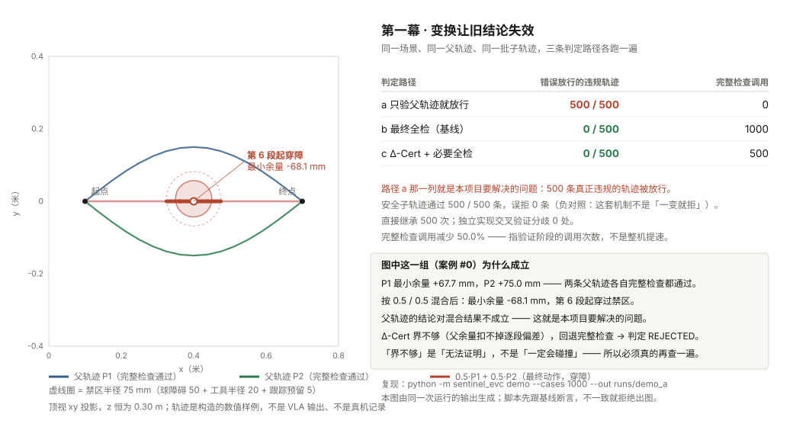

# Sentinel EVC Lab

**English** | [中文](README.zh-CN.md)

> A gate at the last commit point of a robot policy's action block: it verifies the action
> that will *actually* be executed. Permits are time-boxed, single-use and revocable, and
> every step leaves a record a third party can verify independently.

A numeric reference implementation. It runs in five minutes on an ordinary laptop —
no GPU, no robot arm, no model weights.

> **Status**: v0.1 (candidate) · `pytest` **24 passed** · three-act demo reproducible · license **not yet in effect** (see License)
> CI: [workflow runs](https://github.com/LancerLSY/sentinel-evc-lab/actions/workflows/ci.yml)
> (workflow badge images do not load for a private repository, so this is a link rather than
> a badge; the badge goes on after the repository becomes public.)

---

## What this is, and what it is not

| Capability | Status | Explicitly *not* claimed |
| --- | --- | --- |
| Action contract + canonical hashing | Implemented, numeric domain | Does not cover real-arm inverse kinematics |
| Full geometric check | Implemented: static sphere obstacles + box workspace + spherical tool | Does not cover links, grippers, payloads, dynamic obstacles |
| Δ-Cert incremental re-verification | Implemented, L=1 constraint family | Does not cover velocity, acceleration, grasping, contact |
| Single-use execution permit | Implemented, local HMAC | Not PKI, not functional safety |
| Revocation barrier | Implemented against a simulated controller | Not a motor-braking proof |
| Evidence hash chain + signature | Implemented, Ed25519 | Proves record integrity only, not sensor honesty |
| Real VLA integration | **Not started** | Next goal is read-only shadow mode, not closed-loop intervention |
| Learned consequence prediction (WorldGuard) | **Interface only, no implementation** | No training, no experiments, no conclusions |
| Physical robot | **Not started**, out of scope for this round | — |

### Three things we always say

1. "Permit", "certificate" and "verification" each have a specific scope here — this is
   **not a functional-safety certification, not a physical-stop proof, and not an
   accident-liability judgement**.
2. `dt=50 ms`, `K≤4`, the tracking reserve and similar numbers are **configurations of
   this numeric profile** — not a safe speed or a human-protection distance for any robot.
3. "Zero observed failures" only means this set of tests did not find that class of
   problem — **it does not mean zero accidents in arbitrary scenarios**.

---

## Three minutes

Deployment chains share a gap: the action a policy model emits and the action that is
finally handed to the driver are separated by several transforms — normalisation,
aggregation, interpolation, retiming, prefix truncation.

**The problem: verification usually happens *before* those transforms.**

This repository makes the consequence reproducible with a constructed example: two
obstacle-avoiding trajectories, each of which passes a full geometric check on its own,
are blended with weights, and the resulting trajectory goes straight through the obstacle.
The parent trajectory's verdict does not hold for the blend.



1. In this case (#0): parent trajectories P1 and P2 each pass a full check
   (minimum margins +67.7 mm / +75.0 mm); blended 0.5 / 0.5, the final action has a
   minimum margin of **−68.1 mm** and enters the obstacle from segment 6 onward.
2. The "verify the parent and release" path **releases all 500** genuinely violating child
   trajectories — that is the problem this project addresses.
3. "Full check the final action every time" blocks all 500 at a cost of 1000 full checks;
   "Δ-Cert + full check when needed" also releases 0 and falsely rejects 0, using 500
   (**calls during the verification stage — not a whole-system speedup**).

The figure is produced by `python tools/make_demo_a_figure.py --out docs/demo_a.svg`:
the script runs Act One itself and asserts the baseline from `RESULTS.md` before drawing,
so nothing in it is hand-entered.

Run `demo` once and you will see the three verdict paths side by side on the same data.

---

## Quick start (CPU, 5 minutes)

```bash
python -m venv .venv
source .venv/bin/activate          # Windows: .venv\Scripts\Activate.ps1
python -m pip install -e ".[test]"

python -m sentinel_evc demo --cases 1000 --out runs/my_first_run
```

Then verify that run's evidence bundle independently:

```bash
python -m sentinel_evc verify \
  --bundle runs/my_first_run/bundle \
  --public-key runs/my_first_run/anchors/demo.public \
  --run-id my_first_run
```

And see what tampering does:

```bash
python -m sentinel_evc tamper --out runs/my_first_run
```

Open `runs/my_first_run/report.html` for the offline replay page (double-click; no server).

Use an empty output directory for new runs. Do not overwrite the bundled `sample_run/`.

---

## What the three demos each prove

### Act One · A transform invalidates the earlier verdict

All three verdict paths run on **exactly the same** scene, parent and child trajectories:

| Verdict path | Violating trajectories wrongly released | Full-check calls |
| --- | --- | --- |
| a · release on the parent's verdict | 500 / 500 | 0 |
| b · full check of the final action (baseline) | 0 / 500 | 1000 |
| c · Δ-Cert + full check when needed | 0 / 500 | 500 |

At the same time, 500 safe, same-side perturbations all pass, with 0 false rejections.
That negative control matters: it shows the mechanism is not "reject anything that changed".

> **About that 50%:** it refers to **full-check call counts in the verification stage**,
> not a whole-system speedup. The cost of establishing parent certificates and the cost of
> falling back after a failed inheritance must both be added back before anyone talks about
> end-to-end gains. This repository has no end-to-end timing data, so it makes no speedup
> claim of any kind.

### Act Two · Revocation does not make actions that already happened disappear

Seven fault injections: late action, expired permit, permit replay, scene change,
queue-revision change, revocation race, unconfirmed cancel. All of them blocked further
invalid submissions.

Two results matter, and the second matters just as much:

- After revocation, **new** local submissions from the old generation = **0**
- But the step committed **before** revocation still shows up in `observed`

Emptying a software queue, the controller confirming a cancel, and the motion physically
stopping are three different things. The `observed` cursor here is simulation output — not
a motor-braking proof. A real demonstration must be measured against the actual controller.

### Act Three · The evidence can be verified independently

Events carry a sequence number and the previous event's digest, forming a hash chain; the
manifest records the event count, the tip hash and per-file digests, and is signed with
Ed25519. The verifier is a separate implementation: it only reads files and recomputes,
and imports none of the writer's modules.

The `tamper` command demonstrates four kinds of tampering, each leaving a different
failure signature:

| Tampering | Failing verification layer |
| --- | --- |
| Flip one byte in an event | file_digest · hash_chain · tip_hash |
| Delete the last 3 lines | file_digest · event_count · tip_hash |
| Swap in a different public key | signature |
| Change the run_id | run_id |

A signature only proves **record integrity relative to a specified public key**. It does
not prove that sensors were honest, that an action physically happened, or who is at
fault. The bundled key is for demonstration; it is not a customer PKI.

---

## Results and limitations

`sample_run/` is the complete output of one real run, shipped with the repository and
independently verifiable with `verify`. Reproduction commands for every number are in
[RESULTS.md](RESULTS.md).

This repository has **not** run: a real VLA, MuJoCo, ROS 2, a physical robot, a vision
model, or mTLS.

"Zero observed failures" only means this set of constructed tests did not find that class
of problem; it is not zero accidents in arbitrary scenarios. Task success rate, prediction
coverage, false-positive rate and real accident rate are different metrics and must not be
merged into a single "safety rate".

---

## Architecture

```
Snapshot ──> candidate compile ──> full check / Δ-Cert inherit ──> Authority.prepare
                                                                        │
                                                              Lease (single-use, TTL)
                                                                        │
                                                                        v
                                          Executor.commit ── re-check state, context, deadline
                                                   │
                                            stepwise dispatch ──> SimController
                                                   │                    │
                                                revoke            three cursors
                                                   │        submitted / accepted / observed
                                                   v
                              EventLog ──> hash chain ──> signature ──> independent verify + static replay page
```

Five release invariants, each locked by a test in `tests/`:

1. No unauthorised channel may write to the driver — only `Executor` calls `controller.submit`
2. A permit cannot be consumed twice
3. A committed irrevocable prefix cannot be rewritten
4. No new old-generation local submissions after revocation
5. An unconfirmed cancel must not restore the old plan

---

## Real VLA integration status

**Not started.** The next goal is **read-only shadow mode**: record the "raw action block"
and the "finally submitted action" inside a real upstream chain, change no values, and
answer offline: "had the gate been enabled at the time, how many submissions would it have
rejected, and why". Closed-loop intervention is out of scope for this round. The plan is in
[docs/下一步_影子模式接入.md](docs/下一步_影子模式接入.md) (Chinese).

---

## Running the tests

```bash
python -m pytest -q          # preferred
python run_tests.py          # fallback runner when pytest cannot be installed
```

---

## Dependency discipline

The only runtime dependency is `cryptography`. No torch, no scipy, no web framework.
`report.html` is generated from a Python string template plus inline SVG — no build step,
no CDN, and it opens offline.

How often a stranger's `pip install` succeeds on the first try decides whether anyone uses
this repository at all.

---

## Contributing

Welcome contributions: new constructed counterexamples, independent checker
implementations, fault-injection scenarios, cross-platform reproduction records.

PRs must include: tests, input/output samples, known limitations.

Evidence that **one of this repository's conclusions does not hold** is especially
welcome. Negative results are kept in the repository, not deleted.

---

## License

See [LICENSE.proposed](LICENSE.proposed). **Until the team has confirmed code ownership,
the prior-disclosure order and dependency licences, this repository is not yet licensed
for open source.** The file is named `LICENSE.proposed` rather than `LICENSE` for exactly
that reason: a public repository without an effective licence is not open source.

The licence type itself is **also not settled** (Apache-2.0 and MIT differ materially on
patent terms; the team has to decide).
