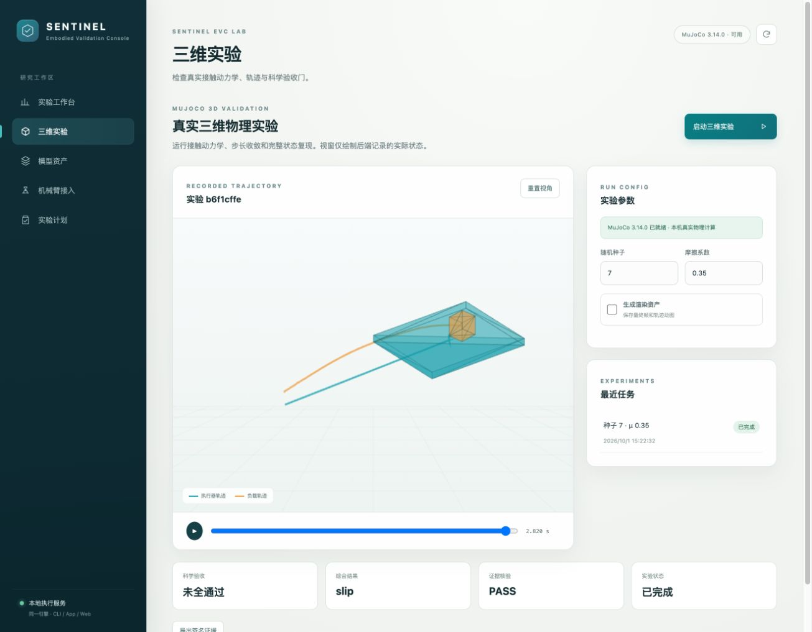
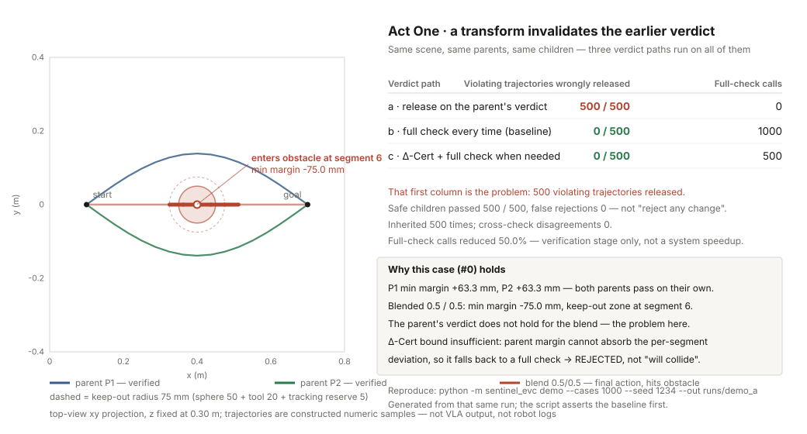

# Sentinel EVC Lab

**English** | [中文](README.zh-CN.md)

> A gate at the last commit point of a robot policy's action block: it verifies the action
> that will *actually* be executed. Permits are time-boxed, single-use and revocable, and
> every step leaves a record a third party can verify independently.

A local product workbench with a CLI, native macOS App and browser fallback. The same
Python engine serves numeric reference runs, a fixed MuJoCo contact profile, bounded 3D
asset inspection and read-only robot diagnostics.

> **Status**: v0.3 CLI + App workbench · three-act demo reproducible · license: **MIT**
> CI: [workflow runs](https://github.com/LancerLSY/sentinel-evc-lab/actions/workflows/ci.yml)


## Product quick start

Clone the repository and start the interactive terminal installer. Python 3.10+ is
required; building the optional macOS App also requires Apple Command Line Tools.

```bash
git clone https://github.com/LancerLSY/sentinel-evc-lab.git
cd sentinel-evc-lab
./tools/install.sh
```

Choose the full or lightweight profile, a new installation directory, and whether to
build the macOS App. The wizard shows actual stage progress, keeps detailed failure
logs, and offers to open the workbench or display SSH setup commands when finished.
If `python3` points to an older interpreter, set `PYTHON=/path/to/python3.12` when
running the script. Windows users can run `.\tools\install.ps1` from PowerShell.

For unattended installation, pass the target explicitly (`all` also installs MuJoCo):

```bash
./tools/install.sh "$HOME/Applications/Sentinel-EVC"
open "$HOME/Applications/Sentinel-EVC/Sentinel EVC.app"
```

The installed CLI is at `Sentinel-EVC/bin/sentinel-evc`. If the native App cannot be
used, launch `sentinel-evc serve` and open its loopback URL in a browser. All entrypoints
share four integration surfaces: numeric/physics experiments, model assets, read-only
robot diagnostics and the staged experiment plan. The offline Canvas viewer renders
parsed model geometry and signed, recorded MuJoCo trajectories; it does not invent live
telemetry.

[Product design](DESIGN.md) · [App installation](docs/install_app.md) · [Model and robot integration ports](docs/integration_ports.md)



The CLI, App and integration ports are available on `main`. The workbench keeps
execution completion, evidence integrity and scientific acceptance visible separately;
a completed experiment can retain a failed scientific gate.


## Local numeric workbench

```bash
python -m pip install -e ".[test]"
python -m sentinel_evc serve --data-dir runs/workbench --port 8765
```

Open `http://127.0.0.1:8765`: create/import a scenario, compare all four final candidates, monitor actual simulated load feedback, stop/approve resume, replay saved steps/filter events, and export signed ZIP evidence. One local service owns one workspace.

The bundled calibration covers only the fixed 0.35 m candidate family. Unknown actions remain `unknown`; physical/risk violations are `denied`. The default physical scenario selects 1.6 s and completes 40 observed commands. The residual template may reject every candidate at the default .12 m threshold; this conservative negative result is retained. Host wall time and observed-command numeric time are distinct.

```bash
python -m sentinel_evc run --mode physical --out runs/workbench
python -m sentinel_evc train-baseline --mode residual --out runs/residual-baseline
python -m sentinel_evc experiments
python -m pytest -q
```

[Mechanism matrix](docs/implementation_matrix.md) · [Validation](docs/product_validation.md) · [Pending experiments](docs/experiment_plan.md) · [Contracts](docs/product_contracts.md)

A genuine local numerical product increment. Real VLA, GRU, vision and device-motion experiments remain pending with explicit prerequisites; prototype measurements do not establish those capabilities.

## Alignment and reliability

The [v4 F01–F12 review](docs/design_alignment.md) maps the original requirements to
current code and pending integrations. The [reliability report](docs/reliability_results.md)
describes evidence rereads, shutdown ownership, cancellation races and the additional
numeric/physics scenario protocol. Reproduce the numeric matrix with:

```bash
python tools/validate_scenarios.py --out runs/reliability-scenarios
```

The matrix checks supported runs, conservative refusals, unsupported actions and
restart/tamper recovery. Physics acceptance failures remain visible; successful
software regression does not establish full v4 completion or hardware reliability.

## Reproduce local performance

```bash
python -m pip install -e ".[physics,test]"
python tools/benchmark_performance.py --out runs/performance-01 --physics-warmup 1
```

The benchmark records 20 paired 1,000-case geometry repetitions, 10 realtime numeric
runs and three complete 25-trial MuJoCo experiments. It includes parent proofs, failed
fallbacks, signing and independent verification; numeric totals also include ZIP
export. Warmups are retained and excluded from quantiles. See the
[measurement protocol](docs/performance_protocol.md). Use a new output directory.

Historical `main` snapshot `7a16586` measurements on Apple M4, 10 cores / 16 GiB:

| Workload | Repetitions | P50 | P95 |
|---|---:|---:|---:|
| Realtime numeric run, 40 observations + verified evidence export | 10 | 3.236 s | 3.267 s |
| Complete headless MuJoCo experiment, 25 verified trials | 3 | 12.707 s | 12.737 s |
| Full geometry path, 1,000 cases including parents and evidence | 20 | 0.362 s | 0.373 s |
| Delta + fallback path, identical 1,000 cases | 20 | 0.418 s | 0.446 s |

The paired delta/full median ratio is **1.151: delta was about 15.1% slower** in this
simple geometry workload. MuJoCo retained **8/9 passing gates**, including the failing
fast-branch convergence result. Small-sample percentiles are descriptive. See the
[full measured report and raw samples](docs/performance_results.md) for source identity,
parent/fallback costs, measurement boundaries and reproduction.


---

## What this is, and what it is not

| Capability | Status | Explicitly *not* claimed |
| --- | --- | --- |
| Action contract + canonical hashing | Implemented, numeric domain | Does not cover real-arm inverse kinematics |
| Full geometric check | Implemented: static sphere obstacles + box workspace + spherical tool | Does not cover links, grippers, payloads, dynamic obstacles |
| Δ-Cert incremental re-verification | Implemented, L=1 constraint family | Does not cover velocity, acceleration, grasping, contact |
| Single-use execution permit | Implemented, local HMAC | Not PKI, not functional safety |
| Revocation barrier | Implemented against a simulated controller | Not a motor-braking proof |
| Evidence hash chain + signature | Implemented, Ed25519 | Proves record integrity only, not sensor honesty |
| Real VLA integration | **Pending** | Next goal is read-only shadow mode, not closed-loop intervention |
| Numeric consequence prediction | **Implemented: physical ID + trainable ridge residual + root calibration** | Not the v4 GRU, visual WorldGuard or a robot result |
| Robot connection | **Implemented: mock + Universal Robots read-only diagnostics** | Motion adapter and hardware actuation remain pending |
| 3D model entrypoint | **Implemented: bounded OBJ/STL/MJCF/URDF import and Canvas preview** | Import or compile success does not authorize motion |
| MuJoCo fixed fixture | **Implemented: signed open-tray contact experiment** | Separate profile; fastest candidate currently fails one of nine gates |

### Three things we always say

1. "Permit", "certificate" and "verification" each have a specific scope here — this is
   **not a functional-safety certification, not a physical-stop proof, and not an
   accident-liability judgement**.
2. `dt=50 ms`, `K≤4`, the tracking reserve and similar numbers are **configurations of
   this numeric profile** — not a safe speed or a human-protection distance for any robot.
3. "Zero observed failures" only means this set of tests did not find that class of
   problem — **it does not mean zero accidents in arbitrary scenarios**.

---

## Three minutes

Deployment chains share a gap: the action a policy model emits and the action that is
finally handed to the driver are separated by several transforms — normalisation,
aggregation, interpolation, retiming, prefix truncation.

**The problem: verification usually happens *before* those transforms.**

This repository makes the consequence reproducible with a constructed example: two
obstacle-avoiding trajectories, each of which passes a full geometric check on its own,
are blended with weights, and the resulting trajectory goes straight through the obstacle.
The parent trajectory's verdict does not hold for the blend.



1. In this case (#0): parent trajectories P1 and P2 each pass a full check
   (minimum margins +67.7 mm / +75.0 mm); blended 0.5 / 0.5, the final action has a
   minimum margin of **−68.1 mm** and enters the obstacle from segment 6 onward.
2. The "verify the parent and release" path **releases all 500** genuinely violating child
   trajectories — that is the problem this project addresses.
3. "Full check the final action every time" blocks all 500 at a cost of 1000 full checks;
   "Δ-Cert + full check when needed" also releases 0 and falsely rejects 0, using 500
   (**calls during the verification stage — not a whole-system speedup**).

The figure is produced by `python tools/make_demo_a_figure.py --lang en`
(`--lang zh` writes the Chinese figure used by [README.zh-CN.md](README.zh-CN.md)):
the script runs Act One itself and asserts the baseline from `RESULTS.md` before drawing,
so nothing in it is hand-entered.

Run `demo` once and you will see the three verdict paths side by side on the same data.

---

## Quick start (CPU, 5 minutes)

```bash
python -m venv .venv
source .venv/bin/activate          # Windows: .venv\Scripts\Activate.ps1
python -m pip install -e ".[test]"

python -m sentinel_evc demo --cases 1000 --out runs/my_first_run
```

Then verify that run's evidence bundle independently:

```bash
python -m sentinel_evc verify \
  --bundle runs/my_first_run/bundle \
  --public-key runs/my_first_run/anchors/demo.public \
  --run-id my_first_run
```

And see what tampering does:

```bash
python -m sentinel_evc tamper --out runs/my_first_run
```

Open `runs/my_first_run/report.html` for the offline replay page (double-click; no server).

Use an empty output directory for new runs. Do not overwrite the bundled `sample_run/`.

---

## What the three demos each prove

### Act One · A transform invalidates the earlier verdict

All three verdict paths run on **exactly the same** scene, parent and child trajectories:

| Verdict path | Violating trajectories wrongly released | Full-check calls |
| --- | --- | --- |
| a · release on the parent's verdict | 500 / 500 | 0 |
| b · full check of the final action (baseline) | 0 / 500 | 1000 |
| c · Δ-Cert + full check when needed | 0 / 500 | 500 |

At the same time, 500 safe, same-side perturbations all pass, with 0 false rejections.
That negative control matters: it shows the mechanism is not "reject anything that changed".

> **About that 50%:** it refers to **full-check call counts in the verification stage**,
> not a whole-system speedup. The cost of establishing parent certificates and the cost of
> falling back after a failed inheritance must both be added back before anyone talks about
> end-to-end gains. The [local benchmark](docs/performance_results.md) now includes those
> costs: delta was slower in this simple workload. No whole-system speedup is claimed.

### Act Two · Revocation does not make actions that already happened disappear

Seven fault injections: late action, expired permit, permit replay, scene change,
queue-revision change, revocation race, unconfirmed cancel. All of them blocked further
invalid submissions.

Two results matter, and the second matters just as much:

- After revocation, **new** local submissions from the old generation = **0**
- But the step committed **before** revocation still shows up in `observed`

Emptying a software queue, the controller confirming a cancel, and the motion physically
stopping are three different things. The `observed` cursor here is simulation output — not
a motor-braking proof. A real demonstration must be measured against the actual controller.

### Act Three · The evidence can be verified independently

Events carry a sequence number and the previous event's digest, forming a hash chain; the
manifest records the event count, the tip hash and per-file digests, and is signed with
Ed25519. The verifier is a separate implementation: it only reads files and recomputes,
and imports none of the writer's modules.

The `tamper` command demonstrates four kinds of tampering, each leaving a different
failure signature:

| Tampering | Failing verification layer |
| --- | --- |
| Flip one byte in an event | file_digest · hash_chain · tip_hash |
| Delete the last 3 lines | file_digest · event_count · tip_hash |
| Swap in a different public key | signature |
| Change the run_id | run_id · hash_chain · tip_hash |

A signature only proves **record integrity relative to a specified public key**. It does
not prove that sensors were honest, that an action physically happened, or who is at
fault. The bundled key is for demonstration; it is not a customer PKI.

---

## Results and limitations

`sample_run/` is the complete output of one real run, shipped with the repository and
independently verifiable with `verify`. Reproduction commands for every number are in
[RESULTS.md](RESULTS.md).

This repository has run its separate fixed MuJoCo open-tray profile. It has **not** run a
real VLA, ROS 2 motion stack, physical robot motion, vision model or mTLS. Imported models
are inspected separately and are never promoted into the trusted motion fixture.

"Zero observed failures" only means this set of constructed tests did not find that class
of problem; it is not zero accidents in arbitrary scenarios. Task success rate, prediction
coverage, false-positive rate and real accident rate are different metrics and must not be
merged into a single "safety rate".

---

## Architecture

```
Snapshot ──> candidate compile ──> full check / Δ-Cert inherit ──> Authority.prepare
                                                                        │
                                                              Lease (single-use, TTL)
                                                                        │
                                                                        v
                                          Executor.commit ── re-check state, context, deadline
                                                   │
                                            stepwise dispatch ──> SimController
                                                   │                    │
                                                revoke            three cursors
                                                   │        submitted / accepted / observed
                                                   v
                              EventLog ──> hash chain ──> signature ──> independent verify + static replay page
```

Five release invariants, each locked by a test in `tests/`:

1. No unauthorised channel may write to the driver — only `Executor` calls `controller.submit`
2. A permit cannot be consumed twice
3. A committed irrevocable prefix cannot be rewritten
4. No new old-generation local submissions after revocation
5. An unconfirmed cancel must not restore the old plan

---

## Real VLA integration status

**Not started.** The next goal is **read-only shadow mode**: record the "raw action block"
and the "finally submitted action" inside a real upstream chain, change no values, and
answer offline: "had the gate been enabled at the time, how many submissions would it have
rejected, and why". Closed-loop intervention is out of scope for this round. The plan is in
[docs/下一步_影子模式接入.md](docs/下一步_影子模式接入.md) (Chinese).

---

## Running the tests

```bash
python -m pytest -q          # preferred
python run_tests.py          # fallback runner when pytest cannot be installed
```

---

## Dependency discipline

The core runtime dependency is `cryptography`; the `physics` install profile adds MuJoCo
and Pillow. No torch, no scipy, no web framework.
`report.html` is generated from a Python string template plus inline SVG — no build step,
no CDN, and it opens offline.

How often a stranger's `pip install` succeeds on the first try decides whether anyone uses
this repository at all.

A per-package licence registry (measured from the installed distributions, not copied from
upstream docs) is in [docs/依赖许可.md](docs/依赖许可.md) (Chinese).

---

## Contributing

Welcome contributions: new constructed counterexamples, independent checker
implementations, fault-injection scenarios, cross-platform reproduction records.

PRs must include: tests, input/output samples, known limitations.

Evidence that **one of this repository's conclusions does not hold** is especially
welcome. Negative results are kept in the repository, not deleted.

Current tasks and progress (including the staged shadow-mode steps) are in
[docs/任务板.md](docs/任务板.md) (Chinese).

---

## License

This project is released under the **MIT License** — full text in [LICENSE](LICENSE);
the copyright line reads `Copyright (c) 2026 Sentinel EVC Lab contributors`.

Two things stated plainly:

- **MIT carries no patent grant.** The core mechanism is the subject of a separate
  patent application (application no. 202611458350.1). This licence grants no patent
  rights, express or implied.
- The runtime dependency `cryptography` (Apache-2.0) and the test dependency `pytest`
  (MIT) keep their own licences, unaffected by this one.

The repository is public. Code licensing and patent rights retain the separate scopes above.

## MuJoCo 3D contact experiment and SSH reproduction

An optional experimental profile now runs an actuated XYZ open tray with a free 3D payload in MuJoCo. It records actual servo/contact dynamics, paired complete-state branches, five physics resolutions, revoke with continuing dynamics, mutation refusal and signed trial/experiment evidence. The existing numeric workbench remains a separate profile.

```bash
python -m pip install -e ".[physics,test]"
python -m sentinel_evc physics --out runs/physics01 --seed 7 --render
# Existing OpenSSH alias, Python 3.10+, working key/agent and known_hosts required:
python -m sentinel_evc remote-physics --host YOUR_ALIAS --out runs/remote01 --seed 7
python -m sentinel_evc verify-physics --out runs/remote01
```

Omit `--render` for headless CPU physics. Remote rendering uses EGL and needs a working driver. Local rendering uses the platform's MuJoCo renderer. Outputs must be empty new directories. SSH transport reads no passwords and refuses changed host keys.

A completed experiment can return **3** when an acceptance gate fails. Its signed `COMPLETE.json`/index and all 25 trial bundles remain available. The fixed fixture's geometry-only fastest choice slips, and its full terminal-pose convergence currently fails; this negative result is retained. Slower candidates pass the recorded local refinement. This experiment does not implement a robot arm, VLA checkpoint or learned 3D WorldGuard, and does not establish robot safety. [Full design review and optimized SSH/physics contract](docs/physics_ssh_design.md).

[中文复盘与当前完成范围](docs/physics_review_zh.md)。
