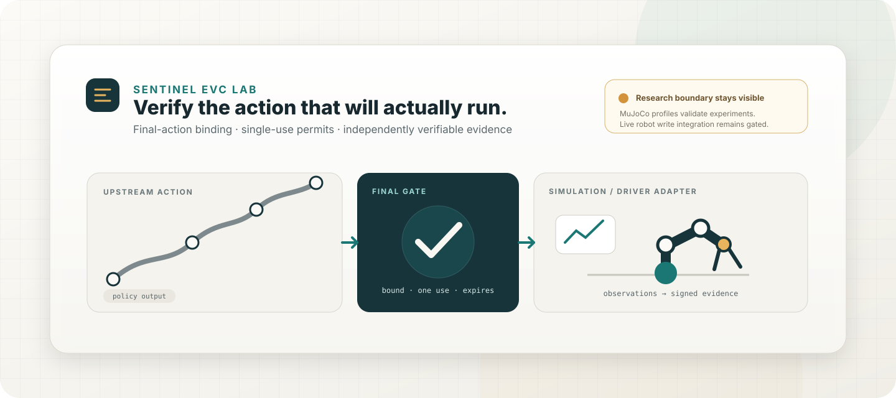
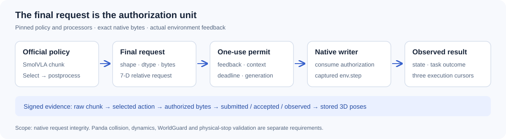
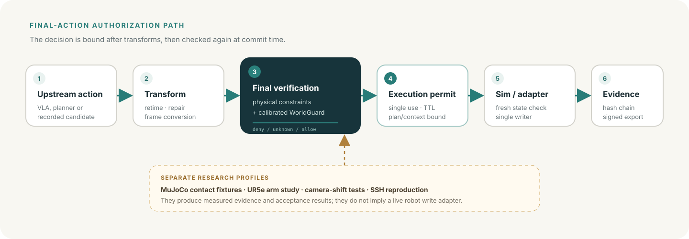
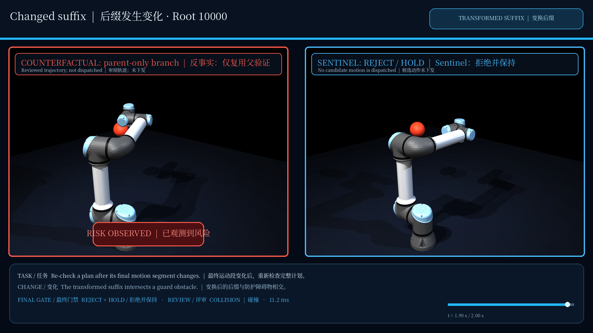
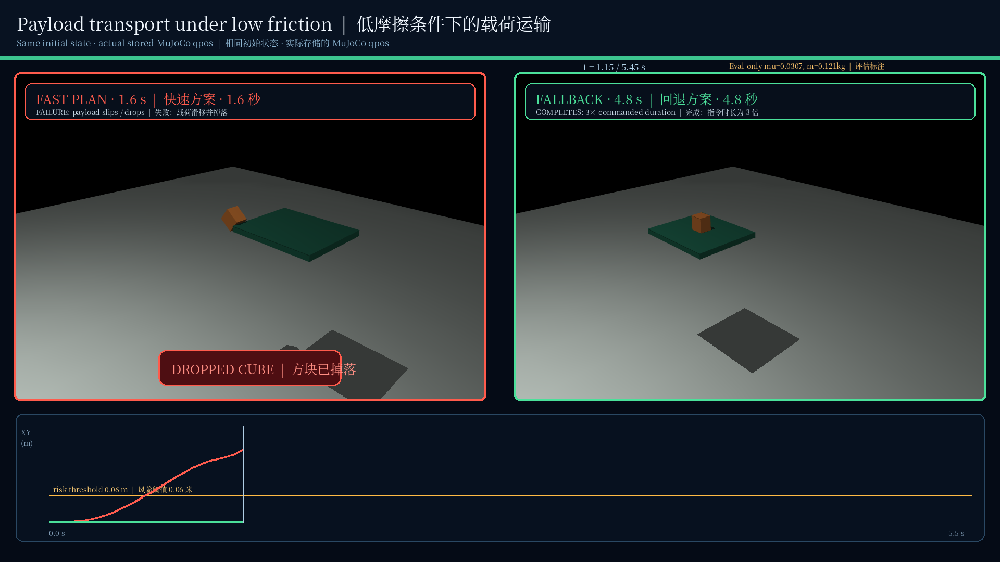
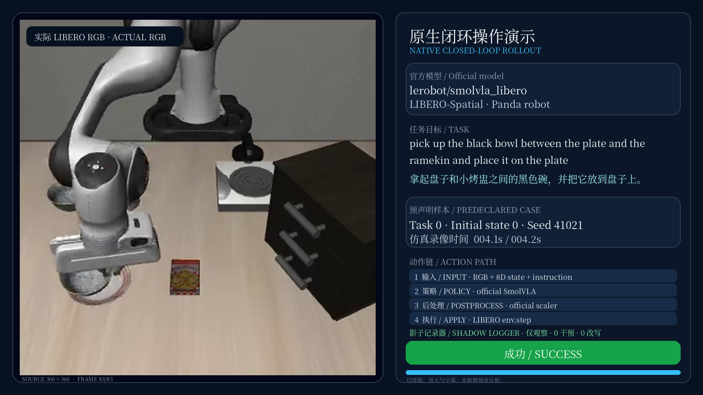
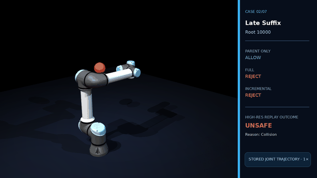
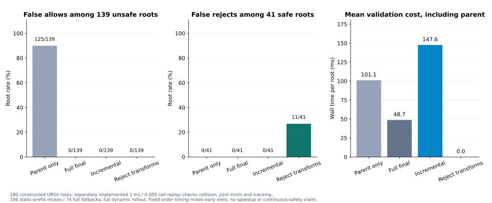

# Sentinel EVC Lab

**English** · [中文](README.zh-CN.md)

<p align="center">
  
</p>

**[Project homepage](https://lansiyao.com/research/sentinel-vla/project/)** · [GitHub](https://github.com/LancerLSY/sentinel-evc-lab) · [Hugging Face](https://huggingface.co/LancerLSY/sentinel-smolvla-so100)

Sentinel EVC places an authorization gate at the last commit point of a robot
policy's action block. It checks the action that will **actually** execute, issues
a time-boxed single-use permit, and records evidence that a third party can verify.

The repository is a local research product with a CLI, native macOS App, browser
workbench, SSH experiment runner, bounded 3D model inspection, and read-only robot
diagnostics. The product core and each research profile keep separate capability
and evidence boundaries.

> **v0.3 · active research prototype · MIT**
>
> Product runtime: Python 3.10+ · macOS App: Python-managed, locally built · server: `127.0.0.1` only

[Install](#five-minute-setup) · [See the mechanism](#how-the-gate-works) ·
[Review measured results](#measured-results) · [Download experiment pack](https://github.com/LancerLSY/sentinel-evc-lab/releases/tag/paper-validation-20261002) ·
[Research showcase](docs/research_showcase.md) · [CI](https://github.com/LancerLSY/sentinel-evc-lab/actions/workflows/ci.yml)

## What is usable today

| Surface | Available now | Boundary |
|---|---|---|
| **CLI + local service** | install, run, verify, export; numeric and fixed MuJoCo profiles | local single-workspace service |
| **Native macOS App** | same loopback workbench; independently keyed native-run import, task-specific 3D replay and signed ZIP export | requires a managed Python environment; locally built, without distribution signing/notarization |
| **SSH experiments** | strict OpenSSH launch, source binding, returned-evidence verification | existing host alias, key agent and `known_hosts` required |
| **Robot entry** | mock diagnostics and Universal Robots read-only dashboard probe | no physical motion/write adapter yet |
| **3D model entry** | OBJ, STL, MJCF and URDF inspection; offline Canvas preview | inspection does not grant execution authority |
| **Native VLA integration** | official SmolVLA/Panda inference, exact 7-D request authorization, one-use permits and recorded environment feedback | LIBERO simulation; no Panda collision, dynamics, WorldGuard or physical-stop validation |
| **GPU/model research** | trained WorldGuard families and a SmolVLA fine-tune on fixed SO100 recordings | separate experimental profiles; the SO100 overlay is not the native Panda checkpoint |

The workbench always shows execution completion, evidence integrity, and scientific
acceptance separately. A run may complete correctly while a scientific gate fails.

## Five-minute setup

### Interactive installer

```bash
git clone https://github.com/LancerLSY/sentinel-evc-lab.git
cd sentinel-evc-lab
./tools/install.sh
```

Choose the full profile for MuJoCo support, or the core profile for the smaller
runtime. The wizard creates an isolated environment, retains a public source
snapshot, shows stage progress, and can build the native macOS App. If `python3`
is too old, invoke it as `PYTHON=/path/to/python3.12 ./tools/install.sh`.
Windows users can run `.\tools\install.ps1` in PowerShell.

### Unattended install and launch

```bash
./tools/install.sh "$HOME/Applications/Sentinel-EVC"
open "$HOME/Applications/Sentinel-EVC/Sentinel EVC.app"
```

The installed CLI is `Sentinel-EVC/bin/sentinel-evc`. On other desktop platforms,
or without the App, start `sentinel-evc serve` and open the printed loopback URL.

### Source checkout

```bash
python -m pip install -e ".[physics]"
python -m sentinel_evc serve --data-dir runs/workbench --port 8765
```

Open `http://127.0.0.1:8765`, create or import a scenario, compare all four final
candidates, run a recorded simulation, inspect events, and export signed ZIP evidence.

[App installation and distribution boundary](docs/install_app.md) ·
[Model, robot and executor ports](docs/integration_ports.md) ·
[Product validation](docs/product_validation.md)

### Use an existing VLA environment

Keep the heavy ML stack in its existing environment. The installed CLI can
launch the native runner using that environment's Python:

```bash
sentinel-evc native-run --python /path/to/vla/bin/python \
  --config /path/to/native-active.json --out /path/to/new-run
sentinel-evc native-import --archive /path/to/sentinel-native-vla-bundle.zip \
  --public-key /path/to/independently-retained.public --run-id ACTUAL_RUN_ID \
  --data-dir /path/to/workbench-data
```

Open **Native VLA runs** in the App to select a task and stored time step.
The scene uses the task's actual MuJoCo visual meshes and body poses; the same
frame shows the request, authorization and submitted/accepted/observed cursors.
Importing a recording does not run inference or grant robot motion authority.

[Native gateway contract and configuration](docs/native_vla_gateway.md) ·
[Frozen paired protocol](docs/research/2026-10-03/native-product/PROTOCOL.md) ·
[Method and related tools](docs/native_method_position.md)



## How the gate works

<p align="center">
  
</p>

1. An upstream VLA, planner, or recorded policy proposes an action block.
2. Retiming, repair, frame conversion, or any other transform creates the final candidate.
3. The selected profile evaluates the final candidate: physical/WorldGuard checks
   in the bounded numerical profile, or request identity/schema/context in the
   native Panda profile.
4. The authority issues a plan/context-bound permit with a deadline and one use.
5. The executor checks fresh state and is the only component allowed to call the controller.
6. Submitted, accepted, and observed cursors enter a signed, independently verifiable log.

Revocation stops new submissions from the old generation. Recovery requires confirmed
cancel, drain, fresh feedback, a current epoch, and explicit approval. The implementation
does not claim that a signature proves sensor honesty or physical execution.

[Implementation matrix](docs/implementation_matrix.md) ·
[Product contracts](docs/product_contracts.md) ·
[Design trace](docs/design_alignment.md)

## Prospective experiments and clear 3D demonstrations

[**Frozen protocols and full results**](docs/research/2026-10-02/paper-v2/RESULTS.md) ·
[**Data, source and 1080p videos**](https://github.com/LancerLSY/sentinel-evc-lab/releases/tag/paper-validation-20261002)

| New study | Measured outcome | Main limitation |
|---|---|---|
| Support routing, 600 fresh roots | 300 completed, 300 rejected, 0 observed unsafe selections | fixed 4.8 s completed all 600; rejection is incomplete |
| Physical stress, 27 cells / 324 roots | 4.8 s completes 324/324; 1.6 s completes 184/324 with 78 drops | floor policy equals fixed 4.8 s; finite sample, 3× motion duration |
| Hidden future friction, 100 paired roots | 1.6 s outcomes differ in 100/100 identical-input pairs | ambiguity requires a trusted bound or additional sensing |
| Fair UR5e verification cost, 60 roots | full and incremental agree on 60/60; mean marginal saving 0.996 ms | incremental P95 is worse; hazard diversity remains limited |
| Original official SmolVLA/LIBERO, 100 fixed rollouts | 58/100 success; task 5 fails 10/10 | official Panda checkpoint, observe-only logging; not the SO100 overlay |
| Paired backend comparison, 40 fresh rollouts | task 5: 0/10 → 7/10; control: 10/10 → 10/10 | complete MuJoCo 3.8.1 / 3.3.7 treatment; benchmark compatibility, not physical accuracy |
| Full-suite fresh-state confirmation, 100 rollouts | **93/100 success**; zero crashes; task 4 remains 6/10 | official Panda checkpoint, isolated MuJoCo 3.3.7, horizon 10; separate grid from original 58/100 |

[](https://github.com/LancerLSY/sentinel-evc-lab/releases/download/paper-validation-20261002/sentinel-ur5e-paper.mp4)

**UR5e, 1080p · 19.95 s.** The red pane illustrates rejected proposed motion; it was not dispatched. The adjacent pane shows allow/execution or no candidate dispatch. Official full robot meshes and stored MuJoCo joint states are used. These three examples explain the earlier mechanism fixtures, not the new cost study or physical hardware.

[](https://github.com/LancerLSY/sentinel-evc-lab/releases/download/paper-validation-20261002/friction-failure-vs-fallback.mp4)

**Contact failure, 1080p · 10.2 s.** The same new low-friction root contrasts 1.6 s with 4.8 s: the payload drops versus completes the transport. The live displacement graph explains the risk threshold; the fallback takes three times as long. Videos reconstruct actual saved simulation states and include bilingual captions.

[](https://github.com/LancerLSY/sentinel-evc-lab/releases/download/paper-validation-20261002/libero-task00-state00-explained.mp4)

**Original native Panda configuration, 4.15 s.** The predeclared task 0/state 0 succeeds in 83 actual actions under MuJoCo 3.8.1 with 50 actions executed per prediction chunk. Original 360×360 simulator RGB is placed in a bilingual 1080p canvas and played at the actual 20 Hz control clock. This film belongs to the original 58/100 study, which retains all 42 failures; the fresh 93/100 confirmation uses a separate grid and configuration.

[Retained failure replay](https://github.com/LancerLSY/sentinel-evc-lab/releases/download/paper-validation-20261002/task5_state0_failure_bilingual_20hz.mp4) replays the original task 5/state 0 actions exactly: zero reward, no task success, maximum target-bowl center rise 1.674 mm. It is a post-hoc diagnostic and adds no benchmark episode.

[Paired backend replay](docs/research/2026-10-02/paper-v2/backend/BACKEND_REPLAY.md) shows task 5/state 21 under MuJoCo 3.8.1 and 3.3.7: failure after 280 actions versus success after 85 actions. The 1080p bilingual film replays the recorded actions with no policy inference or intervention; its display-only final-frame hold adds no simulated motion. [Replay data, source and video](https://github.com/LancerLSY/sentinel-evc-lab/releases/tag/simulator-replays-20261002).

## Measured results

These numbers come from recorded procedures and retained artifacts. They are observations
on the named data and profiles, not a general robot-safety rate.

### Measured hardware: RTX 4090 D (24 GB)

All GPU values below were measured on an **RTX 4090 D (24 GB)**.

| Experiment | Measured result | Interpretation |
|---|---:|---|
| SmolVLA, 5,000 updates | held-out normalized action MAE **0.673166 → 0.245984** (**63.46%** lower) | fixed SO100 recordings and pinned model/data revisions |
| SmolVLA image-to-action inference | **P50 229.26 ms · P95 236.90 ms** | four threads, in-memory image through unnormalization |
| W0/W1/W2 ensembles | **36 trained members** | numerical, MuJoCo object, visual-object and real-data joint studies |
| Fixed-camera visual profile | **0/500** unsafe selections observed | same fixed simulator test group; below-nominal coverage is retained |
| Camera shift, original calibration | **47/500** unsafe selections | evidence that camera identity belongs in the supported profile |
| Profile-matched recalibration control | **0/500**, all actions **1.6 s** | recovery on the existing stress set, not a new independent deployment test |
| SO100 state/action vs. visual/state/action | images increased normalized error by **10.0%** | the simpler state/action predictor is the better comparator for this task |

The strongest physical-identification baseline also beat the strict learned numerical
model. Negative findings remain part of the result rather than being hidden.

### New-distribution W2 audit

A separate recorded run evaluated the existing state and image ensembles on **600 new
MuJoCo roots**: six scenarios, 100 roots per scenario, four sibling actions per root.

| New independent scenario | State gate | Image gate | Main finding |
|---|---:|---:|---|
| Nominal | **0/100** unsafe selected | **0/100** | no unsafe selection observed in this group |
| Shifted camera | **0/100** | **7/100** (95% root-bootstrap interval **3%–12%**) | camera-independent state gate remains the stronger comparator |
| Hidden low friction | **100/100** | **100/100** | all four candidates were unsafe; both learned gates still selected one |

The 1.35× displacement test is outside the trained action contract. Full-state coverage
fell to 15% (state) and 8% (image), so the declared product result is `MODEL_UNKNOWN`
and rejects all 100 roots. Raw model selections are retained only as a degradation
diagnostic. This run used the actual RTX 4090 D and completed in 30.53 s; physics was
computed by MuJoCo workers, so this time is not a model-latency benchmark.

[Scenario report](docs/worldguard_scenario_results.md) ·
[Run manifest](docs/research/2026-10-02/worldguard-scenarios/manifest.json) ·
[Raw metrics](docs/research/2026-10-02/worldguard-scenarios/metrics.json)

### Low-friction physical fallback

The low-friction audit exposed a hard limit: all four original 2 s candidates were
unsafe, so calibration could reject them but could not create an executable action.
A separate **5 s physical profile** tested 100 new roots with 1.6, 3.2 and 4.8 s plans.

| Plan in the new profile | Unsafe | Drops | Tray task completion | Cost |
|---|---:|---:|---:|---:|
| Fixed 1.6 s | **100/100** | **58/100** | **0/100** | baseline duration |
| Fixed 4.8 s | **0/100** | **0/100** | **100/100** | **3×** action duration |

Zero unsafe observations in 100 roots has a 95% Wilson upper bound of **3.70%**; it is
not a zero-risk guarantee. The screening rule uses configured `μ_min=0.015`—the system
does not measure friction. It selected 4.8 s. The unused
3.2 s plan was also safe in all 100 roots, but the conservative rule rejected it.
This is a new, undeployed MuJoCo profile—not a repair of the original neural 2 s
WorldGuard and not evidence about an unknown-friction physical robot.

[Low-friction report](docs/low_friction_fallback.md) ·
[Run manifest](docs/research/2026-10-02/low-friction-fallback/manifest.json)

[Full GPU report](docs/gpu_training_results.md) ·
[Model cards and loading](docs/gpu_model_cards.md) ·
[Evaluated SmolVLA overlay card](docs/huggingface/smolvla_model_card.md) ·
[Reproduction commands](experiments/gpu/README.md) ·
[Verified artifact release](https://github.com/LancerLSY/sentinel-evc-lab/releases/tag/gpu-experiments-20261002) ·
[Hugging Face model](https://huggingface.co/LancerLSY/sentinel-smolvla-so100)

The evaluated SmolVLA overlay, verified loader and model card are published on
Hugging Face. All 21 payload files match the selected local bundle; see the
[Hub publication receipt](docs/huggingface/smolvla_hub_publication.json). The overlay
requires the pinned original SmolVLA base and frozen backbone.
The packaged loader rebuilt a finite `[1,50,6]` dev-only prediction that was bitwise
equal to the pinned reference (`maximum_absolute_difference: 0.0`); see the
[loading verification](docs/huggingface/smolvla_loading_verification.json).

## 3D robot-arm research

<p align="center">
  
</p>

The current MuJoCo Menagerie UR5e result covers **180 same-root comparisons** across
six scenario classes (30 roots each). A separately implemented higher-resolution
review—0.005 rad static sampling and 1 ms MuJoCo steps—labels 139 roots unsafe and
41 safe. It does not import the gate runner. The animation uses its stored joint
trajectory for `late_suffix / root 10000`: parent-only validation allows it, while
final-plan validation rejects it and the higher-resolution replay records a collision.
The GIF is outcome-conditioned: it is the first review-unsafe `late_suffix` case chosen
after review labels were known, so it illustrates a failure and does not estimate a rate.

| Policy | Allowed | False allows / 139 unsafe | False rejects / 41 safe | Mean measured validation wall time |
|---|---:|---:|---:|---:|
| Parent only | 166/180 | **125/139** | 0/41 | 101.15 ms |
| Full final-plan validation | 41/180 | **0/139** | **0/41** | **48.74 ms** |
| Incremental + mandatory fallback | 41/180 | **0/139** | **0/41** | **147.65 ms total** |
| Conservative reject-transforms | 30/180 | 0/139 | **11/41** | 0 ms; no validation call |

Incremental checking authorized static-prefix reuse on 106/180 roots and used full
fallback on 74/180; all 14 roots with a denied or missing parent record fell back.
The incremental stage averaged 46.50 ms, but parent validation added 101.15 ms.
Counted end to end, incremental validation was **slower than the 48.74 ms full check**.
Dynamic validation always replays from frame zero; only a bound static-prefix record is
reused, and any invalid binding triggers full fallback. That in-process record binds the
prefix, model, assets, time step, initial state and context. It is not a complete v4
externally signed certificate.

The reuse subset averaged 112.18 + 44.55 = 156.73 ms; the fallback subset averaged
85.34 + 49.30 = 134.64 ms. These are observed costs from one fixed-order matrix with
early static exits, not an algorithm benchmark. The higher-resolution review reuses the
same 180 constructed roots with adversarial obstacle placement as the earlier run; it
is not a new natural-distribution holdout. `0/139` therefore is not a general reliability
guarantee.

<p align="center">
  
</p>

[Poster frame](docs/media/ur5e-validation.png) ·
[Seven-case 720p montage](https://github.com/LancerLSY/sentinel-evc-lab/releases/download/simulation-research-20261002/ur5e-validation-montage.mp4) ·
[v3 run manifest](docs/research/2026-10-02/ur5e/v3/manifest.json) ·
[v3 per-root results](docs/research/2026-10-02/ur5e/v3/per_root.json) ·
[Higher-resolution review](docs/research/2026-10-02/ur5e/v3/review/reviewed_metrics.json) ·
[Media manifest](docs/research/2026-10-02/ur5e/media_manifest.json) ·
[Simulation research release](https://github.com/LancerLSY/sentinel-evc-lab/releases/tag/simulation-research-20261002)

The montage covers seven representative cases: one from every scenario plus a safe
narrow-passage case, selected after review outcomes were known. It contains 287 stored
joint-state frames shown at 1× (14.35 s); its 33.75 s total also includes explicitly
labeled title and hold frames. The GIF contains 21 encoded frames over 2.9 s from a
29-frame logical sequence. Media rendering does not rerun physics or recompute gates.

The release archive also carries a portable UR5e model that loads independently:
27 files, including 26 verified official Menagerie assets. The
[original v2 manifest](docs/research/2026-10-02/ur5e/manifest.json),
[per-root record](docs/research/2026-10-02/ur5e/per_root.json), and
[review](docs/research/2026-10-02/ur5e/original_review.json) remain public as history;
their older timings are not the headline result.

This arm study evaluates an experimental validation profile. It does **not** mean that
the UR5e model, learned WorldGuard, or a physical arm driver has been integrated into
the product-core executor. The current product robot surface remains read-only.

[Research showcase and experiment boundaries](docs/research_showcase.md)

## Workbench

<p align="center">
  
</p>

```bash
python -m sentinel_evc run --mode physical --out runs/numeric01
python -m sentinel_evc train-baseline --mode residual --out runs/residual01
python -m sentinel_evc physics --out runs/physics01 --seed 7 --render
python -m sentinel_evc verify-physics --out runs/physics01
```

The bundled numeric calibration covers only the fixed 0.35 m candidate family.
Unsupported action families remain `unknown`; physical or risk violations are `denied`.
The fixed contact fixture retains its negative results: the geometry-only fastest choice
can slip, and the fastest branch fails terminal-pose convergence.

## SSH reproduction

```bash
# Existing OpenSSH alias, Python 3.10+, key agent and known_hosts required
python -m sentinel_evc remote-physics \
  --host YOUR_ALIAS --out runs/remote01 --seed 7
python -m sentinel_evc verify-physics --out runs/remote01
```

The SSH path runs the same trusted source on the remote machine, retrieves the bundle,
and verifies it against the submitted source and transfer receipt. It reads no passwords
and refuses changed host keys. Remote rendering requires a working EGL driver.

[Physics and SSH design](docs/physics_ssh_design.md) ·
[Performance protocol](docs/performance_protocol.md) ·
[Recorded results](docs/performance_results.md)

## Reproduce the reference mechanism

The compact CPU demo needs only the core dependency and writes to a new output directory.

```bash
python -m venv .venv
source .venv/bin/activate
python -m pip install -e .

python -m sentinel_evc demo --out runs/demo --run-id demo --cases 1000
python -m sentinel_evc verify \
  --bundle runs/demo/bundle \
  --public-key runs/demo/anchors/demo.public \
  --run-id demo
```

Open `runs/demo/report.html` for the offline replay. The three acts demonstrate that a post-check transform invalidates the old verdict,
revocation cannot erase already accepted actions, and signed evidence can be checked
without trusting the runtime that produced it. Exact reproduction commands and historical
measurements are in [RESULTS.md](RESULTS.md).

## Current scientific and product boundary

- The numeric, fixed MuJoCo, visual/GPU, and arm research profiles are distinct experiments.
- Imported OBJ/STL/MJCF/URDF assets are parsed and previewed; they receive no motion authority.
- ROS 2 motion, physical robot actuation, mTLS, production PKI, and notarized distribution remain open work.
- “Zero observed failures” describes only the stated sample. Coverage, false allows, task success, and physical incidents are different quantities.
- Evidence signatures establish integrity relative to the stated public key; they do not establish sensor truth, physical causation, or liability.

[Experiment plan](docs/experiment_plan.md) ·
[Reliability record](docs/reliability_results.md) ·
[Capability matrix](docs/implementation_matrix.md)

## Development

```bash
python -m pytest -q
python run_tests.py
```

The core runtime dependency is `cryptography`; the `physics` profile adds MuJoCo and
Pillow. The local UI uses no web framework, build step, or CDN. See the measured
[dependency and licence registry](docs/依赖许可.md).

Contributions should include tests, input/output examples, and known limitations.
Counterexamples that overturn a repository conclusion are especially valuable; negative
results are retained. See the [current task board](docs/任务板.md).

## License

The code is released under the [MIT License](LICENSE). MIT does not include a patent
grant. The core mechanism is the subject of patent application **202611458350.1**;
the software license does not grant express or implied patent rights. Third-party
dependencies retain their own licenses.
