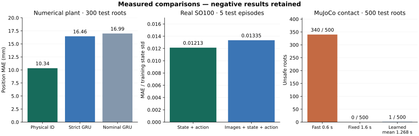

# GPU training and mechanism review — 2026-10-02

This report records experiments performed on an RTX 4090 D (24 GB), with Python
3.12.3, PyTorch 2.8.0+cu128 and MuJoCo 3.14.0. The public product baseline was
`cb79c3ae42120f7f9375ddb0ef63b40dbe37b696`; each experimental script and artifact
has its own SHA256. Training dependencies remain outside the installable core.
No new software tests were written for this training mission.

## Inputs and experimental boundaries

The real dataset is [SO100 PickPlace](https://huggingface.co/datasets/lerobot/svla_so100_pickplace),
revision `728583b5eaf9e739a7f119e2def466fa1d552402`: 50 episodes, 19,631 samples,
30 Hz, six joint/gripper fields and two recorded cameras. The source metadata
does not declare physical units or driver acknowledgments. Logged action targets
are retained in their native representation; training scales are fitted on the
30 training episodes. These data provide no object-pose, slip, force or incident
labels. Joint prediction on these recordings therefore evaluates a different
claim from object consequence prediction in MuJoCo.

The actual VLA inputs are the fixed [SmolVLA base](https://huggingface.co/lerobot/smolvla_base)
revision `d9f33c94a60fb382c90dea2164c96845bd955e28` and
[SmolVLM2 backbone](https://huggingface.co/HuggingFaceTB/SmolVLM2-500M-Video-Instruct)
revision `7b375e1b73b11138ff12fe22c8f2822d8fe03467`. Dataset and model bytes are
checked against independently retrieved official Hub metadata. The transport
mirror supplies bytes; official LFS SHA256/Git blob IDs establish integrity.

All real-data experiments share an episode split of 30 train / 5 dev / 10 cal /
5 test, seed 20261002. Normalization and visual PCA use train only. Development
data choose checkpoints; calibration data set frozen ranks; test data evaluate
the resulting procedure. Every simulated root keeps its four candidate siblings
together. Source files, fixed inputs and runnable commands are in
[the experiment guide](../experiments/gpu/README.md).

## Numerical WorldGuard

Three 48D GRU members were trained, plus three independently trained no-action
members. The first engineering variant includes a fixed nominal residual plant
in its forward function and samples branch-level minibatches. It is identified
as that variant rather than the strict v4 architecture. Its original alpha=.1
run retains 271/300 joint coverage (90.33%) and eight false allows; this is a 90%
protocol, not a failed 95% protocol.

With the same frozen weights, training normalization, development scales and
candidate rule, fresh calibration/test roots at the design alpha=.05 give
286/300 coverage (95.33%), a 76% root allow rate and one false allow. Position MAE
is 15.686 mm. The original result remains available.

A separate strict v4 experiment removes hidden stiffness, damping and cubic
plant constants from the model forward. Its update is
`v_next = v + dt * (-a + bounded_learned_residual)` followed by known integration.
Each member bootstraps whole roots and trains with all four siblings. It reuses
the fixed training/development data, with fresh calibration roots
800000–800198 and test roots 900000–900299.

| Frozen procedure on the same 300 fresh test roots | Position MAE | Joint root coverage | Roots with an allowed candidate | False allows / all roots |
|---|---:|---:|---:|---:|
| Strict v4 GRU, root bootstrap | 16.461 mm | 286/300 (95.33%) | 217/300 (72.33%) | 3/300 |
| Earlier engineering GRU | 16.993 mm | 288/300 (96.00%) | 208/300 (69.33%) | 2/300 |
| Observable-history physical identification | **10.335 mm** | 288/300 (96.00%) | 244/300 (81.33%) | 1/300 |
| Independently trained strict no-action GRU | 40.852 mm | 285/300 (95.00%) | 0/300 | 0/300 |

The strict model aligns better with the specified architecture and batching, but
does not beat the strong physical-identification baseline. Architecture and
minibatch semantics changed together, so the strict/engineering comparison does
not isolate either factor. Joint marginal coverage is not a guarantee about the
selected subset. A model that rejects every candidate can have high coverage
without providing useful task throughput.

Strict ensemble inference measured P50 69.99 ms / P95 71.28 ms for one root,
four candidates and 40 steps, including host transfer. Other experimental CUDA
work could overlap; this is not isolated product latency or a 50 ms control-loop
qualification.

## MuJoCo object consequence prediction

The dataset contains 1000 train / 200 dev / 299 cal / 500 test roots, each with
four candidate movement durations: 0.6, 0.9, 1.2 and 1.6 seconds. Labels come
from actual MuJoCo contact dynamics, randomized mass/friction and complete-state
paired branches. The predictor reads 22 observed state fields and final XYZ
targets, and autoregressively predicts 15 payload fields over 40 steps / 2 s.
Hidden material parameters remain outside neural inputs. Three GRU128 members
and three independently trained no-action members were fitted.

The evaluator uses direct 2 ms control substeps, without the product's ACK and
prepare intervals. This evaluates an offline simulator controller schedule.
An independent artifact check verified unique/disjoint root IDs, metadata split
membership and every sibling's target hash. One failed serialization preflight
and a subsequent training-mode failure remain in the run logs; completed physics
labels were reused after fixing the training-mode error.

| Policy on 500 test roots | Unsafe within the 2 s window | Unsafe by the additional 0.5 s hold | Mean selected movement duration |
|---|---:|---:|---:|
| Geometry-only earliest, 0.6 s | 340/500 | 340/500 | 0.600 s |
| Fixed slow, 1.6 s | **0/500** | **0/500** | 1.600 s |
| Learned XY envelope gate | 1/500 | 1/500 | 1.268 s |

The learned rule selected 1.2 s for 415 roots and 1.6 s for 85 roots. Relative
to the fixed slow policy, commanded movement duration fell by 0.332 s (20.75%).
Every evaluation rollout still lasts two seconds; no end-to-end wall-clock
throughput gain was measured.

Payload-relative coordinate MAE is x=7.258 mm, y=2.847 mm and z=7.393 mm, pooled
5.833 mm; mean 3D Euclidean error is 12.846 mm. The aggregate 15D error mixes
position, velocity, rotation and angular velocity and is not a length.

Full candidate/time/state joint coverage was 472/500 (94.4%); the separate
candidate/time/XY risk envelope covered 464/500 (92.8%). Both empirical values
are below their nominal 95% targets. The gate uses the XY envelope, not the
full-state envelope. The extra half-second hold has its own outcome diagnostic
and is outside the calibrated forecast horizon.

The false allow is `mujoco-root-00101905`, candidate 1.2 s. Its measured peak XY
offset was 60.471 mm against a 60 mm threshold; the calibrated corner bound was
57.733 mm. The payload did not drop. This failure and the fixed-slow policy's
better failure count are retained alongside the duration benefit.

## Real SO100 joint prediction

The nine-member comparison completed 4000 updates per member: three state/action
models, three visual/state/action models and three visual models trained without
future actions. The two-camera cache encoded all 39,262 recorded image frames
with fixed spatial grids and train-only PCA. The full run took 2086.89 seconds,
including training and its evaluations, while other experimental work could
share the GPU.

| Procedure on the same 5 test episodes / 844 overlapping windows | Native-field pooled MAE | Train-state-standard-deviation-normalized MAE | Joint episode coverage |
|---|---:|---:|---:|
| Persistence | 6.91258 | 0.360358 | 5/5 |
| Logged action target as state | 1.44388 | 0.092078 | 4/5 |
| State/action GRU | **0.21098** | **0.012134** | 5/5 |
| Visual/state/action GRU | 0.22509 | 0.013348 | 5/5 |
| Independently trained visual model without future actions | 3.19514 | 0.172016 | 4/5 |
| Future-action shuffle, using the frozen visual model's calibration | 21.20334 | 1.062935 | 0/5 |

Adding images increased normalized error by 10.0% in this recorded joint-following
task; the smaller state/action model is the better comparator. Action removal
and shuffling substantially worsen prediction, supporting action sensitivity
within this dataset. They do not establish causal counterfactual contact outcomes.
The source's undeclared field units prevent interpreting the pooled native
number as a physical distance or common angular error.

The independent unit is the episode, not each overlapping window. With only ten
calibration episodes, the finite conformal object has alpha=.1 and rank 10. A
95% request needs rank 11 and has no finite threshold. Coverage over five test
episodes remains a small-sample observation; envelope widths and all per-episode
errors are retained in [the raw result](gpu/2026-10-02/w1_test_results.json).
Incident and allow rates are left null because this dataset supplies no labels
for those decisions.

The calibrated full widths, in the source's six joint/gripper fields, are
`[16.10, 19.38, 38.36, 15.38, 19.27, 12.65]` for state/action and
`[12.11, 14.60, 24.92, 11.33, 13.33, 11.82]` for visual/state/action. Dividing
by each field's training standard deviation gives
`[0.59, 0.57, 1.99, 0.92, 1.71, 1.31]` and
`[0.45, 0.43, 1.29, 0.67, 1.18, 1.23]`, respectively. The 5/5 coverage uses
these broad envelopes. The shuffled-action result reuses the original visual
model's frozen development scales and calibration; it is not recalibrated after
the intervention. An independent dev-only check strictly reloaded all nine
saved NPZ files, reproduced finite `[10,40,6]` outputs, and verified all 16 run
artifacts, source/split identities, input bytes and train-only normalization.
[Reload evidence](gpu/2026-10-02/w1_reload_verification.json) and
[envelope audit](gpu/2026-10-02/w1_envelope_audit.json) retain the details.

## Visual object WorldGuard in 3D

`w2-mujoco-visual-v1` reuses the completed W2 physics dataset and future labels.
It reconstructs each of the eight recorded historical 3D states for actual
dual-camera EGL rendering; no physical trajectory is generated again. Position
reconstruction error is zero and the maximum rotation-6D reconstruction error
is 2.98e-8. Frozen official ResNet18 spatial features and train-only PCA produce
128 visual fields per frame. The full run took 769.59 seconds.

The new visual model reads those historical image features, six observed tray
position/velocity fields and past/future XYZ targets. Its initial-state head
estimates payload state from history. Recorded payload state, true
`initial_output` and future images are excluded. Three members are trained for
each of visual, robot-only and visual/no-action families. Splits retain all four
siblings with their root; training minibatches sample flattened branches, rather
than the strict W0 experiment's root bootstrap. Checkpoints minimize raw mixed
15D development MAE, an exploratory criterion rather than position/risk-optimal
selection. The earlier W2 model is an oracle reference with
more object-state information, rather than a same-input baseline.

| Frozen procedure, 500 test roots | Mixed 15D MAE | Full-state / XY joint coverage | Selected / rejected roots | Unsafe selected / all roots | Selected duration |
|---|---:|---:|---:|---:|---|
| Visual object GRU | 0.03102 | 94.4% / 94.4% | 500 / 0 | 0/500 | 393 at 1.2 s; 107 at 1.6 s |
| Robot-only GRU | 0.04776 | 95.2% / 94.2% | 500 / 0 | 0/500 | All at 1.6 s |
| Independently trained visual/no-action GRU | 0.04885 | 93.2% / 94.2% | 235 / 265 | 0/500 | Selected 235 at 1.2 s |
| Action shuffle intervention | 0.17694 | 92.6% / 95.8% | 0 / 500 | 0/500 | No selected candidate |
| Shifted cameras, original visual calibration | 0.05688 | 94.4% / **55.8%** | 500 / 0 | **47/500** | All at 1.2 s |
| Earlier W2 observed-object oracle reference | 0.03013 | 94.4% / 92.8% | 500 / 0 | 1/500 | Mean 1.268 s |

The visual model's mean movement duration is 1.2856 s, 19.65% below the fixed
1.6 s strategy; zero unsafe selections were observed within this group of 500
roots. Both visual envelope coverages remain below the nominal 95%. Mixed 15D
MAE combines different units and must not be interpreted as meters.

Payload-relative XYZ coordinate MAE is `[8.648, 3.825, 10.519]` mm for the visual
model, pooled 7.664 mm, versus `[21.062, 14.292, 51.204]` mm and pooled 28.852 mm
for robot-only. Mean 3D Euclidean errors are 17.071 mm and 62.884 mm. The camera
shift increases pooled XYZ error to 40.001 mm. The action shuffle uses the same
trained weights but rolls future-target times on dev/cal/test and calibrates
that changed predictor separately; its 95.8% XY coverage accompanies complete
rejection and is not robustness of the normal calibration.

The camera stress experiment renders the same 500 test histories from a shifted
layout, with the original development scales and calibration unchanged. It
produces 47 unsafe selections. Full-state coverage alone masks this task-specific
XY failure. This result requires binding camera layout, preprocessing, encoder,
PCA, model and calibration identities for a supported visual profile, and
collecting new calibration data after a layout change. The experiment measures
one fixed simulated scene and does not establish real-camera object tracking.
An independent check verified all 31 artifacts, original labels, all split
memberships, train-only scaling/PCA selection and strict dev-only reload of all
nine members. The saved image-feature channel order is `overview, front`; the
shifted test order is `overview_shift, front_shift`. Sorted camera dictionaries
alone do not reconstruct this order, so preserve the exact source and this
ordered contract. [Audit evidence](gpu/2026-10-02/w2_visual_independent_audit.json).

## Design decisions supported by these results

Use the physical-identification model as the numerical default while the learned
model remains an experimental comparator. The tested numerical plant rewards
parameter identification more than replacing it with a larger predictor.

For contact tasks, evaluate the learned policy against the fixed slow strategy
using both duration and failures. The current result supplies a measurable
tradeoff, not evidence to enable robot motion. Keep model/profile/action and
calibration identities bound to each prediction before integrating trained
weights with the execution permit path.

Real images and simulated object states require separate model cards. The
simulation visual experiment reconstructs recorded historical 3D states for
rendering and keeps future labels unchanged; it can check an image-to-object
prediction pipeline. Real object supervision and device execution remain distinct
next steps.

Keep the SO100 state/action predictor as the joint-dynamics default for this
experiment. Increase visual capacity only after choosing a target for which
the images add observable information, such as payload state under contact.
The [model cards](gpu_model_cards.md) specify each input/output space and weight
loading procedure.
