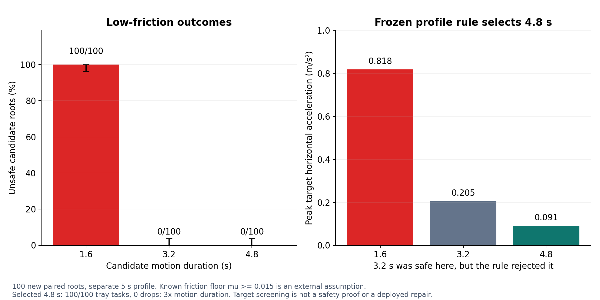

# Low-friction long-horizon physical fallback (2026-10-02)

The frozen W2 candidate family had no safe action in the earlier 100-root
low-friction test.  Calibration alone could only reject every candidate; it
could not create an executable alternative.  This independent MuJoCo study
therefore defines a new physical profile rather than extending the trained
WorldGuard: 100 x 50 ms = 5 s forecast, a separate 0.5 s hold, and sibling
actions lasting 1.6, 3.2, or 4.8 s.

The formal test uses 100 new roots, seeds 620000--620099, with friction sampled
from 0.015--0.05 and payload mass from 0.04--0.16 kg.  The three actions for a
root start from the same complete `mjSTATE_INTEGRATION` state.  The five-root
preflight used disjoint seeds 670000--670004; matching hashes show that the
formal test used the same script and protocol bytes.

## Provenance timing erratum

The original `protocol.json` says `frozen_at_utc=2026-10-02T00:00:00Z`.  That
timestamp is invalid: it is later than the observed remote filesystem sequence
and did not come from a trusted timestamp or preregistration service.  The true
historical freeze time and formal-run start/end times cannot be recovered and
are recorded as `unknown`.

Remote filesystem metadata and matching script/protocol hashes are consistent
with the disjoint preflight occurring before the formal test.  They establish
ordering only.  There was no external preregistration, immutable precommitment,
or trusted time attestation.  The original protocol, manifest, metrics, raw
states, labels, CSV, and preflight evidence remain byte-for-byte unchanged.
Their hashes, observed invocation, verified import-source hashes, file stats,
and evidence limits are recorded in
`runs/low-friction-fallback-20261002/provenance_supplemental_erratum.json`.

## Frozen screening rule

The **known-profile target-acceleration screening** assumes the profile's
declared friction floor `mu_min=0.015`.  The system did not independently verify
that floor at run time; it is a public profile condition, not a sensed or
inferred property.  The rule first aborts if the final observed history reports
no payload support or relative XY offset above 0.06 m.  It then chooses the
shortest plan for which every discrete target step satisfies

`norm(a_xy) <= mu_min * (g + a_z)`, with `g + a_z > 0`.

The rule reads candidate targets and the final observed support/relative XY
only.  Root friction, payload mass, and future labels are hidden.  This is
target-acceleration screening: servo tracking and contact-force error are not
modeled in the inequality and remain measured outcomes.  The rule is not a
mathematical safety guarantee or a perception-based estimate of friction.

The frozen target diagnostics were:

| Duration | Peak target horizontal acceleration | Minimum bound margin | Rule result |
| ---: | ---: | ---: | --- |
| 1.6 s | 0.8178 m/s² | -0.6733 m/s² | reject |
| 3.2 s | 0.2049 m/s² | -0.0584 m/s² | reject |
| 4.8 s | 0.0912 m/s² | +0.0557 m/s² | accept |

The rule therefore chose 4.8 s for every non-aborted root.  It did not inspect
formal-test outcomes to choose that duration.

## Formal results

| Policy | Selected / rejected / observed abort | Unsafe selected | Drops | Task completion | Mean duration |
| --- | ---: | ---: | ---: | ---: | ---: |
| Fixed 1.6 s | 100 / 0 / 0 | 100 / 100 | 58 / 100 | 0 / 100 | 1.6 s |
| Fixed long 4.8 s | 100 / 0 / 0 | 0 / 100 | 0 / 100 | 100 / 100 | 4.8 s |
| Known-profile target-acceleration screening | 100 / 0 / 0 | 0 / 100 | 0 / 100 | 100 / 100 | 4.8 s |

Task completion was frozen as: selected, no forecast risk or drop, and tray
endpoint tracking error at most 0.01 m.  The empirical root-bootstrap 95%
interval was [100%, 100%] unsafe for fixed 1.6 s and [0%, 0%] unsafe for both
4.8 s policies.  These percentile intervals describe this constructed sample;
they do not establish a population safety bound.  The two-sided Wilson 95%
interval is [96.30%, 100%] for 100/100 and [0%, 3.70%] for 0/100.

The paired duration cost is +3.2 s, or 3x the 1.6 s action duration.  Mean tray
endpoint tracking error was 0.0000023 m at 1.6 s and 0.0000052 m at 4.8 s.
Mean observed peak tray horizontal acceleration fell from 0.8177 to 0.0912
m/s².  Mean observed-versus-target peak acceleration deviation at 4.8 s was
0.000048 m/s².

The unused 3.2 s candidate was also observed safe in all 100 formal roots, while
the frozen profile rule rejected it because its target acceleration exceeded
the predeclared worst-case friction-floor bound.  This exposes the cost of the
conservative known-profile assumption; the result was not used to change the
rule after seeing the test set.  Its 0/100 observed failures still has a Wilson
95% upper bound of 3.70%.

All labels, complete root states, histories, targets, tracking measurements,
metadata, hashes, CSV rows, and preflight evidence are stored in
`runs/low-friction-fallback-20261002/`.  The formal run used the RTX 4090 D host
with six physics workers and completed in 4.13 s.

This result only answers whether a slower, newly declared MuJoCo action family
can supply executable tray candidates for this low-friction profile.  “Task
completion” is the tray/payload simulation criterion stated above.  It does not
show that the original 2 s WorldGuard supports a 5 s forecast, and the known
friction floor was not system-verified.  The screening was not deployed.  This
is not a real-robot result, functional safety certification, or physical
stopping proof.  Zero observed unsafe selections means only that none occurred
in these 100 constructed roots under this profile.

## Saved-metrics comparison

[Protocol and provenance erratum](research/2026-10-02/low-friction-fallback/provenance_supplemental_erratum.json) · [Independent review](research/2026-10-02/independent_review.json) · [Figure hashes](research/2026-10-02/figure_manifest.json)
