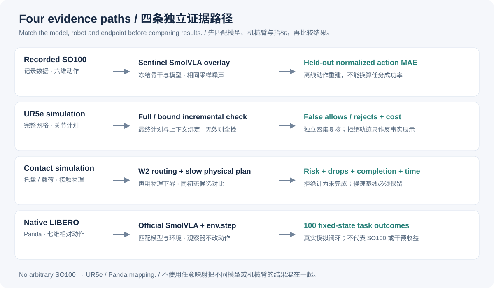
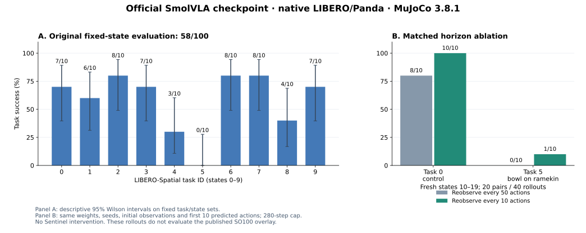
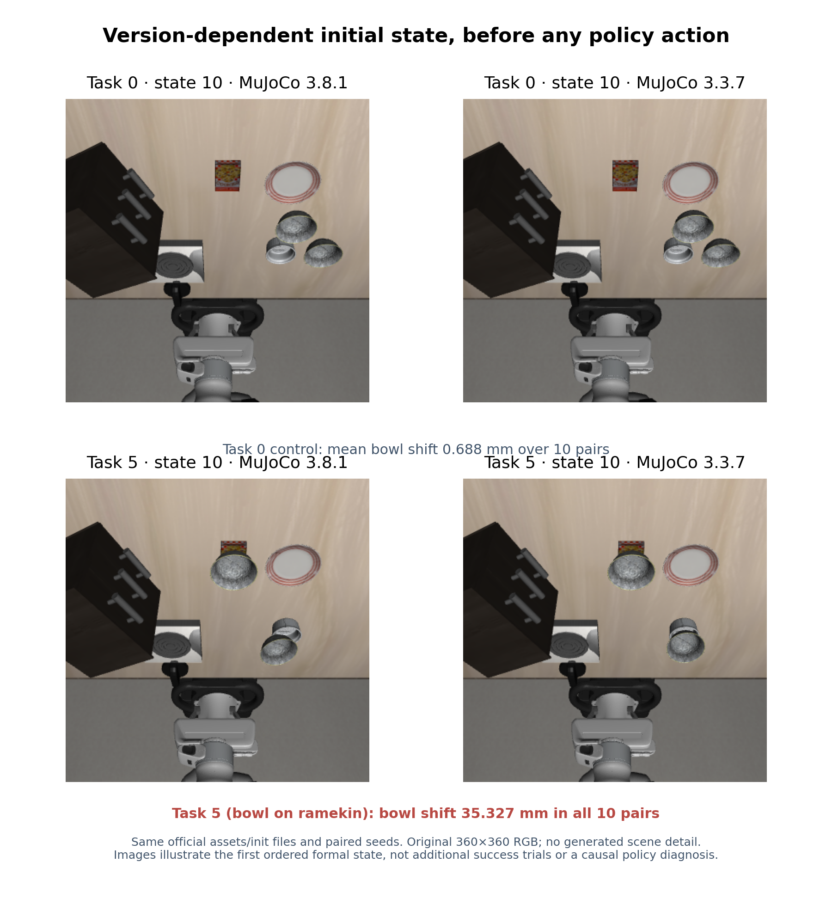
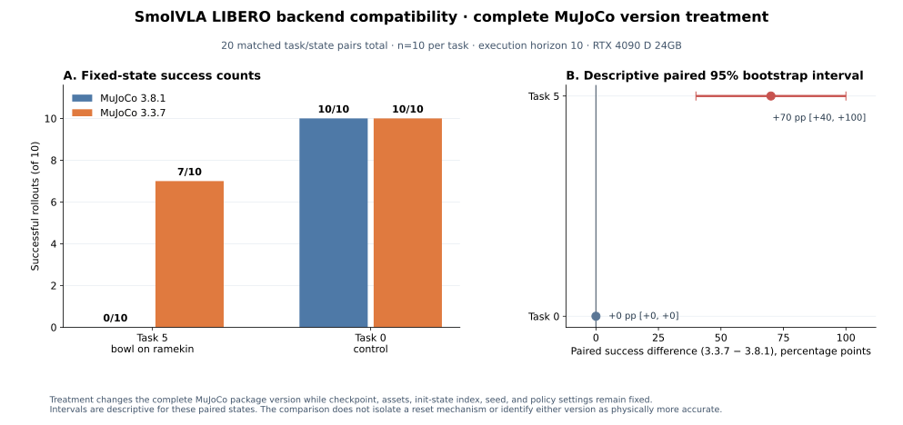
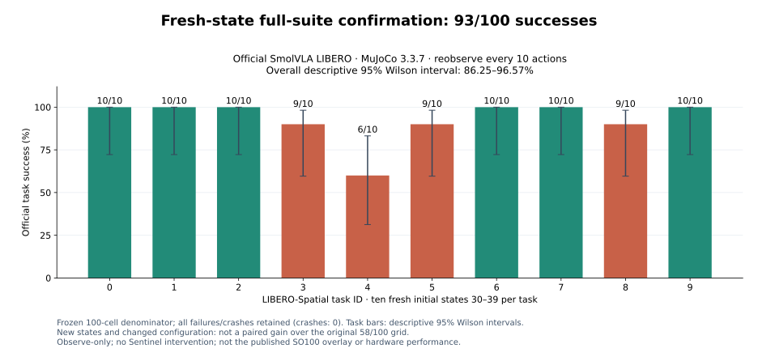
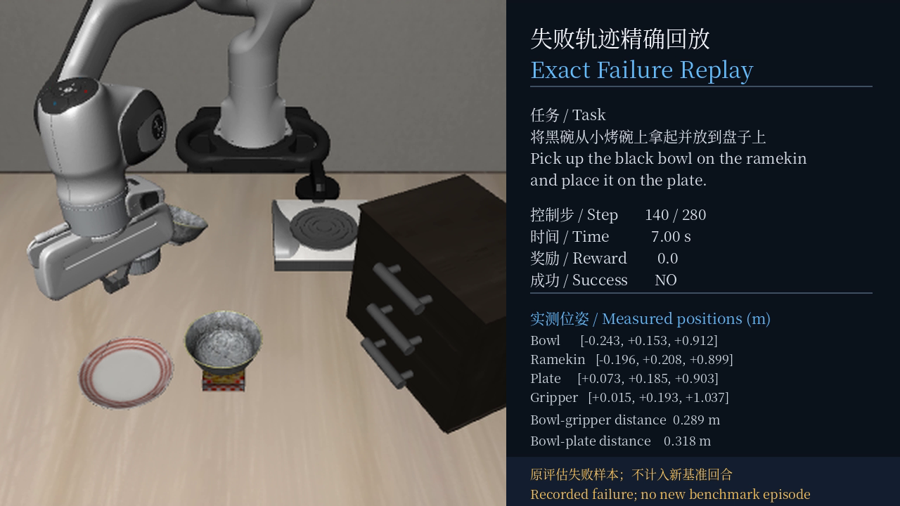

# Support-aware routing and final-action verification

## Prospective design and retained evidence

The [experiment matrix](EXPERIMENT_MATRIX.md) maps each question to its frozen grid, comparator, statistical unit and endpoint.

The [experimental protocol](PROTOCOL.md) defines hypotheses, independent units, candidate actions, support declarations, baselines, acceptance criteria and uncertainty before formal execution. Sources and model/calibration artifacts are hash-bound. Cost protocol commit: `0ae1c20`. Intervention amendment commit: `ce56e1e`. This is prospective execution ordering, not external preregistration.

The GPU is **RTX 4090 D (24 GB)** with PyTorch 2.8.0+cu128. Routing/contact and UR5e studies use MuJoCo 3.14.0; native VLA and version comparisons use the simulator versions stated in their respective subsections. Contact physics and UR5e verification are CPU work; visual feature/model inference and rendered media use the GPU. The installable product, bounded research policies, and pretrained VLA studies remain distinct profiles.

Intervals are descriptive summaries of the finite fixed/stratified design; they do not establish a risk bound for a continuous parameter domain or a deployment population. Bootstrap resampling uses roots and preserves within-root pairing.

## Failure mechanism and repair

The original neural gate failed in low friction because all four supported candidates were unsafe. Ranking those candidates cannot solve that problem. The repair adds a separately screened long-horizon physical action family, requiring a trusted declared friction floor. Camera mismatch disables the visual model and routes to the existing state model only when object state and nominal physics are available.

The router receives declared camera/profile identifiers and actual final-target arrays. It never receives a sampled friction, sampled mass, evaluator scene name, future outcome or test label. This is a configuration-aware repair; it does not learn to estimate friction or recognize camera shifts from pixels. False declarations remain a failure mode.

## New held-out routing study: 600 roots

Each scene uses 100 fresh roots. Six candidate actions share one complete integration-state snapshot. Evaluation includes 5 s execution and a 0.5 s hold. Completion means no observed risk/drop and tray endpoint error at most 0.01 m; every rejection counts as incomplete.

| Scene | Fixed 1.6 s: unsafe / complete | Fixed 4.8 s: unsafe / complete | Integrated: unsafe / complete / reject |
|---|---:|---:|---:|
| Nominal | 0 / 100 | 0 / 100 | **0 / 100 / 0** |
| Declared low friction | 100 / 0 | 0 / 100 | **0 / 100 / 0** |
| Shifted camera | 0 / 100 | 0 / 100 | **0 / 100 / 0** |
| Low mass | 0 / 100 | 0 / 100 | **0 / 0 / 100** |
| High mass | 0 / 100 | 0 / 100 | **0 / 0 / 100** |
| 1.35× displacement | 1 / 99 | 0 / 100 | **0 / 0 / 100** |

Numbers are counts per 100 roots, not percentages in mixed denominators. The integrated policy completes **300/600** roots and rejects **300/600**. It observes no unsafe selection in this dataset, while the fixed 4.8 s comparator completes **600/600**. The support gate therefore has a substantial utility limitation; rejection is not success.

Both nominal and camera-routed model branches choose 1.2 s on 86/100 roots and 1.6 s on 14/100 (mean 1.256 s). The declared-floor branch chooses 4.8 s on all low-friction roots, costing 3× the fixed 1.6 s duration. Zero unsafe observations per 100-root scene has a Wilson 95% interval of approximately **0–3.70%**; 100/100 completion has **96.30–100%**. These are sample estimates, conditional on the declared simulator profile.

Reject-all and missing-floor controls complete 0/100 roots where they reject. The physical-floor route matches fixed 4.8 s in the declared low-friction scene. Full per-policy estimates, selected-only denominators, paired-root bootstrap differences, root-level outcomes and tensors are retained in the experiment pack. W2 coverage applies only to its 2 s contract, while the primary execution outcome deliberately includes the longer diagnostic hold.

## Broader physical fallback: 324 independent roots

A second [protocol](BROAD_FALLBACK_PROTOCOL.md), committed as `797c12d` before execution, addresses the utility gap with a bounded physical comparator. It crosses three friction bins (0.015–0.8), three payload-mass bins (0.02–0.20 kg) and three displacement-scale bins (0.8–1.5). Each of 27 cells has eight parameter corners and four random interior points, with independent root perturbations. Preflight seeds are disjoint. Main outcomes cover the full 5.5 s execution/hold window.

| Policy | Unsafe / 324 | Drops / 324 | Complete / 324 | Motion duration |
|---|---:|---:|---:|---:|
| Fixed 1.6 s | **140** | **78** | **184** | 1.6 s |
| Fixed 4.8 s | **0** | **0** | **324** | 4.8 s |
| Declared-floor screening | **0** | **0** | **324** | 4.8 s on every root |

The slower comparator improves completion by 43.21 percentage points over 1.6 s (paired-root bootstrap 95% CI **37.96–48.77 pp**). Zero observed unsafe/drop events in 324 roots has an aggregate Wilson upper bound **1.17%**; completion has a lower bound **98.83%**. Each cell contains only 12 roots, whose zero-event upper bound is **24.25%**. Corner coverage and aggregate counts do not qualify the entire continuous parameter rectangle.

The fast policy's unsafe counts by friction bin are **102/108**, **38/108**, and **0/108**; drops are 72, 6 and 0. This locates the main observed failure in friction rather than suggesting another neural model would recover an unobserved parameter. The extra 0.5 s hold introduces no new risk in this sample. Fifty-millisecond endpoint samples show no servo saturation, but cannot exclude substep transient peaks.

A **post-hoc sibling diagnostic**, not an additional preregistered policy comparison, checks the stored unselected 3.2 s candidates: 23/324 are unsafe and 6/324 drop over the full 5.5 s window. All 23 unsafe roots lie in low-friction cells with displacement above the lowest bin. Thus the previously safe 3.2 s actions from the narrower study cannot simply be promoted to the wider physical profile. No new simulation or policy tuning is used for this diagnostic.

The screening policy admits only the 4.8 s candidate on every root. It is **identical to fixed 4.8 s** root by root, offers no adaptive-duration advantage, and never exercises rejection. The frozen empirical acceptance gate passes, conditional on these simulator assumptions and truthful declared bounds. This study supplies evidence for a separate slow physical profile; it does not retroactively change the earlier router's 300 rejected outcomes or establish deployment/hardware qualification. [Full metrics](broad-fallback/metrics.json) and [root-level outcomes](broad-fallback/per_root.json) retain every stratum.

## Hidden-friction counterfactual: 100 pairs

Each pair restores independently checked identical integration states, observed history and action bytes. Mass and non-friction model hashes match. Only **future** contact friction changes from 0.3 to 0.025 after observation.

- For the 1.6 s motion, nominal and low-friction unsafe labels differ in **100/100** pairs.
- For the 4.8 s motion, unsafe labels differ in **0/100** pairs.

This establishes a concrete failure mode for an unobserved future contact change. A deterministic gate receiving identical observations/actions cannot tell those branches apart. It does not establish that static friction can never be identified using informative probing. A trusted physical bound, additional sensing/probing, or conservative fallback is required for that ambiguity.

## Independent obstacle fields and fair UR5e cost

Sixty new roots sample obstacle fields before creating any plan. A separate, denser 0.005 rad scanner and 1 ms replay label 23 unsafe and 37 safe final plans. The incremental binding now includes the tracking threshold and validator source digest; invalid records trigger full fallback.

| Policy | False allow / 23 unsafe | False reject / 37 safe |
|---|---:|---:|
| Parent only | 20 / 23 | 0 / 37 |
| Full final validation | **0 / 23** | **0 / 37** |
| Bound increment + full fallback | **0 / 23** | **0 / 37** |
| Reject transforms | 0 / 23 | **27 / 37** |

Full and incremental decisions disagree on **0/60** roots. Twenty-three roots use complete fallback. Zero observed false allows among 23 unsafe roots has a descriptive Wilson 95% upper bound of **14.31%**; this small sample does not establish a universal guarantee.

Methods receive an excluded warmup and three stored repetitions with rotated order. Comparing per-root timing medians, mean marginal full cost is **85.351 ms** and mean marginal incremental cost is **84.356 ms**. The paired difference is **−0.996 ms**, with root-bootstrap 95% CI **[−1.728, −0.291] ms**; the ratio of means is **0.9883**, CI **[0.9799, 0.9964]**.

The average gain is small. At K=1 with the same parent cost charged to both methods, mean totals are 186.915 vs 185.919 ms. Full P95 is **223.214 ms** while incremental P95 is **226.218 ms**. Incremental P95 remains worse at K=2/4/8. This study supports a small mean marginal difference, **no tail-latency improvement**, and no general robot-speed claim.

Hazard diversity is limited: independent obstacle sampling produces only three collision cases; joint-limit and tracking strata contribute 20 designed unsafe cases. The smooth-suffix and environment-change strata happen to contain no unsafe final plans. This limitation stays visible rather than moving obstacles onto trajectories after seeing outcomes.

## Native official SmolVLA closed loop: 100 fixed rollouts

The [separate protocol](LIBERO_PROTOCOL.md) and runner were frozen at commit `c3b9f9f` before formal execution. The official `lerobot/smolvla_libero` checkpoint drives its native LIBERO/Panda environment with two cameras, 8-D state and 7-D relative action. This is not the published SO100 overlay or UR5e, and the observer makes no interventions.

**58/100 tasks succeed (58.0%)**, with descriptive Wilson 95% interval **48.21–67.20%**. Per-task success counts, in official task order, are **7, 6, 8, 7, 3, 0, 8, 8, 4, 7** out of ten. The bowl-on-ramekin task fails **10/10**. Every one of the 42 failures reaches the 280-step cap with zero official reward; the 58 successes end in 79–178 steps. These observations locate a task-specific weakness without identifying its visual or contact cause.

The 100 episode plans and actual resets match states 0–9 and seeds 41021–41030 exactly. There are 404 raw chunks and **17,868** postprocessed/env-step action pairs with maximum absolute difference **0.0**, and **zero interventions**. The run takes 1,742.21 s (29.04 min). This traced end-to-end time includes simulation, inference and logging; it is not an inference-only or real-time hardware benchmark. [The manifest](libero/manifest.json) binds weights, normalizers, backbone/tokenizer, mixed runtime assets, task BDDL/init-state sources, action trace and selected original RGB video.

[The explained native video](https://github.com/LancerLSY/sentinel-evc-lab/releases/download/paper-validation-20261002/libero-task00-state00-explained.mp4) retains the prospectively selected task 0/state 0, which succeeds in 83 actions. Its 83 original 360×360 RGB frames are placed in a 1080p bilingual canvas; no additional scene detail is created. The original container tags 80 fps. Explained playback uses the actual frozen 20 Hz action clock (4.15 s), rather than implying that container metadata is the simulation clock. The [video manifest](libero-video/video_manifest.json) binds original and explained files separately. This successful illustration does not replace the 42 failures in the full metrics.

The original [SmolVLA paper, Table 13](https://arxiv.org/pdf/2506.01844) reports lower LIBERO performance when executing a full 50-step chunk rather than re-observing after ten actions. This motivates a new, separately frozen execution-horizon diagnostic on fresh states; it does not permit rewriting the 58/100 result. An [unresolved upstream reset report](https://github.com/huggingface/lerobot/issues/4390) also motivates a no-policy simulator-version audit for task 5. That report is a hypothesis source, not evidence that the observed failures have this cause.

## Execution-horizon ablation: 20 matched pairs / 40 rollouts

The [horizon design](REPLAN_PROTOCOL.md) was frozen at `d1b4b1c` before formal evaluation. Tasks 5 (primary failure task) and 0 (control) use fresh states 10–19. Prediction chunks remain 50 actions; the treatment executes only 10 before reobserving. Weights, processors, MuJoCo 3.8.1, init files and paired random seeds are unchanged. Branch order alternates, every trial resets the policy, and all 20 pairs have identical initial state/camera hashes and identical first 10 predicted actions.

| Task | Execute 50 / 10 | Paired success gain | Descriptive paired bootstrap 95% |
|---|---:|---:|---:|
| 5: bowl on ramekin (primary) | 0/10 → 1/10 | +10 pp | 0–30 pp |
| 0: control | 8/10 → 10/10 | +20 pp | 0–50 pp |

The main severe failure remains: task 5 still fails 9/10 with frequent feedback. These small-sample intervals include zero and do not establish a general model improvement. The task-5 improvement is state 16 only; task-0 improvements are states 14 and 18. There are zero crashes and zero interventions. All 40 state/seed resets and 7,510 postprocessor-to-environment action comparisons pass; maximum difference is zero. [Full manifest and pairs](replan/manifest.json) binds the complete raw trace.

Task 5 mean traced episode wall time increases from 26.76 s to 30.72 s, while mean inference chunks per action increase from 0.02143 to 0.10024. The control's mean wall time drops from 12.64 s to 10.16 s because two long timeout failures become successes; that is not an inference-speed comparison. Total formal wall time is 803.39 s. This is an execution-horizon ablation, not the paper's asynchronous overlapping-chunk method.

## Simulator-version reset diagnostic: 40 no-policy resets

The [reset audit protocol](RESET_AUDIT_PROTOCOL.md) and source were frozen at `c7bfa7d` before formal capture. Twenty matched task/state pairs use tasks 0 and 5, fresh states 10–19, and identical init files, assets, seeds and reset settings, under MuJoCo 3.8.1 and an isolated 3.3.7 prefix. No policy is loaded and no action is executed. Both excluded preflight receipts are bound in each formal manifest.

For task 5, the black bowl's reset position differs by **35.327 mm in all 10 pairs**, with orientation difference **0.24724 rad**; its position relative to the ramekin differs by 35.782 mm. In task 0, the mean bowl position difference is **0.688 mm**, maximum 3.564 mm. Both camera arrays differ in every pair. This confirms a task-dependent version effect before the policy's first action; it does not establish that reset pose caused the original 0/10 success rate. [Paired measurements](reset-audit/comparison/paired_records.json) and [comparison manifest](reset-audit/comparison/comparison.json) retain the raw-output bindings.

MuJoCo's [official 3.4.0 changelog](https://mujoco.readthedocs.io/en/stable/changelog.html#version-3-4-0-december-5-2025) records a box–box distance bug fix. The [upstream LIBERO report](https://github.com/huggingface/lerobot/issues/4390) proposes that old benchmark resets depend on the previous contact behavior. Using 3.3.7 is therefore a benchmark-compatibility comparison, not a claim that its contact physics is more accurate. Official task/init assets are not rewritten. A separately frozen policy comparison evaluates the full backend-version effect on actual task success.

## Backend-version closed loop: 20 pairs / 40 rollouts

The [backend protocol](BACKEND_PROTOCOL.md) was frozen at `eebfb7a` before execution. Task 5 is the primary endpoint and task 0 the control, each using fresh states 20–29. Both branches predict 50 actions and reobserve every ten. Only the complete MuJoCo version changes (3.8.1 versus isolated 3.3.7); official weights, processors, task/init files, assets, paired seeds, policy resets and the 280-step cap remain fixed. Crashes count as failures, without replacement.

| Task | MuJoCo 3.8.1 / 3.3.7 | Paired success change | Descriptive bootstrap 95% |
|---|---:|---:|---:|
| 5: bowl on ramekin (primary) | 0/10 → 7/10 | +70 pp | 40–100 pp |
| 0: control | 10/10 → 10/10 | 0 pp | 0–0 pp |

No crash or missing reset occurs; all 40 actual task/state/seed receipts match the plan. Initial robot-state hashes match in all 20 pairs, while cameras and first predicted actions differ in all pairs, as expected when changing the scene-generating backend. The two branches dispatch 3,570 and 2,241 actions; every postprocessor-to-environment comparison is byte-identical, with zero observer interventions. [All paired episodes](backend/comparison/paired_episodes.json) and the [comparison manifest](backend/comparison/comparison.json) retain successes and failures.

This supports a **complete-version benchmark-compatibility effect**, without isolating reset pose, a specific contact implementation or physical accuracy as the cause. Three of ten primary-task episodes still fail under 3.3.7. The treatment choices were motivated by earlier diagnostics, so a separately frozen full-task confirmation uses new states; these two selected tasks are not an overall model-success estimate.

## Full-suite fresh-state confirmation: 93/100

The [confirmation protocol](CONFIRMATION_PROTOCOL.md) and step-outcome recorder were frozen at `9b1a48d` before formal execution. A reviewed, excluded preflight precedes all ten LIBERO-Spatial tasks at ten fresh initial states 30–39 each. Official weights and processors remain fixed, with isolated MuJoCo 3.3.7, 50-action prediction chunks and a ten-action execution horizon. States, backend and horizon differ from the original 58/100 grid; the percentages are separate configuration results, not a paired gain.

**93/100 episodes succeed (93.0%)**, with descriptive Wilson 95% interval **86.25–96.57%**, and zero crashes. Every task asks the policy to pick up the specified black bowl and place it on the plate:

| Official task ID | Initial bowl location | Success |
|---|---|---:|
| 0 | Between plate and ramekin | 10/10 |
| 1 | Next to ramekin | 10/10 |
| 2 | Table center | 10/10 |
| 3 | On cookie box | 9/10 |
| 4 | Top drawer of wooden cabinet | 6/10 |
| 5 | On ramekin | 9/10 |
| 6 | Next to cookie box | 10/10 |
| 7 | On stove | 10/10 |
| 8 | Next to plate | 9/10 |
| 9 | On wooden cabinet | 10/10 |

All seven failures reach the 280-step cap with zero official reward: task3/state35; task4/states30,31,34,37; task5/state34; task8/state33. The **6/10 top-drawer task** remains the weakest. No failed cell is retried, replaced or removed. Robot-state, action and outcome traces alone do not identify the remaining contact or grasp failure causes.

Independent review reparses all 47,467 events and verifies 100 actual state/seed resets, 1,199 raw prediction chunks, and 11,592 aligned selected/postprocessed/environment actions and official step outcomes. Every postprocessed/environment action is byte-identical, maximum difference zero, with zero interventions. Every successful episode ends with reward 1 and official success termination. Total traced wall time is 1,462.97 s (24.38 min), including inference, simulation and recording; it is not an inference-only benchmark. The [complete manifest](confirmation/manifest.json) and [frozen protocol](confirmation/frozen_protocol.json) retain every episode, fourteen source bindings and the excluded preflight digest.

The 93% result belongs to this declared official LIBERO/Panda configuration. It is not the repository's SO100 overlay success rate, Sentinel intervention efficacy or real-robot performance. The original 58/100, both matched diagnostics and all failed records remain separately reported.

## Exact-action replay of the original failure

The first failed task-5/state-0 rollout is selected **post hoc** for diagnosis. It replays the original 280 environment actions under the bound MuJoCo 3.8.1 stack, without loading or calling a policy. Initial processed state, both camera hashes and instruction match the original trace; every replay action hash matches. The result remains zero reward and no official success. This replay is excluded from every benchmark denominator.

The target bowl body's maximum observed center-z increase is **1.674 mm**; its final center is **30.947 mm lower** and 46.513 mm displaced. Its distance to the plate-body center never falls below 288.175 mm. Minimum target-body-center to **observed EEF position** is 77.189 mm. That distance is not fingertip clearance, contact evidence or a grasp criterion; the video label “Bowl-gripper distance” refers to this center-to-EEF measurement. The second bowl's body position remains effectively unchanged. These measurements describe the failed transport, not its cause. [Retained geometry](libero-failure/pose_diagnostic.json) and [source/output manifest](libero-failure/manifest.json) identify the evidence.

The 720p bilingual film contains 281 actual simulator RGB frames (initial frame plus 280 actions), 20 fps and 14.05 s. Original camera detail is 360×360; text and resizing add no scene detail. The [presentation-only receipt](libero-failure/presentation_media_receipt.json) binds first/middle/final frame selections to the unchanged original replay.

## Clear 3D evidence

[The 1080p UR5e film](https://github.com/LancerLSY/sentinel-evc-lab/releases/download/paper-validation-20261002/sentinel-ur5e-paper.mp4) uses the official pinned full robot meshes and saved independent-review trajectories. Its three illustrative IDs are fixed before rendering. A red pane shows the unsafe proposed final trajectory as a **counterfactual, not dispatched motion**; the adjacent pane shows the recorded allow/reject outcome from the same initial state. Bilingual captions identify task, changed suffix/context, physical obstacle, decision, risk and trajectory time.

This video rerenders the earlier 180-root mechanism fixtures; it is not presented as footage of the new 60-root obstacle study or of SmolVLA controlling UR5e. A rejected pane is a visualization of no candidate dispatch, not a measured hardware braking/hold experiment.

[The 1080p friction comparison](https://github.com/LancerLSY/sentinel-evc-lab/releases/download/paper-validation-20261002/friction-failure-vs-fallback.mp4) replays the first prospectively ordered low-friction root, `low_friction-711000`, from the new formal study. Both panes start from the same recorded state: the 1.6 s plan slips and drops the payload; the 4.8 s plan reaches the target without the recorded risk. The lower graph shows payload displacement against the 0.06 m risk threshold. Exact friction/mass labels are evaluator annotations; the decision receives only the declared floor. The slower action costs 3× the motion duration. Its [media manifest](friction-video/video_manifest.json) binds the source, input tensors, selected root, position reconstruction and output hashes.

## Design implication

The fixed long-duration physical comparator is stronger than the integrated router in total task utility. The separately frozen 324-root physical stress study supports a slow fallback under the declared bounds, while exposing no selection advantage over a fixed 4.8 s plan. A product route still needs a profile-specific integration and evidence boundary. More neural capacity is not the first response to an unobservable physical parameter or an empty safe candidate set.

SO100 action reconstruction remains an offline result. Native VLA closed-loop behavior is evaluated only with an embodiment-matched checkpoint and environment under [its separate protocol](LIBERO_PROTOCOL.md). This work does not establish SO100 task success, hardware validation, continuous collision freedom or functional safety certification.
