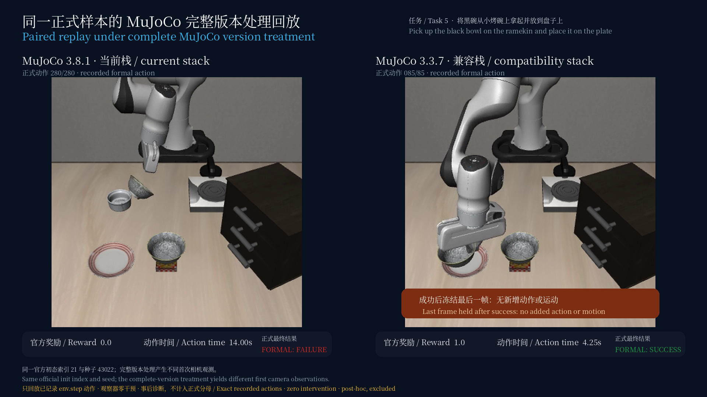

# Paired backend replay

The replay uses the first state-ordered discordant pair from the frozen backend experiment: LIBERO-Spatial task 5, official initial-state index 21, seed 43022. It passes the recorded formal `env.step` actions back through the matching simulator stacks. The observer changes no action and performs no policy inference.

| Stack | Recorded actions | Reward | Outcome |
| --- | ---: | ---: | --- |
| MuJoCo 3.8.1 | 280 | 0.0 | Failure |
| MuJoCo 3.3.7 | 85 | 1.0 | Success |

The current replay ran for 14.00 seconds of native motion. The legacy replay reached the formal success condition after 4.25 seconds. For the side-by-side film, the legacy panel holds its last successful frame for the remaining 9.75 seconds. That display hold adds no action, simulation step, reward, or motion.

The executable asset binding covers 239 regular files from `lerobot/libero-assets` revision `0b3ea86be5fe169d0fd036ae63d1070ec09e90f6`. Every file is checked against its fixed-revision LFS SHA-256 or Git blob SHA-1 receipt. The reconstructed content tree is `c7fef2c780dbab2bbdaf375a2a8bbac171341718988f01cd5309bbb4d692e015`. Cache metadata and incomplete downloads are excluded. This is a portable content binding; it does not claim byte-for-byte equality with the historical 955-file mixed installation tree.

The capture used LeRobot 0.6.1, hf-libero 0.1.4, robosuite 1.4.0, MuJoCo 3.8.1 and the isolated MuJoCo 3.3.7 compatibility prefix. A runtime-only `sitecustomize.py` imported `SmolVLAConfig` so LeRobot could deserialize the checkpoint configuration without loading the policy or its weights. Its exact content and SHA-256 are recorded in [environment-receipt.json](paired-replay/environment-receipt.json).

Evidence files:

- [current capture manifest](paired-replay/current-manifest.json)
- [legacy capture manifest](paired-replay/legacy-manifest.json)
- [comparison manifest](paired-replay/comparison-manifest.json)
- [runtime receipt](paired-replay/environment-receipt.json)
- [renderer status](paired_replay_renderer_status.json)

The composed movie decoded completely as H.264, 1920×1080, 20 fps, 280 frames, and 14.00 seconds, with no audio stream. This diagnostic is post-hoc and excluded from all benchmark denominators. It shows that the complete simulator-version treatment changes the observed rollout for this fixed formal case; it does not isolate a reset mechanism or establish which simulator version is physically more accurate.
