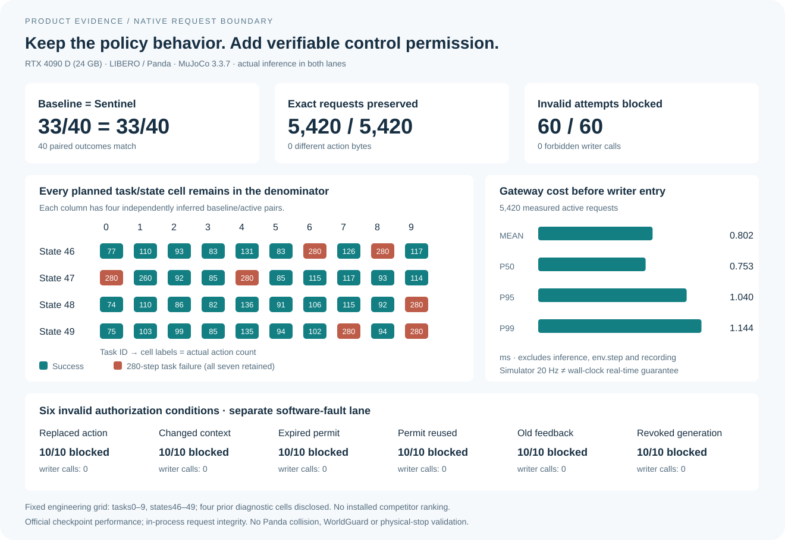

# Native VLA execution gateway: measured product behavior

Sentinel preserved every official native request and task outcome on the fixed
40-pair grid while adding a short-lived, one-use authorization boundary and
independently verifiable execution evidence. Six software authorization-fault classes
were blocked before the instrumented writer in all 60 attempts.

This evaluates the official `lerobot/smolvla_libero` Panda policy with and without
Sentinel. It is an engineering comparison of the execution integration, not a
ranking of installed competitor products or an improvement to policy accuracy.



## Fixed paired evaluation

The [protocol](RAW_REQUEST_PROTOCOL.md) and [freeze manifest](freeze-v3/freeze-manifest.json)
were retained before execution. The source is
`2ede56bd655554ad03b9dc93731ca1660aae9010`; the frozen runner, profile,
controller receipts and all three configurations match their SHA-256 identities.
Hardware: **RTX 4090 D (24 GB)**; MuJoCo **3.3.7**; ten LIBERO-Spatial tasks;
states **46–49**; actual inference in both lanes; execute **10** actions from
50 predictions; feedback budget **1500 ms**; permit lifetime **250 ms**.

| Endpoint | Direct native baseline | Sentinel active |
|---|---:|---:|
| Completed planned episodes | 40/40 | 40/40 |
| Task successes | 33/40 (82.5%) | 33/40 (82.5%) |
| Descriptive 95% Wilson interval | 68.05–91.25% | 68.05–91.25% |
| Task failures retained | 7 | 7 |
| Crashes / interface aborts | 0 / 0 | 0 / 0 |
| Submitted / accepted / observed | 5,420 / 5,420 / 5,420 | 5,420 / 5,420 / 5,420 |
| Official postprocessor → environment comparisons | 5,420 exact | 5,420 exact |
| Maximum action difference | 0 | 0 |

All **40 paired complete action sequences are byte-identical**; all trajectory
lengths and official terminal success labels match. Dependency file identities
match, excluding the deliberately different mode/run configuration. Seven
failures occur at task/state **0/47, 4/47, 6/46, 7/49, 8/46, 9/48 and 9/49**;
each reaches the 280-step cap in both lanes. These failures were not removed,
replaced or credited as authorization successes.

Four cells had prior diagnostic use, as disclosed in the protocol. The other
36 cells contain 29 successes in each lane. This does not make them a new task
distribution benchmark. The historical 93/100 observation-only study uses
other initial states and remains a separate result.

### Per-task outcomes

| Task ID | Baseline successes / 4 | Active successes / 4 | Byte-identical pairs / 4 |
|---|---:|---:|---:|
| 0 | 3 | 3 | 4 |
| 1 | 4 | 4 | 4 |
| 2 | 4 | 4 | 4 |
| 3 | 4 | 4 | 4 |
| 4 | 3 | 3 | 4 |
| 5 | 4 | 4 | 4 |
| 6 | 3 | 3 | 4 |
| 7 | 3 | 3 | 4 |
| 8 | 3 | 3 | 4 |
| 9 | 2 | 2 | 4 |

## Invalid authorization attempts

A separate fixed lane uses tasks 0–9/state 45, with six synthetic faults per
episode. **60/60** attempts have the expected denial reason and **zero** forbidden
writer calls. Expiry is injected with a timestamp beyond the permit deadline;
old feedback uses a changed feedback identity. These are reproducible software
contract checks, not naturally occurring incidents or physical hazard trials.

| Injected condition | Denial reason | Blocked / attempts | Forbidden writer calls |
|---|---|---:|---:|
| Action changed after authorization | `ACTION_REPLACED` | 10/10 | 0 |
| Queue/context changed | `CONTEXT_CHANGED` | 10/10 | 0 |
| Permit deadline exceeded | `LEASE_EXPIRED` | 10/10 | 0 |
| Consumed permit reused | `LEASE_REPLAY` | 10/10 | 0 |
| Feedback identity replaced | `FEEDBACK_CHANGED` | 10/10 | 0 |
| Authorization generation revoked | `GENERATION_REVOKED` | 10/10 | 0 |

After each invalid attempt, the unchanged legitimate action is submitted with
fresh authorization. The fault lane completes all ten episodes: eight task
successes, two 280-step failures, zero crashes, and 1,413 exact normal actions.
Those task outcomes are separate from the 60-attempt fault denominator. The
fault configuration records no task meshes; its attempts are displayed as
records rather than invented three-dimensional motion.

## Measured cost

Authorization plus pre-writer admission is summed **per actual active action**,
then summarized over 5,420 actions; percentiles are not sums of stage percentiles.

| Boundary | Samples | Mean (ms) | P50 (ms) | P95 (ms) | P99 (ms) |
|---|---:|---:|---:|---:|---:|
| Authorize + admission | 5,420 | 0.802 | 0.753 | 1.040 | 1.144 |
| Authorize | 5,420 | 0.554 | 0.520 | 0.725 | 0.796 |
| Admission before writer | 5,420 | 0.247 | 0.233 | 0.317 | 0.349 |
| Active env.step | 5,420 | 28.127 | 26.610 | 38.272 | 44.537 |
| Baseline env.step | 5,420 | 27.288 | 26.589 | 35.771 | 40.555 |
| Active policy inference → raw 50-action chunk | 559 | 351.505 | 327.860 | 454.556 | 467.021 |
| Baseline policy inference → raw 50-action chunk | 559 | 352.239 | 340.609 | 464.777 | 503.281 |

The measured gateway boundary excludes inference, environment stepping,
rendering, recording and evidence serialization. Runner elapsed time is
535.310 s for baseline and 548.357 s for active. Its timer starts after output
directory creation and ends after environment/trace closure; it includes
identity checks, imports, model loading, environment setup, inference and
recording, and excludes final result/replay serialization and bundle signing.
The sequential runs do not isolate all host scheduling or simulator cost.
The **20 Hz simulator/replay clock is not a wall-clock real-time guarantee**.

## Product interpretation

- Keep existing official policy processors and native control semantics.
- Place authorization on the exact final request at the captured environment writer.
- Reject substituted, reused, expired or context-invalid requests before that writer.
- Import with an independently selected public key, inspect actual mesh/pose/action/
  permit/feedback records in the App, and export the original signed evidence.

This is an in-process request-integrity boundary. It does not establish Panda
collision avoidance, WorldGuard deployment, physical braking, hostile-process
isolation or device safety. MoveIt Pro's physical controls and LeRobot's RTC
remain useful complementary capabilities; see [method and ecosystem roles](../../../native_method_position.md).

## Reproduce and inspect

The [native artifact release](https://github.com/LancerLSY/sentinel-evc-lab/releases/tag/native-vla-product-20261003)
contains each signed ZIP plus its separately retained 32-byte raw
Ed25519 public key, all frozen configurations, the paired-cell CSV and the
comparison JSON. [Artifact filenames, download URLs and SHA-256](ARTIFACTS.json)
identify the original evidence and retained negative runs. [Independent verification](independent-verification.json) and
[root audit](root-audit.json) retain the local check; the recomputed comparison
is byte-identical to the GPU output, SHA-256
`0989df712330b582d69ec074f3689301f4e39b2e56b598d8420dde2887cf5e4d`.

Import all three bundles with `sentinel-evc native-import` using their actual
run IDs `native-formal-baseline-v3`, `native-formal-active-v3` and
`native-formal-fault-v3`. Run the public analyzer against the resulting bundle
folders with separately selected public keys:

```bash
python experiments/vla/summarize_native_runs.py \
  --baseline /data/native-formal-baseline-v3 --baseline-key /keys/baseline.public \
  --active /data/native-formal-active-v3 --active-key /keys/active.public \
  --fault /data/native-formal-fault-v3 --fault-key /keys/fault.public \
  --out /data/new-comparison
```

The three predeclared scene/video cells are **tasks 0, 4 and 5/state 46**.
Companion films replay retained actions and audit the source trajectory; they
add no benchmark samples. The first ordered failure, **task 0/state 47**, is
retained as a separately labeled post-hoc diagnostic. [Video, interactive replay and failure interpretation](MEDIA.md) explain each
view and retain media provenance.

## Retained compatibility failures

The earlier bounded raw-request profile incorrectly applied a downstream
controller range before `env.step`. Its partial active and fault runs remain
negative results in [V2_NEGATIVE_RESULTS.md](V2_NEGATIVE_RESULTS.md), with all
planned/unrun denominators and the original signed bundles. The representation-
defined float32 profile preserves the upstream controller's clipping location;
it does not infer a physical safety envelope from observed action maxima.
The failed original JSON serialization and launch are retained separately and
excluded from completed paired statistics.
