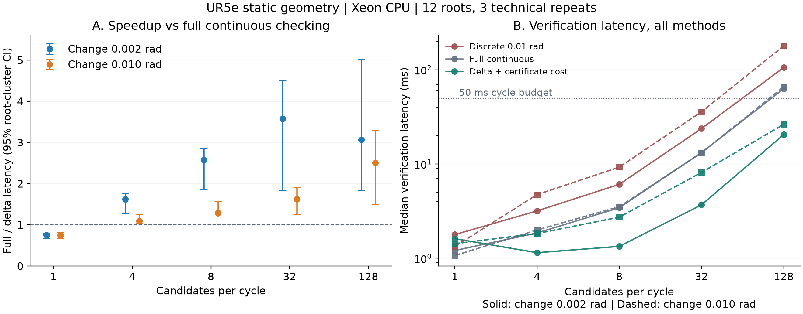
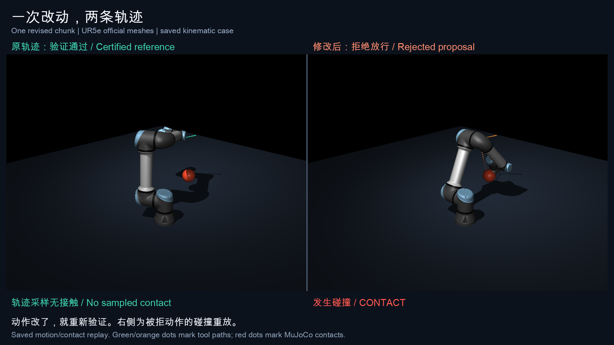

# Sentinel EVC v2：动作改动后的重验、写入许可与三维证据

## 结论

**Sentinel 的产品价值是：机器人改了下一段动作后，保留仍然有效的检查，只重算受影响的部分，再把获准动作的字节绑定到实际软件写入。** 使用者可以在记录中找到批准了什么、写出了什么，以及动作修改后哪里失去了原来的依据。

四候选 UR5e 配置中，计入父证书建立和新证书生成成本，增量检查比从头连续检查快 **1.092–1.619 倍**。两种修改幅度的 95% 根簇置信区间均高于 1。全网格增量判定与完整连续检查一致。数值 CLI 与 App 共用的执行路径已接入精确剩余轨迹的证书复用。

证据支持两项可展示的优势：**降低重复验证成本**，以及**把批准动作与写入动作接起来**。对照是可复现的检查方法和本仓库旧实现。具名竞品的完整产品比较、UR5e 与真实 VLA 的整套闭环属于下一项实验。

## 1. 材料与版本

| 材料 | 身份 | 用途 |
|---|---|---|
| 主分支基线 | `45cc88347ea812a84c5021fc793387dce6bea295` | 产品行为对照 |
| Claude 三提交补丁 | 末提交 `bdf9d49e1444ba57db69afe6e42b5c5e154614f1` | 待审实现与原始试点 |
| 契约及几何修复 | `fbac9321d70a41259792b0fbf23433fe3e6632d2` | 经独立复核的实现 |
| 数值产品集成 | `eb7b681` | CLI/App 共用执行路径 |
| 官方机械臂模型 | Menagerie `4d038b3feae26ec82b46a4d586379114012a8ac7` | 固定 UR5e 模型及渲染资产 |
| 官方 MJCF | SHA-256 `ffd0a7b336d3c2d27c35a15cc0d4aaa95196769aca190ac8d6522d3318c345a0` | 模型内容绑定 |

原始三份输入的 SHA-256：

```text
Sentinel_EVC_v2_Differentiation_and_Experiments.md
bcf2d9b18627f9008929697ac57ffb544ecb4c25f182d03df7f3366e78251a67
sentinel-evc-v2.patch
8809aba6961f952c72e0e3b2a7f8222e15b184e09cfb60aa121bf86409b6466a
Sentinel_EVC_v2_pilot_results.zip
0347eb0b071a483dcc9a45ad0c32ec01a401d2f1f6256a4548723c9989db68c8
```

原始试点放在 `pilot/`。修复后的数据放在 `evidence/`。保留报告中的旧数字供追溯，产品性能主张采用下面的修复后实验。

## 2. Claude 方案中需要修复的实质问题

| 问题 | 可构造的后果 | 已实施修复 |
|---|---|---|
| 规范化哈希把相差一个浮点最小单位的场景合并 | 几何结论相反，场景身份仍相同 | `Scene.hash` 改为带类型域的精确 float64 内容哈希，旧值保留为 `legacy_hash` |
| 只凭计划的规范化哈希寻找证书 | 字节已变化的动作可能沿用旧证书 | 证书、许可、COMMIT 绑定 `plan_exact`，DISPATCH 记录精确动作字节及其哈希 |
| 提交与撤销不共用最终准入锁 | 撤销附近可能新增旧代次提交 | 短同步提交与代次切换在同一准入锁内完成，网络和控制器等待在锁外 |
| 日志容量检查与写入之间有时间窗口 | 写出动作后可能没有 ACK 记录空间 | 原子预留 COMMIT、DISPATCH、ACK，已预留记录固定保留，日志缺口保持可见 |
| 写入器以 `KeyboardInterrupt` 退出 | 已进入写入却缺少失败 ACK | 捕获 `BaseException`，写出预留的失败 ACK 后原样抛出 |
| 大尺度坐标下的浮点抵消 | 子轨迹完整检查拒绝，继承余量仍为正 | 对父轨迹、子轨迹与场景共同限制数值尺度，超出范围转完整检查 |
| 空间索引边界舍入 | 极窄边界处遗漏应检查的障碍 | 向上舍入搜索半径并增加边界余量，超尺度时枚举所有障碍 |
| 机械臂证书未充分绑定内容和模型 | 修改下界数组或换模型后继续继承 | 不可变字节存储，绑定模型、场景、配置、形状、深度和证书内容，可信进程发行封印 |
| 机械臂递归检查缺少工作量上限 | 切线附近检查量膨胀 | 默认 200,000 次 FK 预算，耗尽返回 unknown 并拒绝放行 |
| 试点漏计证书生成成本 | 加速比偏高 | 公平实验计入验证、证书复制、哈希、发行封印与父证书摊销 |

数值继承的实数证明与浮点实现分别表述。机械臂使用 1 nm 数值保护余量，实测判定一致性单独报告。该余量是工程保护，不能替代全浮点域的形式化证明。

独立审查见 [契约复核](evidence/reviews/contract-review.md)、[数值产品集成复核](evidence/reviews/product-v2-integration-review.md) 与 [几何复核](evidence/reviews/geometry-review.md)。

## 3. 写入许可：随机化契约故障实验

协议在执行前冻结。主种子为 1584471580。每类使用 200 组独立生成的动作和上下文，共 1,600 个案例。

| 类别 | 案例 | 目标写入器进入次数 | 结果 |
|---|---:|---:|---|
| 动作相差 1 ULP | 200 | 0 | `ACTION_REPLACED` |
| 许可重复使用 | 200 | 0 | `LEASE_REPLAY` |
| 许可过期 | 200 | 0 | `LEASE_EXPIRED` |
| 反馈替换 | 200 | 0 | `FEEDBACK_CHANGED` |
| 上下文替换 | 200 | 0 | `CONTEXT_CHANGED` |
| 执行代次撤销 | 200 | 0 | `GENERATION_REVOKED` |
| 证据缺口 | 200 | 0 | `EVIDENCE_GAP` |
| 合法负对照 | 200 | 200 | `ALLOWED` |

这 1,600 个案例全部得到预期结果。额外的并发撤销和异常退出案例保留了已进入写入的 ACK。两次本地运行与服务器运行的原始 JSONL 逐字节相同，SHA-256 为 `05ae7d406de0d35c8676f29d8ce8ab48f0b157c092ea68e509dafa4e015a4187`。

这是有界、可重复的故障演练。原始 17 类构造对照也被复现：先检后执行 1 类、签名令牌 6 类、原版 v1 11 类、v2 17 类。每类只有一个构造实例，且对照是仓库内的机制消融，不能写成竞品拦截率。

[冻结协议](evidence/native-fault-drill-server/protocol.json) · [逐例记录](evidence/native-fault-drill-server/raw.jsonl) · [汇总](evidence/native-fault-drill-server/summary.json)

## 4. UR5e 性能：冻结输入与公平计时

### 设计

比较三种实现：0.01 rad 离散采样、从头连续检查、增量连续检查。三种方法使用完全相同的候选动作块。先生成并冻结全部输入，再进行计时。未来轨迹由完整连续检查认可的第一个候选决定，各计时方法都不能改变输入选择。

主网格为候选数 1、8、32、128，修改幅度 0.002、0.01 rad。四候选配置作为补充实验单独冻结。每格 12 个根，每根 60 周期，前 20 周期预热，后 40 周期计时。执行三个 Python 进程，并轮换方法顺序。BLAS 使用一线程，进程绑定 CPU 0–2。

三个进程复用了相同的 12 个根，属于技术重复。原冻结协议把分析单位写成根与进程的组合。首次汇总和结果查看前，另行冻结了统计修订：以根为簇，先对三个技术重复取中位数，再对 12 个根做 10,000 次配对 bootstrap。原协议和修订都保留。四候选实验是补充分析，报告时与主网格分列。

增量耗时包含证书内容、模型和配置检查，以及选中证书的复制、哈希和发行封印。父证书建立成本按 40 个计时周期摊销。下表是验证阶段的墙钟时间，处理器为 **Xeon Platinum 8474C**。服务器的 **RTX 4090 D 24 GB** 用于三维渲染，未承担这些几何计时。

### 全网格结果

加速比为对照耗时除以增量耗时。大于 1 表示增量更快。区间按 12 个根簇计算。

| 候选数 | 修改幅度 rad | 完整/增量，95% CI | 离散/增量，95% CI |
|---:|---:|---:|---:|
| 1 | 0.002 | 0.749 [0.663, 0.804] | 1.106 [0.967, 1.186] |
| 1 | 0.010 | 0.749 [0.676, 0.819] | 0.936 [0.613, 1.302] |
| 4 | 0.002 | 1.619 [1.276, 1.755] | 2.776 [2.132, 2.954] |
| 4 | 0.010 | 1.092 [1.035, 1.253] | 2.588 [2.288, 3.027] |
| 8 | 0.002 | 2.571 [1.867, 2.859] | 4.554 [3.304, 5.056] |
| 8 | 0.010 | 1.291 [1.197, 1.575] | 3.398 [2.957, 4.142] |
| 32 | 0.002 | 3.580 [1.832, 4.509] | 6.444 [3.166, 8.129] |
| 32 | 0.010 | 1.621 [1.251, 1.914] | 4.400 [2.896, 5.255] |
| 128 | 0.002 | 3.065 [1.835, 5.029] | 5.157 [2.933, 8.443] |
| 128 | 0.010 | 2.504 [1.499, 3.303] | 6.790 [3.750, 8.964] |



10 格共包含 **249,120 个唯一候选输入**。三个技术重复产生 **747,360 次增量与完整检查的逐候选判定对照**，含预热。分歧为 0，FK 预算 unknown 为 0。离散与完整检查使用同样数量的比较。0.01 rad 离散检查在 `N=128, jitter=0.01` 中漏掉 1 个唯一候选的窄接触，相同输入在三个技术重复中重复出现。

事后诊断定位到零起始编号的 root 2、cycle 37、candidate 32。连续检查拒绝，离散检查放行。独立 0.0005 rad 网格的最小代理余量为 −0.988 µm。MuJoCo 在 1,264 个姿态中的 5 个检测到接触，首次接触距离为 −0.424 µm。该证据说明这一个亚微米案例被采样漏过，量级、轨迹和判定均保留在 [诊断包](evidence/discrete-disagreement/README.md)。

四候选配置的完整检查与增量检查中位数分别为：

| 修改幅度 | 完整连续检查 | 增量检查，含父证书摊销 | 完整/增量 |
|---|---:|---:|---:|
| 0.002 rad | 1.855 ms | 1.145 ms | 1.619 倍 |
| 0.010 rad | 1.998 ms | 1.830 ms | 1.092 倍 |

单候选的增量速度为完整检查的 0.749 倍，即耗时约增加 33.5%。证书开销需要多个候选或多个控制周期才能摊薄。

### 50 ms 周期预算

| 候选数 | 修改幅度 rad | 离散超时 | 完整超时 | 增量超时 |
|---:|---:|---:|---:|---:|
| 1 | 0.002 | 0/1440 | 0/1440 | 0/1440 |
| 1 | 0.010 | 0/1440 | 0/1440 | 0/1440 |
| 4 | 0.002 | 0/1440 | 0/1440 | 0/1440 |
| 4 | 0.010 | 0/1440 | 0/1440 | 0/1440 |
| 8 | 0.002 | 0/1440 | 0/1440 | 0/1440 |
| 8 | 0.010 | 0/1440 | 0/1440 | 0/1440 |
| 32 | 0.002 | 0/1440 | 0/1440 | 0/1440 |
| 32 | 0.010 | 1/1440 | 0/1440 | 0/1440 |
| 128 | 0.002 | 1440/1440 | 1440/1440 | 235/1440 |
| 128 | 0.010 | 1440/1440 | 1440/1440 | 344/1440 |

每格有 1,440 个实测周期，来自 12 根 × 40 周期 × 3 技术重复。128 候选时增量仍有 235 或 344 个周期超时。其余增量配置本组没有 50 ms 超时。FK 次数预算约束检查工作量，不能代替墙钟截止时间管理。

[主协议](evidence/fair-arm/protocol.frozen.json) · [统计修订](evidence/fair-arm/analysis-amendment.pre-summary.json) · [主汇总](evidence/fair-arm/summary.root-cluster.json) · [四候选汇总](evidence/fair-arm-n4/summary.root-cluster.json)

## 5. 独立 MuJoCo 接触交叉检查

使用固定的官方 UR5e MJCF。保留官方九个碰撞几何体，校对类型、半径、轴线及所属连杆。设置关节位置后调用 `mj_forward`，独立读取机械臂自碰撞和机械臂与两个球障碍的接触。

| 项目 | 结果 |
|---|---:|
| 随机关节姿态 | 2,000 |
| MuJoCo 检测到接触的姿态 | 333 |
| MuJoCo 接触但代理模型放行 | 0 |
| 代理模型拒绝但 MuJoCo 无接触 | 28 |
| FK 轴端点最大误差 | 6.66 × 10⁻¹⁶ m |
| 运动轨迹 | 360 |
| 独立密集姿态检查点 | 482,073 |
| 连续代理模型判定 free 的轨迹 | 237 |
| 上述 237 条中的密集 MuJoCo 接触 | 0 |
| 代理模型 collision / joint_limit / unknown | 93 / 30 / 0 |

密集检查的最大关节间距为 0.0005 rad。轨迹覆盖六个场景，每场景 30 根，分别检查父轨迹和修改后的轨迹。

28 个保守分歧的事后诊断都涉及末端圆柱。检查器把它包成胶囊，包络体积大于实际圆柱。该差异提高了保守性，也会拒绝一些 MuJoCo 无接触姿态。

本实验是运动学接触审计。连续判定来自静态胶囊代理模型，MuJoCo 在密集离散姿态上交叉检查。这里的裸臂模型包含关节限位、自碰撞和球障碍，夹爪、工具、桌面、动态障碍与真实跟踪误差需要相应模型。

[协议](evidence/mujoco-crosscheck-protocol.json) · [结果](evidence/mujoco-crosscheck/result.json) · [保守分歧诊断](evidence/mujoco-crosscheck/conservative-differences.json)

## 6. 三维视频：清楚展示为什么拒绝

视频采用实际保存的 `late_suffix/root0` 轨迹与官方 UR5e 外观模型。左侧展示获准父轨迹，右侧展示被拒修改轨迹的碰撞后果。绿色和橙色轨迹标出末端运动，红点标出 MuJoCo 接触。每帧关节位置、接触记录和文件哈希都随包保存。



[观看 1080p 三维视频](media/ur5e_changed_chunk.mp4) · [逐帧记录](media/frames.json) · [媒体凭据](media/media-receipt.json)

视频为 1920 × 1080、30 fps、10 秒。父轨迹 300 帧均无接触，修改轨迹 98 帧出现接触。这是反事实运动学重放，用于展示拒绝原因。机器人控制器与 VLA 策略并未执行视频中的被拒动作。

## 7. 数值产品集成与设计对齐

CLI 和 App 使用同一数值执行生命周期。所选计划先建立一次 v2 根证书。每个短前缀执行后，对实际剩余的精确轨迹继承证书，再由原 Authority 签发许可。动作修改、场景修改、模型配置变化和父证书内容变化均要重新验证。

固定 seed7 产品对照中，新旧实现都提交、接受和观察到 40 步。选中动作、观测历史与执行游标相同。新实现建立 1 次根证书，剩余轨迹完整重验为 0，复用了 220 个线段。两个签名包各含 179 条事件，七层独立证据校验通过。候选记录中的单调时钟期限和由此生成的身份不同，排除这些每次运行变化的字段后，候选决策相同。

独立停止恢复运行也完成。实际停止游标为 2，恢复许可全部使用新的执行代次，证书从实际剩余位置开始，复用了 240 个线段。签名证据校验验证文件、事件和身份关系，几何语义仍由对应检查器负责。

| v4 设计要求 | 当前对齐情况 | 后续实验 |
|---|---|---|
| 最终动作变化后重验，F04 | 数值运行和 UR5e 实验均有全检对照 | UR5e 验证接入 VLA 执行器 |
| 准备、提交上下文绑定，F05 | 精确动作绑定，产品提供场景内容哈希 | 第三方适配器启用严格场景 profile |
| 单写者及撤销线性化，F06 | 最终准入与代次变化共享锁，独立竞态复核 | 真机驱动提交与取消语义 |
| submitted / accepted / observed，F07 | 数值产品实际记录三种游标 | 硬件反馈与传感延迟 |
| unknown 有界回退，F09 | 机械臂检查有 FK 上限，耗尽不放行 | 实测截止时间与超时取消 |
| 独立证据校验，F10 | 原校验器保留，精确动作和许可字段可追溯 | 独立重算几何结论、客户信任锚 |
| 独立根分组统计，F11 | 每格 12 根，技术重复保留在根簇内 | 独立任务、模型与场景批次 |
| 20 Hz，最多四候选 | 四候选两格实测加速，全部周期小于 50 ms | 含推理、驱动与传感的闭环总延迟 |
| WorldGuard 预测绑定最终动作 | 原预测接口和精确后缀约束保留 | v2 几何与已训练模型的共同闭环 |

本次没有训练模型，也没有重跑 SmolVLA 推理。仓库中既有原生 VLA 实验保留原身份，不算作本次 v2 联合验证。

## 8. 数值规模与许可流水线

数值 v2 在 1,000 个构造案例和 4,320 个流式周期上与完整检查判定一致。障碍数至少 16 时，计入根证书和回退成本，相对较快的完整检查，中位数加速为 3.30–13.70 倍，P95 加速为 2.02–8.14 倍。该数据在 Apple M4 上取得，保留为修复后规模实验。其计时未使用上面的独立进程、顺序轮换和根簇区间设计。

一个障碍时速度为完整检查的 0.84–0.99 倍。父证书只用一次的构造实验中，v2 比 v1 完整检查多花 51.8% 时间。规模优势来自复用与摊销，简单一次性任务优先完整检查。

许可流水线的参考模拟把 40 步从 80 个控制周期降为 41 个周期，K=1 时授权新鲜度为 50 ms。原始输出逐字节复现。这说明参考执行器中的等待可以重叠。数值产品仍使用已有短前缀排空流程，实测墙钟流水线收益和真机吞吐需要单独测量。

## 9. 产品定位与下一项决定性实验

适合的用户是已经有机器人策略、并且每周期会产生多个动作候选的集成团队。他们需要反复修改动作、维护现有检查结论，并查清最终动作进入驱动之前发生的变化。

可直接使用的介绍是：

> 机器人临时改动作时，Sentinel 会检查哪些旧结论还能用，只重算变化部分，再核对写出去的动作是否就是获准的那份。四候选 UR5e 实验中，检查耗时降低，判定与从头检查一致。每次批准和软件写入都有可查记录。

连续碰撞检查已有成熟实现，[FCL](https://github.com/flexible-collision-library/fcl) 和 [MoveIt 的 Bullet 集成](https://moveit.picknik.ai/main/doc/examples/bullet_collision_checker/bullet_collision_checker.html) 都提供相关能力。当前差异化主张围绕**跨修改的证书复用、最终字节授权和写入证据的连接**。本组实验尚未建立任何具名竞品无法提供这一组合的排他性结论。

下一项联合实验应固定真实 VLA 检查点、至少四候选和 UR5e 执行适配器。比较从头连续检查与增量检查，保持相同候选和选择规则。逐次记录推理、验证、授权、驱动提交、反馈和任务结果。主要验收项为判定一致、获准字节与提交字节相同、任务成功率保持、完整周期延迟下降，并保留全部超时、碰撞拒绝和任务失败。

## 10. 可信边界、验证与复现

精确字节证据来自可信软件写入适配器。机械臂证书的进程内发行封印证明本进程认可的来源，系统不抵御能修改发行器的恶意同进程代码。`Context.scene_hash` 在兼容接口中仍可省略，当前产品调用方已提供。流水线的历史前缀哈希记录位置，夹爪事件由各自计划和许可绑定。

MuJoCo 版本为 3.8.1，NumPy 为 2.3.2，Python 为 3.12.3。服务器完整现有检查为 **262 通过、0 跳过**。本地完整检查为 253 通过、9 项 MuJoCo 条件跳过。计数来自本轮各自的检查运行，互不相加。本轮复用所提供补丁的测试与仓库检查，修复过程未编写新测试用例。

输入、模型、源码、协议、逐例结果、统计脚本与媒体均有哈希。完整候选 NPZ 已从服务器取回，随完整实验包提供。复现入口见 [REPRODUCE.md](REPRODUCE.md)。旧签名证据不改写，旧场景哈希由 `legacy_hash` 保留，新执行场景身份使用精确内容哈希。
