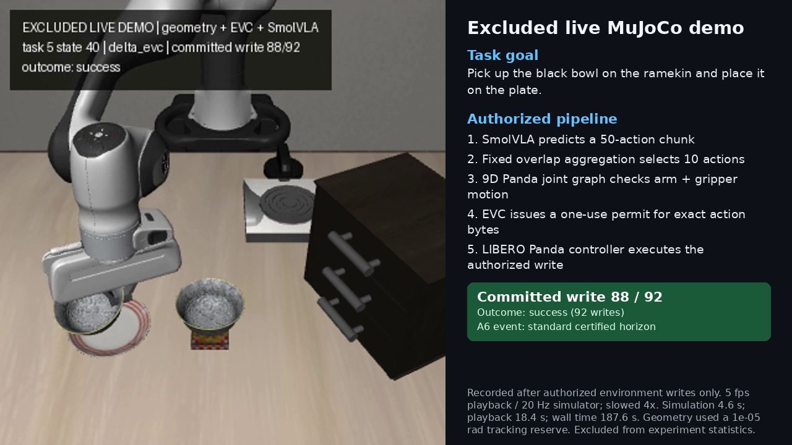

# Unified VLA repair: exact simulation restoration and certified continuation

Restoring the complete controller state eliminated forecast-to-execution drift in the repaired paired runs. Certified short-prefix continuation increased task completion from **2/6 to 3/6** for both final-action branches; the parent-only baseline remained **2/6**. All failed roots are retained. This is a six-root result, with no claim of general success-rate or real-time advantage.

The later A8 run also completed the second task-5 root in the full-final branch, but its grid and completion shard were deadline-limited. The unaggregated native control succeeded on all 6/6 roots, so a completion gap remains in the combined deployment path.

## Scope

These results use the official `lerobot/smolvla_libero` checkpoint with the native LIBERO Panda environment. They do not evaluate, emulate, or validate the SO100 fine-tuned overlay.

The formal grid contains six fixed episode roots: LIBERO Spatial tasks 0, 4, and 5, each at initial-state indices 40 and 41. Every branch runs its own closed loop from the same root; observations and actions are not pooled across branches. The three branches are:

- `parent_only`: certify the latest raw policy chunk, then dispatch the preregistered temporal aggregate under the legacy parent disposition;
- `full_final`: certify the exact aggregate that will be dispatched;
- `delta_evc`: use the raw certificate for incremental checking of the exact aggregate, with full-check fallback.

All three branches write exact native actions through the same one-use gateway. A5 and A6 each also ran an excluded one-step preflight on task 0, state 49.

## What A5 repaired

Three earlier engineering preflights (A4/A4b/A4c) failed restoration checks before formal trials. Their logs are retained separately and contribute no formal episode.

A3's Python-state walker had silently captured zero controller/Python objects. Its root object was `lerobot.envs.libero.LiberoEnv`, and the old walker rejected that root before traversing its members. Therefore, A3's claim that forecast restoration covered controller and RNG state was incomplete.

A5 made four related repairs:

1. It traversed the actual LeRobot environment root and included nested safe state plus per-object RNG state in the rollout fingerprint.
2. It preserved the original top-level mutable references while restoring values, preventing `DeltaBuffer.push()` aliasing from replacing distinct `current` and `last` arrays with a shared post-forecast reference.
3. It retained in-place restoration of the complete native `MjData`, including solver and contact-derived fields, rather than reconstructing state with a forward pass.
4. It expanded the certified trajectory from seven arm hinges to nine Panda coordinates: seven hinge positions in radians and both finger slides in metres.

An excluded, model-free forensic replay exercised four retained A3 action chunks on both task-5 roots. Forecast and actual execution matched at every retained physics substep: maximum qpos error was `0.0`, raw contact-signature sequences were identical, and the complete before/after fingerprints matched. This proves the tested restore path for those states and chunks. It does not establish universal identity preservation for every possible nested Python object graph; the diagnostic explicitly records that boundary.

## A5 and A6 outcomes

A6 added one prospective execution rule to the repaired A5 system. When a ten-action final chunk was denied, `full_final` and `delta_evc` tried unchanged prefixes of lengths 5, 2, and 1, in that order. The first certified prefix was dispatched, followed by immediate re-observation and replanning. A6 did not synthesize a replacement action, widen a tolerance, or add an allowed contact. The `parent_only` branch was unchanged.

| Branch | A5 successes | A6 successes | Change |
|---|---:|---:|---:|
| `parent_only` | 2/6 | 2/6 | 0 |
| `full_final` | 2/6 | 3/6 | +1 |
| `delta_evc` | 2/6 | 3/6 | +1 |

The added A6 success was task 5, state 40, for both certified final-action branches. Each completed in 92 native writes. The matching `parent_only` episode stopped after 90 writes. Both task-0 roots succeeded under every branch in A5 and A6. Both task-4 roots and task 5/state 41 remained unsuccessful; they terminated on fail-closed denials rather than crashes.

Across all 18 formal episodes in each run:

| Run | Crashes | Tracking-drift failures | Observed forbidden contacts |
|---|---:|---:|---:|
| A5 | 0 | 0 | 0 |
| A6 | 0 | 0 | 0 |

Thus A5 and A6 each had zero crashes, zero tracking-drift failures, and zero observed forbidden contacts on the formal grid.

The A6 validation receipt reports 12 recovery invocations: six found a certified unchanged prefix and six found none. A failed recovery produced no action. The outcome gain is therefore a small paired result on six roots, not evidence of a general success-rate improvement.

## Certificate and contact boundaries

The geometry certificate checks joint-linear Panda motion against compiled MuJoCo collision proxies while treating the non-arm scene as frozen at the chunk root. It includes the moving fingers in the nine-coordinate path, but it does not continuously certify the future motion of a grasped object or other moving scene bodies.

Native forecast contact traces are a separate evidence channel. They record contacts at every internal physics substep of the actual controller forecast. A8 uses known unwanted contacts in that native trace as an additional veto. That veto is not equivalent to the frozen-scene continuous certificate, and its pending results must not be attributed to A5 or A6.

`0` observed forbidden contacts describes these recorded MuJoCo episodes under the declared contact policy. It is not a continuous physical-safety claim, a functional-safety claim, or evidence that the system is ready for deployment.

No clean speed comparison is reported. The runs include branch-specific certificate work and shared diagnostic checks, and they were executed as bounded experimental runs rather than a controlled performance benchmark.

## Additional amendments

### A7: single-step Cartesian recovery

A7 completed the same six-root grid. The fixed six single-step Cartesian transformations did **not** add a task success: parent-only remained 2/6, and both final-action branches remained 3/6. Four selected repairs extended two cabinet episodes by a few actions, but neither reached the official goal. No crashes or observed forbidden contacts occurred. The independent receipt verifies 1,134 exact writes, 374 certificates, 762 final-branch substep traces, and zero tracking error or event-chain gaps. [A7 receipt](receipts/A7-evidence-validation.json) and [archive](evidence/A7-run.tar.gz) retain all runs.

### A8: mesh separation, strict tracking and contact veto

A8 added bounded optional mesh face/edge projection directions (at most 2,048 unique extra axes), restored the original strict `1e-8` rad tracking reserve and abort tolerance, and vetoed known unwanted forecast contacts. All contact permissions and native bounds stayed fixed. These combined changes are not an isolated ablation of one mechanism.

The original shard completed the task-4 and task-5 roots for `parent_only` and `full_final`. Both parent task-5 roots failed. **Both full-final task-5 roots succeeded**, at 92 and 103 writes; state 41 had stopped at 40 writes in A5–A7. Both cabinet roots still failed. The delta state-40 task succeeded at 92 writes; delta state 41 stopped at the deadline after 50 writes. The six task-0 cases had not started in this shard.

A separately frozen task-0 completion shard succeeded on state 40 in all branches (77 writes) and state 41 in parent-only (74 writes). State-41 full-final reached its deadline at 20 writes, and state-41 delta did not start. Both shard manifests are **partial**, with clean artifact integrity. They are retained separately; these unfinished cases do not support a completed six-root success-rate comparison. An excluded state-41 delta live follow-up executed 74 writes with no task success before its deadline; it does not replace the formal timeout.

All recorded A8 writes had zero measured hinge/slide tracking error and zero observed forbidden contacts. Seven selected forecast-contact vetoes produced no dispatch. Every one also had a geometry collision decision: no additional geometry-pass/contact-veto rejection was observed in selected or recovery candidates. Thus this run does not establish incremental collision-interception benefit from the veto.

### Native direct control: the remaining completion gap

The excluded posthoc unaggregated native horizon-10 control used the same checkpoint, six roots, seeds, installed assets and 280-action cap. **All six tasks succeeded**, with 600 direct environment writes and zero crashes. Strict checkpoint reload matched 500 keys with no missing or unexpected keys; exact postprocessor-to-environment byte matching passed on all 600 writes.

This control does not use the 50/50 aggregate, geometry admission or repair policy. It therefore exposes a completion gap in the combined deployment path, but cannot attribute that gap separately to aggregation, geometry or contact policy. Its recorder did not measure the unified forbidden-contact metric, so task success is not evidence of contact-policy compliance. [Independent control receipt](receipts/excluded-native-direct-F-evidence-validation.json) and [raw control evidence](evidence/native-direct-control.tar.gz) are retained.

The current integration is not product acceptance. The next discriminating comparison is an unaggregated full-final geometry lane on these exact roots, followed by task-specific contact and route-repair analysis. Real-time cost and the cabinet failures remain open.

## Evidence and implementation

- Runner: [`run_unified_libero.py`](../../../../experiments/vla/run_unified_libero.py)
- Geometry checker: [`panda_geometry.py`](../../../../experiments/vla/panda_geometry.py)
- Safe-prefix implementation: [`safe_prefix_recovery.py`](../../../../experiments/vla/safe_prefix_recovery.py)
- A5 protocol amendment: [`unified_libero_amendment_A5.md`](../../../../experiments/vla/unified_libero_amendment_A5.md)
- A6 protocol amendment: [`unified_libero_amendment_A6.md`](../../../../experiments/vla/unified_libero_amendment_A6.md)
- A5 frozen config: [`config_unified_libero_A5_20261004.json`](../../../../experiments/vla/config_unified_libero_A5_20261004.json)
- A6 frozen config: [`config_unified_libero_A6_20261004.json`](../../../../experiments/vla/config_unified_libero_A6_20261004.json)
- A5 validation receipt: [`receipts/A5-evidence-validation.json`](receipts/A5-evidence-validation.json)
- A6 validation receipt: [`receipts/A6-evidence-validation.json`](receipts/A6-evidence-validation.json)
- Rollout-state forensic receipt: [`receipts/rollout-state-forensic-summary.json`](receipts/rollout-state-forensic-summary.json)
- A5 archive: [`evidence/A5-run.tar.gz`](evidence/A5-run.tar.gz)
- A6 archive: [`evidence/A6-run.tar.gz`](evidence/A6-run.tar.gz)

## Actual 3D motion

The single live capture completes task 5/state 40 in 92 authorized writes. At the last denied ten-action proposal, a certified two-action prefix completes the task. The 1280x720 presentation uses only frames recorded after actual environment writes, with no forecast frames or synthesized motion. Playback is 5 fps, four times slower than the 20 Hz simulator: 4.6 simulated seconds become 18.4 seconds of playback. The source run took 187.6 seconds of wall time. It is an excluded demonstration, not an additional benchmark episode. [Capture receipt](receipts/A6-live-capture-summary.json) and [presentation metadata](video/task05-state040-presentation-metadata.json) preserve the source and output hashes.
