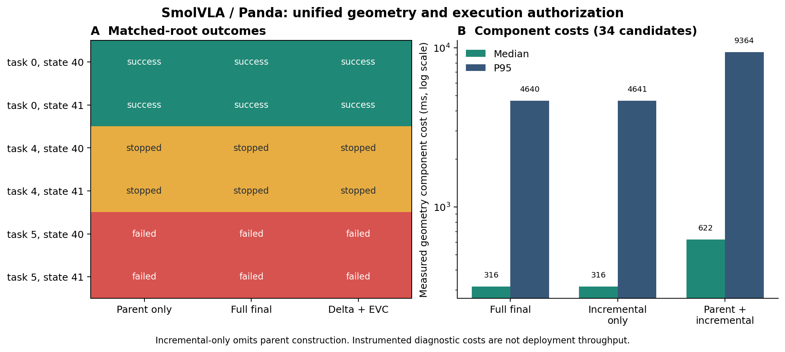
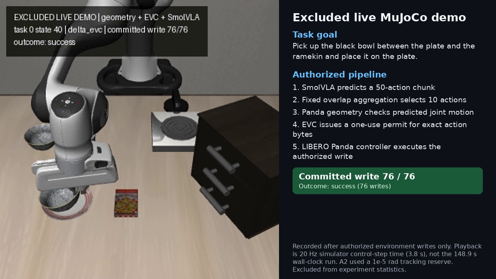

# SmolVLA、Panda 几何检查与 EVC 的统一闭环

**本页保留原始至 A3 的历史结果。后续状态恢复修复、九坐标检查与动作接续结果见 [修复实验](REPAIR_RESULTS.md)。**

这组实验把真实模型输出、自然动作聚合、机械臂几何检查、一次性许可和实际仿真执行接在同一条链路中。每十步重新读取图像并预测动作，实际写入控制器的字节由许可逐次绑定。它补上了此前各模块分别验证、缺少统一运行的证据缺口。

主要结果：**闭环接通，两个抓取初态完成；自然动作修订的碰撞收益和加速优势没有在这组任务中出现。** 接触复杂的任务触发预测与执行偏差停止。全检 P95 成本超过本配置的控制周期。

## 实验设计

- 真实硬件：RTX 4090 D 24GB。
- 官方 `lerobot/smolvla_libero` Panda 检查点。500 个权重键全部匹配，缺失和额外键均为零。它与 SO100 微调 overlay 分别报告。
- MuJoCo 3.3.7、robosuite 1.4.0、hf-libero 0.1.4、LeRobot 0.6.1。
- LIBERO spatial 任务 0、4、5，初态 40、41，固定两个种子，共六个配对初态。
- 预测 50 个动作，每轮执行最多 10 个。第二轮起，将新预测前十步与上一段未执行的对应十步按 50/50 聚合。没有移动障碍或注入危险动作。
- 三个分支：只检当前原始动作；完整检查聚合后动作；父证书、增量继承与必要全检。
- 每个分支都在自己的实际反馈上继续运行。拒绝、崩溃和未完成任务保留在分母中。

此处聚合是明确选择的部署变体。正式配置、协议和两次修订都在各自运行前保存了源码与配置哈希。

## 原始运行与三次修订

| 阶段 | 预定执行 | 结果 | 保留原因 |
|---|---:|---|---|
| 原始严格入口 | 18 | 成功 0/18；全部在早期被原生入口拒绝 | 模型夹爪输出略超出 `[-1,1]`，例如 `-1.003506` |
| A1 显式控制器输入裁剪 | 18 | 每个分支成功 2/6；各停止 2 次、偏差中止 2 次 | 全部初态重跑，裁剪发生在几何检查和授权之前 |
| A2 接触场景误差余量 | 6 | 成功 0/6；全部超出预定误差预算 | 只复验任务 5，结果与 A1 分开 |
| A3 完整原生状态恢复 | 6 | 成功 0/6；偏差与 A2 相同 | 完整恢复 MjData 没有解决该偏差 |

四个阶段共 48 次预定任务执行，全部有终态记录，无未开始案例。工程预检和单独录制的视频不进入这些分母。

A1 沿用控制器的输入限制，入口的界限保持不变。另一个独立诊断在任务 0、初态 40 的第一段动作中确认：裁剪前后 251 个全 48 维 qpos 状态逐位相同。该诊断支持这一段动作的控制器等价性。

### A1：配对结果

| 任务 / 初态 | 只检原始动作 | 最终动作全检 | 增量检查 + EVC |
|---|---|---|---|
| 0 / 40 | 成功，76 步 | 成功，76 步 | 成功，76 步 |
| 0 / 41 | 成功，76 步 | 成功，76 步 | 成功，76 步 |
| 4 / 40 | 停止，40 步 | 停止，40 步 | 停止，40 步 |
| 4 / 41 | 停止，50 步 | 停止，50 步 | 停止，40 步 |
| 5 / 40 | 偏差中止，31 步 | 偏差中止，31 步 | 偏差中止，31 步 |
| 5 / 41 | 偏差中止，32 步 | 偏差中止，32 步 | 偏差中止，32 步 |

共发生 905 次正式控制写入。三个分支均未观测到接触策略所禁止的实际碰撞。正式记录中有 104 个候选动作块，86 个被自然聚合改变。没有发现“原始动作已通过、聚合后动作出现确认碰撞”的案例，全检与增量接受/拒绝判定没有分歧。

任务 4 的六个停止案例中，五个在可逆回滚预测的 MuJoCo 子步中记录到了夹爪与柜体的接触。剩下一个未发现预测接触，但几何检查无法证明间隙，属于 UNKNOWN。它的误停性质仍需独立判断。因此，六次停止不能合并写成六次碰撞拦截。

### A2：计入几何证明的误差预算

A1 的任务 5 分别在 `4.87302424801e-8` 和 `1.59272687739e-6` rad 的偏差下触发 `1e-8` 阈值。A2 为每个关节加入 `1e-5` rad 余量，碰撞间隙扣除该余量对应的完整七关节位移上界，关节限位也扣除余量。余量不足返回 UNKNOWN，预测穿透返回 COLLISION。证书哈希绑定这个配置。

三种分支在初态 40 均执行 35 步后中止，偏差为 `1.07081994811e-5` rad。初态 41 均执行 34 步后中止，偏差为 `5.14480113928e-4` rad。扩大并计入证明的余量没有解决接触场景问题。

这些偏差在写入后测得，随后撤销继续执行的许可。这个结果验证了停止路径，并没有证明超预算的那一步运动仍在原证书的几何界限内。

### A3：检查状态恢复假设

偏差仅从抓取轮次内部开始，此前三轮预测与执行逐位相同。旧状态指纹覆盖积分变量，但 Python 对象遍历器错误地拒绝了 LeRobot 包装器根节点，实际没有捕获控制器对象；这一缺陷在 A5 中确认并修复。此外，旧指纹没有覆盖所有接触求解派生字段。A3 用完整 `MjData` 快照和官方 [mj_copyData](https://mujoco.readthedocs.io/en/3.3.7/APIreference/APIfunctions.html#mj-copydata) 原位恢复，增加接触、加速度和约束状态指纹。误差预算、模型、两个任务初态及三个分支保持 A2 配置。

六个案例仍在相同的 35/34 步中止，最大误差与 A2 相同。完整原生数据恢复没有解释或解决这个偏差。后续 A5 诊断确认了控制器对象遍历遗漏，以及 DeltaBuffer 数组别名导致的恢复错误；修复后预测与实际执行逐位相同。该结论不改变 A3 的失败记录。该假设的失败结果与精确源码保留。

## 增量方法的实际成本

以下数据来自 A1 增量分支的同一批 34 个候选动作。P95 使用最近秩定义。

| 实测几何组件 | 中位数 | P95 |
|---|---:|---:|
| 最终动作完整检查 | 316.00 ms | 4,640.45 ms |
| 增量检查，包含失败回退 | 316.13 ms | 4,641.29 ms |
| 父证书构造 + 增量检查 | 622.39 ms | 9,364.17 ms |

其中 25 个候选回退完整检查，6 个是未修改的首段精确复用，1 个通过变化后的间隙继承，2 个没有可用父证书。真实 VLA 动作变化下，可继承的几何余量较少。当前实现对这组任务没有加速优势，父证书成本还增加了总开销。

执行器为分析额外计算了所有对照检查和有限分辨率复核。组件耗时是实际测量值，整轮耗时含这些诊断成本。本配置每段十步对应 500 ms 控制时间，当前检查尚未满足持续实时执行要求。

## 证据校验

独立审查检查了输出文件哈希、事件链、证书内容、许可单次消费以及控制器收到的字节。

- A1：包含三次预检的 908 次写入全部与许可和保存动作一致。21 条事件链、6,362 个事件均通过，LOG_GAP 为零。失败轮次的 9 次写入缺少完整子步数组，原始缺口保留。
- A2：包含三次预检的 210 次写入全部匹配。9 条事件链、1,476 个事件均通过。210 次写入的实际子步数组全部保存，独立重算偏差与日志一致。
- A3：包含三次预检的 210 次写入全部匹配。9 条事件链、1,476 个事件均通过，210 次写入子步数组完整保存；独立重算确认六次偏差中止。
- 三份审查均未发现哈希完整性故障。运行状态因超出预定轨迹误差阈值而失败。A1 的独立审查还记录了失败轮次的子步数组缺口。

证据位于 [receipts](receipts/)，包括原始裁剪等价性诊断、停止案例复核和独立审查。更新的六案例停止分析以 `a1_task4_denial_analysis_v2.json` 为准，原归档中的四案例分析保持原样。

## 三维视频

[播放 1280×720 实时录制说明视频](video/task00-state040-delta_evc-excluded-live-explained.mp4)。

单独录制 A2 配置下任务 0、初态 40 的实时 MuJoCo 画面。每一帧来自一次授权控制写入之后的实际画面，回滚预测画面不进入影片。这一条演示完成了 76 次写入，统计上单独标记。影片按 20 Hz 仿真运动时钟播放，说明画面同时标出实际计算墙钟时间。

先前尝试按 A1 保存动作重新模拟，在第 31 次写入出现 `1.90352503487e-6` rad 差异，超过预定重放阈值。该尝试中止并保留摘要。最终影片使用新的实时录制画面。

## 证书覆盖范围与下一步

连续证书覆盖编译后的 Panda 碰撞几何、所表示的关节直线段及动作块起点的固定非机械臂场景。移动手指和被抓物体的未来运动不在连续证书范围内。实际仿真接触、执行偏差和任务成功分别记录。现场机器人和功能安全认证需要另外的验证。

这组实验建立了统一链路的运行证据。碰撞收益的对照差距仍为零，接触场景的预测一致性和实时检查成本是产品交付前的两个具体问题。A5 已修复状态边界并重跑相同初态；A6 继续评估短段接续。详见 [修复结果](REPAIR_RESULTS.md)。实时检查成本仍是开放问题。

## 数据与复现

[逐任务 CSV 与汇总 JSON](summaries/) · [原始证据归档](evidence/) · [复现步骤](REPRODUCE.md)

原始记录、失败栈、动作与关节数组、事件链、冻结配置和每个阶段的精确源码全部保留。不同阶段分别汇总。
