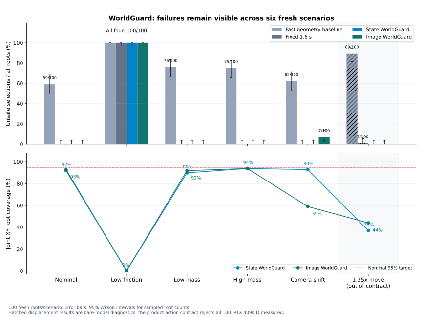
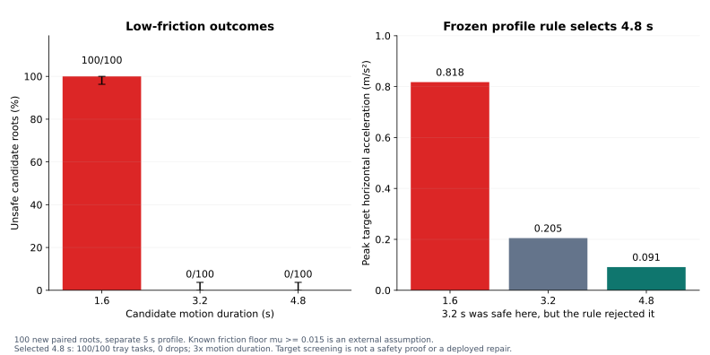

# Research showcase

This page is the short route from the product README to reproducible research
artifacts. Each row keeps the evaluated profile separate from the product-core
executor and from physical robot claims.

## Current evidence map

| Study | Evidence | What it establishes | What it does not establish |
|---|---|---|---|
| Numeric final-action mechanism | [RESULTS.md](../RESULTS.md), shipped `sample_run/` | post-transform recheck, one-use authority, revocation and independent evidence verification | physical robot behavior |
| Fixed MuJoCo contact profile | [design and protocol](physics_ssh_design.md), [validation](product_validation.md) | actual simulator contact dynamics, paired branches, SSH source/evidence binding | an arm model, learned WorldGuard, or hardware control |
| GPU WorldGuard W0/W1/W2 | [training report](gpu_training_results.md), [model cards](gpu_model_cards.md) | recorded offline numerical, visual, contact and real-recording comparisons | general safety or live VLA-to-driver integration |
| W2 new-distribution audit | [scenario report](worldguard_scenario_results.md), [run manifest](../docs/research/2026-10-02/worldguard-scenarios/manifest.json) | 600 new roots across nominal, hidden-physics, displacement and camera shifts | robustness to arbitrary environments or real cameras |
| Low-friction fallback | [study report](low_friction_fallback.md), [run manifest](../docs/research/2026-10-02/low-friction-fallback/manifest.json) | a separate 5 s known-profile action family supplies stable 4.8 s candidates in 100 constructed roots | a repair of the original neural profile or a deployed unknown-friction response |
| SmolVLA fine-tune | [reproduction guide](../experiments/gpu/README.md), [verified release](https://github.com/LancerLSY/sentinel-evc-lab/releases/tag/gpu-experiments-20261002) | actual checkpoint fine-tuning and held-out recorded-data evaluation | a deployed model on Hugging Face or an actuated robot run |
| UR5e arm study | [v3 manifest](research/2026-10-02/ur5e/v3/manifest.json), [higher-resolution review](research/2026-10-02/ur5e/v3/review/reviewed_metrics.json) | MuJoCo Menagerie UR5e same-root comparison, separate high-resolution replay and bound trajectory media | product-core or physical-device integration |

## Research figures

  

  

  

Figure inputs and image digests are recorded in the public
[figure manifest](research/2026-10-02/figure_manifest.json).

## UR5e same-root comparison

  

The current run covers six scenario classes × 30 roots = 180 roots. A separately
implemented reviewer uses 0.005 rad static sampling and 1 ms MuJoCo steps without
importing the gate runner; it labels 139 roots unsafe and 41 safe.

| Policy | Allowed | False allows / unsafe | False rejects / safe | Mean wall time |
|---|---:|---:|---:|---:|
| Parent only | 166/180 | 125/139 | 0/41 | 101.15 ms |
| Full final-plan validation | 41/180 | 0/139 | 0/41 | 48.74 ms |
| Incremental + fallback | 41/180 | 0/139 | 0/41 | 147.65 ms total |
| Conservative reject-transforms | 30/180 | 0/139 | 11/41 | 0 ms; no validation calls |

Static-prefix reuse was authorized for 106 roots; 74 used full fallback. The incremental
stage averaged 46.50 ms, plus 101.15 ms of parent validation. Reuse roots averaged
156.73 ms total; fallback roots averaged 134.64 ms. These are observed costs from one
fixed-order matrix with early static exits, not an algorithm benchmark or a new holdout.

Only the static prefix can be reused. Dynamic validation always replays from frame zero.
The in-process record binds prefix, model, asset tree, time step, initial integration
state and context; invalid binding forces full fallback. It is not a complete externally
signed v4 certificate.

The displayed GIF is outcome-conditioned: after review, it selects the first unsafe
`late_suffix` case, root 10000. It uses the stored higher-resolution joint trajectory,
which collides after parent-only allows the plan and full validation rejects it. This is
an explanatory example, not an independently sampled rate estimate.

[PNG poster](media/ur5e-validation.png) ·
[Seven-case 720p montage](https://github.com/LancerLSY/sentinel-evc-lab/releases/download/simulation-research-20261002/ur5e-validation-montage.mp4) ·
[Media manifest](research/2026-10-02/ur5e/media_manifest.json) ·
[Release pack](https://github.com/LancerLSY/sentinel-evc-lab/releases/tag/simulation-research-20261002)

| Media | Format | SHA256 |
|---|---|---|
| GitHub loop | 640×360 GIF, 21 encoded frames / 2.9 s | `b0fd885ffec3996e834a2cf4f05f85c1f78279bafc32971b013ed4bc758853f9` |
| Poster | 1280×720 PNG, `late_suffix / root 10000` | `6089b1038fd40288a0ce705cfc7b403e731bdeea9619a7345697c4510d822958` |
| Seven-case montage | 1280×720 H.264 MP4, 20 fps, 33.75 s | `05498141908a113a8df9a5f67b620263da42b5dc2d418eb01ccb68a4cbc735e3` |

The GIF represents a 29-frame logical sequence; encoding stores 21 frames. The montage
contains 287 stored joint-state frames shown at 1× (14.35 s). Its remaining duration is
made of explicitly labeled titles and final-state holds. The seven outcome-conditioned
segments cover all six scenario classes plus a safe narrow-passage root. Rendering does
not rerun physics or recompute gates.

The release's portable UR5e model was separately loaded as a six-joint/six-actuator
model. It contains 27 files, including 26 official Menagerie assets whose Git origins
were checked. See the [media and portable-model manifest](research/2026-10-02/ur5e/media_manifest.json).

The [original v2 manifest](research/2026-10-02/ur5e/manifest.json),
[per-root record](research/2026-10-02/ur5e/per_root.json), and
[review](research/2026-10-02/ur5e/original_review.json) remain available for provenance.
They are not pooled with v3 and their older cost values are not the headline result.
The earlier [media-v3 manifest](research/2026-10-02/ur5e/media-v3-manifest.json) is
retained separately. Official model-file origins are recorded in the
[upstream verification receipt](research/2026-10-02/ur5e/upstream_verification.json).

## Hardware statement

**RTX 5090 is a target configuration. RTX 4090 D is the measured configuration for
the current GPU report.** Existing latency values belong only to the RTX 4090 D run.

## Artifact access

- [Current verified GPU experiment release](https://github.com/LancerLSY/sentinel-evc-lab/releases/tag/gpu-experiments-20261002)
- [Simulation source, data, results and UR5e media release](https://github.com/LancerLSY/sentinel-evc-lab/releases/tag/simulation-research-20261002)
- [Source archive](https://github.com/LancerLSY/sentinel-evc-lab/releases/download/simulation-research-20261002/source.zip)
- [Simulation data and results](https://github.com/LancerLSY/sentinel-evc-lab/releases/download/simulation-research-20261002/simulation-data-results.tar.gz)
- [Portable UR5e demonstration pack](https://github.com/LancerLSY/sentinel-evc-lab/releases/download/simulation-research-20261002/ur5e-demonstration.tar.gz)
- [SO100 PickPlace data pack](https://github.com/LancerLSY/sentinel-evc-lab/releases/download/simulation-research-20261002/svla-so100-pickplace-data.tar.gz)
- [Release artifact index](gpu/2026-10-02/release_artifact_index.json)
- [Archive verification](gpu/2026-10-02/release_archive_verification.json)
- [Maintainer's Hugging Face account](https://huggingface.co/LancerLSY)
- [Evaluated SmolVLA overlay model card](huggingface/smolvla_model_card.md)
- [Bitwise-equal loading verification](huggingface/smolvla_loading_verification.json)

The account link is informational. It does not assert that a Sentinel EVC model has
been published there. Model publication requires the evaluated artifact, a complete
model card, and verified write credentials.
