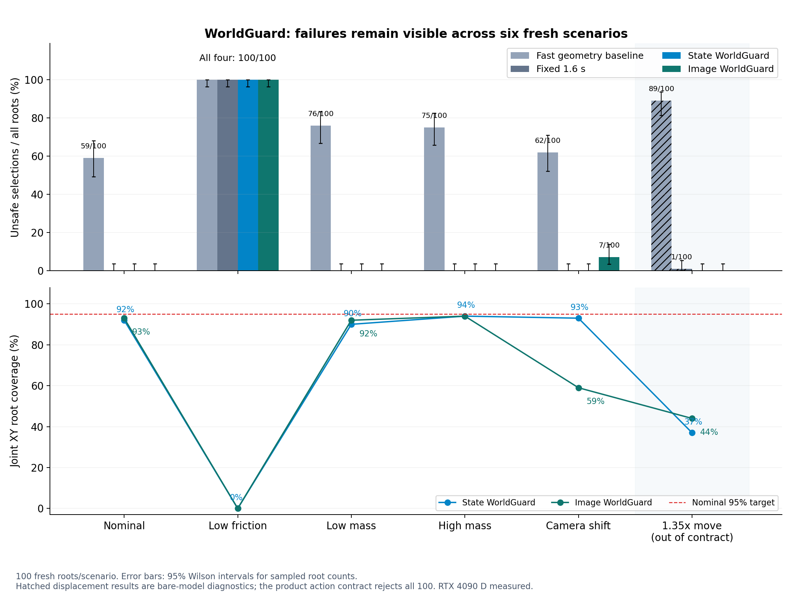

# Frozen WorldGuard scenario evaluation (2026-10-02)

This run evaluates the already trained W2 state and image ensembles on 600 new
MuJoCo roots.  Every scenario has 100 roots and four sibling actions with
durations 0.6, 0.9, 1.2, and 1.6 s.
Each sibling starts from the same complete `mjSTATE_INTEGRATION` state.  Labels
cover the original 40 x 50 ms forecast plus a separately reported 0.5 s hold.

The learned models and the original alpha=0.05 dev scales and calibration
quantiles are frozen.  Friction, payload mass, and initial perturbation generate
the labels but are not model inputs.  Image histories use MuJoCo RGB output in
RGB channel order, then NCHW ImageNet1K_V1 preprocessing and the original
train-only PCA.

## Provenance timing erratum

The original `protocol.json` says `frozen_at_utc=2026-10-02T00:00:00Z`.  That
timestamp is invalid: it is later than the observed remote filesystem sequence
and did not come from a trusted timestamp or preregistration service.  The true
historical freeze time and formal-run start/end times cannot be recovered and
are recorded as `unknown`.

Remote filesystem metadata is consistent with protocol staging, disjoint
preflight, and then the formal run.  It supports that ordering only.  There was
no external preregistration, immutable precommitment, or trusted time attestation.
The original protocol, manifest, metrics, predictions, labels, and metadata
remain byte-for-byte unchanged.  Their hashes, observed invocation, verified
import-source hashes, file stats, and the limits of this evidence are recorded
in `runs/worldguard-scenarios-20261002/provenance_supplemental_erratum.json`.

## Selection results

Each cell is `unsafe selected / selected (rejected)`.  Rejections are not
counted as successes.  "Geometry 0.6" is the upstream geometry-only fastest
baseline; it does not inspect payload dynamics.

| Scenario (100 roots each) | Geometry 0.6 | Fixed 1.6 | State WorldGuard | Image WorldGuard |
| --- | ---: | ---: | ---: | ---: |
| Nominal new roots | 59 / 100 (0) | 0 / 100 (0) | 0 / 100 (0) | 0 / 100 (0) |
| Low friction, 0.015--0.05 | 100 / 100 (0) | 100 / 100 (0) | 100 / 100 (0) | 100 / 100 (0) |
| Low mass, 0.020--0.035 kg | 76 / 100 (0) | 0 / 100 (0) | 0 / 100 (0) | 0 / 100 (0) |
| High mass, 0.170--0.200 kg | 75 / 100 (0) | 0 / 100 (0) | 0 / 100 (0) | 0 / 100 (0) |
| 1.35x displacement stress | 89 / 100 (0) | 1 / 100 (0) | 0 / 98 (2) | 0 / 98 (2) |
| Shifted camera, new roots | 62 / 100 (0) | 0 / 100 (0) | 0 / 100 (0) | 7 / 100 (0) |

The low-friction set contains no safe candidate at any of the four durations.
Both learned gates nevertheless select one candidate for every root.  This is a
failure to detect a hidden physical-parameter shift, rather than a candidate
ranking problem.  The empirical root-bootstrap 95% interval for each learned
gate's all-root unsafe rate is [100%, 100%].  The two-sided Wilson 95% interval
for 100/100 is [96.30%, 100%], which makes the finite-sample uncertainty visible.

The shifted-camera image gate has 7/100 unsafe selections, with an empirical
root-bootstrap 95% interval of [3%, 12%], and no rejection.  Its Wilson 95%
interval is [3.43%, 13.75%].  The camera-independent state gate has 0/100 unsafe
selections on the same new roots; the corresponding Wilson interval is
[0%, 3.70%].  This new test is separate from the earlier 500-root shifted-camera
stress and its engineering recalibration control; no new recalibration was fit
here.

The 1.35x displacement is outside the trained action-family contract.  Its raw
model outputs are retained only as a degradation diagnostic.  Full-state joint
coverage falls to 15% for the state ensemble and 8% for the image ensemble.
The declared product-contract result is therefore `MODEL_UNKNOWN`: reject all
100 roots.  The raw learned selections in the table must not be treated as an
authorized success result.

## Prediction and coverage results

| Scenario | State MAE 15D | Image MAE 15D | State full / XY coverage | Image full / XY coverage |
| --- | ---: | ---: | ---: | ---: |
| Nominal | 0.0302 | 0.0317 | 92% / 92% | 92% / 93% |
| Low friction | 0.1944 | 0.1985 | 0% / 0% | 0% / 0% |
| Low mass | 0.0350 | 0.0372 | 94% / 90% | 94% / 92% |
| High mass | 0.0311 | 0.0323 | 96% / 94% | 96% / 94% |
| 1.35x displacement stress | 0.0807 | 0.0842 | 15% / 37% | 8% / 44% |
| Shifted camera | 0.0270 | 0.0527 | 94% / 93% | 92% / 59% |

All point estimates, root-bootstrap percentile intervals, duration counts,
post-hold outcomes, candidate bounds, predictions, labels, root metadata, and
artifact hashes are in `runs/worldguard-scenarios-20261002/`.  The formal run
used an actual NVIDIA GeForce RTX 4090 D and completed in 30.53 s with six
physics workers and four Torch/OMP/MKL threads.

These are offline MuJoCo results for the stated constructed scenario families.
They are not functional safety certification, physical stopping evidence, or
evidence of real-robot object understanding.  Zero observed unsafe selections
only means that this run did not observe one in the stated 100-root scenario;
0/100 has a Wilson 95% upper bound of 3.70% and is not an all-scenario guarantee.

## Saved-metrics comparison

[Protocol and provenance erratum](research/2026-10-02/worldguard-scenarios/provenance_supplemental_erratum.json) · [Independent review](research/2026-10-02/independent_review.json) · [Figure hashes](research/2026-10-02/figure_manifest.json)
