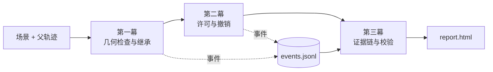

> 来源转录 / 非新增规范。源文件：《临界哨兵 Sentinel-EVC 开源 Demo 实施方案（开工版）.docx》。
> 源文件原始字节 SHA-256：`9b9e3d46f56b824c5a55e38838a3f1e57444138a2cbc7b973725f0b1a34a3ef7`。
> 本文按 DOCX 正文顺序转录标题、段落、列表、表格与代码/公式，仅转换排版；原文节号缺少“二”、目标状态“已实现”和示例成绩均照录，不代表本仓库当前实现或实测。原文中的协作分工、外部操作建议不是本次执行授权。维护者后续确认的工程补充单列于 [spec-open-questions.md](spec-open-questions.md)。本机来源路径仅保存在本地交接记录。

# 临界哨兵 Sentinel-EVC 开源 Demo 实施方案

Sep 18, 2026 · @Someone

## 一、结论先行：马上要做的到底是什么

做一个能在普通笔记本上五分钟跑完的「执行门禁 + 增量重验 + 可独立校验证据」参考实现，不碰真机、不碰 VLA、不碰 GPU。

仓库名建议 sentinel-evc-lab。产品定位句：

> 给机器人策略的动作块加一道最终提交前的门禁 —— 验证的是真正要被执行的那个动作，许可有期限、只能用一次、可以撤销，整个过程留下第三方能独立校验的记录。

### 为什么是这个，不是别的

技术文档 v4 描述的是一个很大的系统（五进程、WorldGuard、真机试点）。首个开源 demo 不该是那个系统的缩小版，而该是那个系统里唯一一条现在就能被完整证明、且不需要任何硬件的主张：

> 上游对动作做过变换之后，变换前的验证结论就不再成立；而现在的部署链里，没有人在最终提交点重新检查这件事。

这条主张有三个好处：

1. 可证伪。 用构造的几何场景就能跑出反例：两条分别验证通过的绕障轨迹，混合之后穿过障碍。这不是效果图，是可复现的数值事实。

2. 零硬件门槛。 评委、老师、GitHub 上的陌生人，clone 下来装完依赖五分钟内能自己跑出同样结果。这是开源项目唯一真正的传播力。

3. 不需要撒谎。 全程不用说一句「我们能保证机器人安全」。要说的是「变换后旧结论失效」和「撤销后不再新增旧代次提交」，这两句你们当场就能证明。

### 首个 demo 的确切形态

两条命令跑完，产出三样东西：

| 产出 | 形态 | 用途 |
| --- | --- | --- |
| 终端对照表 | 三条判定路径的统计 | 五分钟演示的主画面 |
| report.html | 纯静态离线页，双击打开 | 路演、README 配图、给老师看 |
| bundle/ + 公钥 | 事件哈希链 + Ed25519 签名 | 现场跑 verify 通过，改一字节再跑失败 |

```bash
python -m sentinel_evc demo --cases 1000 --out runs/demo01
python -m sentinel_evc verify --bundle runs/demo01/bundle \
  --public-key runs/demo01/anchors/demo.public --run-id demo01
```

### 首版明确不做

不训练任何模型、不接 openpi / LIBERO、不装 MuJoCo、不碰 ROS2、不做 WorldGuard、不做前后端分离管理台、不接真机。这些全部推到 v0.2 之后，而且真实 VLA 那一步要先降级成「影子模式」（见第二节）。

## 三、产品定义：定位、用户、边界

### 用户画像（只服务一类人）

首批用户是做机器人策略部署和版本回归的工程师与实验室。他们手上有一个跑得起来的策略（openpi、LeRobot、自研皆可），有仿真或工位，正在被这类问题困扰：

- 上一版能跑的任务这一版跑不通了，但说不清是模型退化还是执行链变了。

- 出了一次异常，日志有一堆，但拼不出「当时批准的到底是哪个动作、依据是什么」。

- 想在提交前加个检查，但不知道该检查哪一层、检查完凭什么允许发送。

他们不需要再来一个「风险红灯」，他们需要能回答四个问题：动作从哪里来、最终被改成什么、当时为什么允许提交、失败怎么复现。

### 能力状态表（放在 README 最上方）

这张表是整个项目最重要的诚信装置。星标、路演、论文都可能出问题，但只要这张表一直是真的，项目就不会翻车。

| 能力 | v0.1 状态 | 明确不承诺 |
| --- | --- | --- |
| 动作合同与哈希 | 已实现，数值域 | 不覆盖真实机械臂逆运动学 |
| 几何完整检查 | 已实现：静态球障碍 + 盒工作空间 + 球形工具 | 不覆盖连杆、夹爪、载荷、动态障碍 |
| Δ-Cert 增量继承 | 已实现，L=1 约束族 | 不覆盖速度、加速度、夹持、接触 |
| 一次性执行许可 | 已实现，本地 HMAC | 不是 PKI，不是功能安全 |
| 撤销屏障 | 已实现，模拟控制器 | 不是电机制动证明 |
| 证据哈希链与签名 | 已实现，Ed25519 | 只证明记录完整性，不证明传感器诚实 |
| 真实 VLA 接入 | 未开始 | v0.2 目标是影子模式，不是闭环干预 |
| WorldGuard | 仅保留接口 | 无训练、无实验、无结论 |
| 真机 | 未开始，不在本轮范围 | —— |

### 三句必须常说的话

1. 「许可」「证书」「验证」在本项目里都有具体适用范围，不是功能安全认证、不是物理停止证明、不是事故责任判断。

2. 数值实验里的 dt=50 ms、K≤4、tracking reserve 都是这个数值 profile 的配置，不是任何机器人的安全速度或人体保护距离。

3. 「零次观测到失效」只说明这组测试没发现这类问题，不等于任意场景零事故。

把这三句写进 README、写进演示口播、写进答辩 PPT 的备注页。评委和同行会因为你们主动划边界而更信任数据，而不是相反。

## 四、Demo 内容规格：三幕，一条命令跑完

三幕共用一条事件流、一个 run_id、一个签名包。不是三个互相独立的脚本 —— 这一点是 demo 说服力的来源，也是最容易做错的地方。



### 第一幕：变换让旧结论失效

输入

- 场景：球障碍 {center:[x,y,z], radius}、工作空间盒 {lo:[..], hi:[..]}、工具半径 r_tool、跟踪预留 reserve

- 两条父轨迹 P1 / P2：各 H+1 个三维节点，同起点同终点，从障碍两侧绕过，dt=0.05

- 随机种子

处理

1. 对 P1、P2 做整段几何完整检查（每段线段到球心的精确最近点距离，不是只查端点）→ 两张 Certificate，各自保存每段余量 ρ(i,k)

2. 构造两类子轨迹：C_mix = 0.5·P1 + 0.5·P2（异侧混合，实际穿障）和 C_near = P1 + 小扰动（同侧，实际安全）

3. 三条判定路径各跑一遍：

    - 路径 a（对照组）：只看父轨迹已验证 → 直接放行

    - 路径 b（基线）：对最终轨迹做完整检查

    - 路径 c（本项目）：先试 Δ-Cert 继承，界不够则完整检查

输出

每条子轨迹一行记录：verdict ∈ {FULL, INHERITED, REJECTED}、每段剩余余量、首个违规段索引、本次完整检查调用次数、继承深度、父证书 ID。

观众看到的效果（这是演示的第一个高光）

| 判定路径 | 放行的违规轨迹 | 误拒的安全轨迹 | 完整检查调用数 |
| --- | --- | --- | --- |
| a 只验父轨迹 | 500 / 500 | 0 | 0 |
| b 最终全检 | 0 / 500 | 0 | 1000 |
| c Δ-Cert + 必要全检 | 0 / 500 | 0 | 显著少于 b |

路径 a 的那一列就是整个项目要解决的问题。同时 C_near 全部通过，用来堵住「你们不就是把所有变化都拒了吗」这个最常见的质疑。

### 第二幕：撤销不让已发生的动作消失

输入

- 一张 Lease：{lease_id, final_hash, context{robot,boot,epoch,scene_id,queue_rev,committed_prefix_hash}, cert_id, prefix_len=4, deadline_mono, hmac}

- 模拟控制器：队列容量 2 步，ACK 延迟可配，可注入 ACK 丢失

- 七类故障脚本：迟到动作、票据过期、许可重放、scene 变更、queue_rev 变更、撤销竞态、cancel 未确认

处理

Prepare（不发送）→ Commit（复核最新状态、boot/epoch、queue_rev、deadline，消费一次性许可）→ 逐步 dispatch，每步再核对 → 注入故障 → revoke → 观察后续。

输出

三个独立游标 submitted / accepted / observed，每次拒绝的错误码（STATE_STALE、CONTEXT_CHANGED、LEASE_REPLAY、TRACKING_TUBE、CANCEL_UNCONFIRMED 各不相同，不能统一返回 None），撤销前后的提交计数。

观众看到的效果（这是演示最有说服力的地方）

撤销之后：

- 旧代次新增本地提交 = 0

- 但撤销前已提交的那 1 步，仍然在 observed 里出现

第二条一定要讲出来，别藏。它说明你们分得清「软件队列清空」「控制器确认取消」「实际运动停止」是三件事 —— 这恰恰是懂行的人判断一个团队是否真懂这个问题的分水岭。

### 第三幕：证据能被第三方独立校验

输入：前两幕产生的完整事件流。

处理：事件加序号与前项摘要 → 哈希链 → manifest（事件数、tip hash、各文件摘要）→ Ed25519 签名 → 公钥单独落盘。

输出：bundle/（events.jsonl、manifest.json、manifest.sig）、anchors/demo.public、verify 命令的退出码。

观众看到的效果：原包 verify → PASS。然后现场做四次篡改，各自给出不同的失败原因：

| 篡改方式 | 期望失败点 |
| --- | --- |
| 改事件里 1 个字节 | 哈希链在第 k 条断裂 |
| 删掉最后 3 行 | 事件数与 tip hash 不符 |
| 换一把公钥 | 签名验证失败 |
| 改 run_id | 运行标识不匹配 |

四种失败给四种不同报错，比「四次都失败」有说服力得多。

### 增强幕（不做，但留接口）

WorldGuard 那一幕（模型参与候选选择）首版不做。worldguard/ 目录下只放接口定义和一份 README_WHY_EMPTY.md 说明为什么是空的、启用条件是什么。空目录配诚实说明，比塞一个没验证过的模型强。

## 五、仓库结构与模块清单

```text
sentinel-evc-lab/
├── README.md              # 英文；README.zh-CN.md 中文
├── LICENSE                # 权属确认后再放，先叫 LICENSE.proposed
├── pyproject.toml         # 纯 Python，依赖只要 numpy + cryptography
├── src/sentinel_evc/
│   ├── contracts.py       # A · 不可变对象 + 规范化哈希
│   ├── geometry.py        # A · 线段-球精确距离、盒边界、完整检查
│   ├── delta_cert.py      # A · 余量账本、继承判定、依赖失效
│   ├── authority.py       # A · Lease 签发、HMAC、一次性消费
│   ├── executor.py        # A · 单写者、逐步 dispatch、撤销屏障
│   ├── sim_controller.py  # A · 有容量的模拟控制器 + ACK
│   ├── events.py          # B · 事件定义、有界队列、JSONL 写出
│   ├── evidence.py        # B · 哈希链、manifest、Ed25519 签名与校验
│   ├── report.py          # B · 生成静态 report.html（含内联 SVG）
│   ├── scenarios.py       # B · 场景与轨迹构造、批量实验
│   └── cli.py             # B · demo / geometry / fault / verify
├── schemas/               # 冻结的 JSON Schema，第 1 周产出
├── tests/                 # 单元 + 协议 + 故障 + 独立对照
├── sample_run/            # 随包的一次真实运行结果
├── docs/                  # 本方案、边界说明、资料来源
├── worldguard/            # 只有接口和 README_WHY_EMPTY.md
└── .github/               # CI、Issue/PR 模板
```

### 依赖纪律

运行时依赖只允许两个：numpy、cryptography。测试可加 pytest。不引入 torch、不引入 scipy、不引入任何 web 框架。 理由很实际：陌生人 pip install 一次成功的概率，直接决定这个仓库有没有人用。

report.html 用 Python 字符串模板 + 内联 SVG 生成，不要 React、不要 CDN、不要构建步骤。生成出来的文件双击就能看，断网也能看。

### 关键设计约束

| 约束 | 为什么 |
| --- | --- |
| 所有对象是 frozen dataclass | 证书引用的动作不能被事后改写 |
| 哈希用规范化 JSON 序列化（排序键、固定浮点格式） | 跨机器复现的前提 |
| Authority 的 HMAC 密钥与 Evidence 的 Ed25519 密钥分开 | 两者用途不同，共用密钥是设计错误 |
| 只有 Executor 能调 controller.submit | 单写者不变量，用测试强制 |
| 单调时钟判断到期，UTC 只做审计标签 | 不同主机 monotonic 起点不同 |
| 事件队列有上限，满了显式丢弃并记 LOG_GAP | 不无限堆内存，缺口要可见 |

## 六、核心机制实现要点

### 6.1 几何完整检查（geometry.py）

对每一段线段 p_k → p_{k+1} 和静态球障碍 (c, R)，求线段上到球心的最近点参数：

```text
d = p_{k+1} - p_k
t* = clip(dot(c - p_k, d) / dot(d, d), 0, 1)
dist_k = ||p_k + t*·d - c||
margin_k = dist_k - R - r_tool - reserve
```

工作空间盒对线段取两端点的最坏值即可（轴向约束在线段上是线性的，端点取极值）。

必须整段算，不能只查端点。 两个端点都在障碍外、中间穿过球心，是最典型的漏检，也是这类系统最常见的实现 bug。写一个专门的单元测试锁死它。

### 6.2 Δ-Cert 继承（delta_cert.py）

父证书为每段每项约束保存剩余余量 ρ(i,k)。子轨迹在同一时间网格下，第 k 段的偏差界：

```text
e_k = max(‖p'_k − p_k‖, ‖p'_{k+1} − p_{k+1}‖)
ρ_child(i,k) = ρ_parent(i,k) − L(i) · e_k
```

本项目的约束族（点到固定球的欧氏距离、轴向盒边界）都满足 L=1，所以账本可以压成每段一个最小余量，转移检查从 O(H·M) 降到 O(H)。

两个最容易写错的地方：

1. 余量要从父的剩余量扣，不是每次回到最初值。 余量 30 mm，第一次变化耗 8 mm → 剩 22；第二次耗 5 mm → 剩 17，不是 30−5=25。链式继承时这个错误会一路累积成错误放行。

2. 继承失败的结论是「无法证明，去做完整检查」，不是「一定会碰撞」。 返回 REJECTED 之前必须真的跑完整检查。

依赖失效规则（任一成立就不能继承）：时间网格变了、夹爪事件变了、scene_id 变了、controller profile 变了、任务阶段变了、超过最大继承深度。

### 6.3 Lease 签发与消费（authority.py）

```python
lease = authority.prepare(
    final_plan_hash, context, cert_id,
    prefix_len=4, ttl_ms=500, snapshot=snap)
# prepare 不发送任何东西
executor.commit(lease, state_store.snapshot())  # 复核 + 一次性消费
```

Commit 时必须在同一临界区内复核：boot、epoch、scene_id、queue_rev、committed_prefix_hash、观测年龄、起点偏差是否仍在允许管内、deadline 是否还够跑完 prefix。

不变量（每条一个测试）：

- 同一个 lease_id 第二次 commit 必须失败（LEASE_REPLAY）

- 上游传来的 safe=true 或自选的 cert_id 一律不采信，只认本地 CertificateStore 里的记录

- 新快照可以替换旧快照，但必须仍在允许管内；obs_id 相同但状态已出管，照样拒绝

### 6.4 撤销屏障（executor.py）

```python
def revoke(self, reason):
    with self._lock:              # 与本地 dispatch 同一线性化边界
        self._epoch += 1          # 旧代次立刻失效
        self._pending.clear()     # 清本地待发
        self._state = FAULT
    self._controller.cancel()     # 锁外发，等 ACK 不占锁
```

revoke 拿锁只做三件事然后立刻放开 —— 网络等待绝不能占着撤销锁。cancel 的 ACK 到达之前状态一直是 FAULT，ACK 没来就不允许恢复（CANCEL_UNCONFIRMED）。

恢复必须同时满足三件事：cancel 完成记录、新快照有效、人工批准。少一样都不恢复。

### 6.5 证据哈希链（evidence.py）

```text
event[i].prev_hash = sha256(canonical_json(event[i-1]))
manifest = {run_id, event_count, tip_hash, files:{name: sha256}}
signature = Ed25519.sign(canonical_json(manifest))
```

校验器是独立函数，只接受 bundle 路径 + 公钥 + run_id 三个参数，不 import 产生数据的任何模块。这一点很重要：如果校验器复用了写入方的代码，那它证明不了什么。

规范化 JSON 自己实现即可（sort_keys=True + 固定浮点格式 + UTF-8 无 BOM），但不要在 README 里写「实现了 RFC 8785」 —— 除非真的按标准逐条对过。

## 七、数据契约：A 和 B 的解耦点

第 1 周末必须冻结这两个 schema，冻结之后改动要两人同意。 冻结之后 B 就不再依赖 A 的代码进度 —— 这是本方案里对排期影响最大的一条安排。

### 事件 schema（schemas/event.schema.json）

```json
{
  "seq": 42,
  "ts_mono_ns": 123456789,
  "ts_utc": "2026-09-18T10:00:00.123Z",
  "run_id": "demo01",
  "type": "COMMIT",
  "plan_hash": "sha256:ab12...",
  "lease_id": "lease-0007",
  "cert_id": "cert-0003",
  "payload": { "...": "因 type 而异" },
  "prev_hash": "sha256:cd34..."
}
```

事件类型固定 13 种，首版就全部定义，不要后加：PROPOSAL、TRANSFORM、CERTIFICATE、PREPARE、COMMIT、DISPATCH、CONTROLLER_ACK、OBSERVED、REVOKE、CANCEL_ACK、BACKUP、OUTCOME、LOG_GAP。

### 场景 schema（schemas/scenario.schema.json）

```json
{
  "scene_id": "scene-001",
  "obstacles": [{"type": "sphere", "center": [0.4, 0.0, 0.3], "radius": 0.05}],
  "workspace": {"lo": [0.0, -0.4, 0.0], "hi": [0.8, 0.4, 0.6]},
  "tool_radius": 0.02,
  "tracking_reserve": 0.005,
  "dt": 0.05,
  "horizon": 16,
  "seed": 1234
}
```

### 判定结果 schema（schemas/verdict.schema.json）

```json
{
  "plan_hash": "sha256:...",
  "parent_cert_id": "cert-0003",
  "verdict": "INHERITED",
  "path": "delta",
  "margins": [0.017, 0.021, 0.009],
  "first_violation_segment": null,
  "full_checks_used": 0,
  "inherit_depth": 2,
  "reason_code": null
}
```

### 解耦怎么落地

第 1 周第 4 天，A 手写一个 sample_events.jsonl（20 条左右，覆盖全部 13 种类型，包括一次 REVOKE 和一次 LOG_GAP），提交到 tests/fixtures/。

从这一刻起：

- B 拿这个假文件开发 evidence.py、report.py、cli.py 和全部页面，一行都不用等 A

- A 拿这个假文件当作自己 events.py 输出的目标格式，写完直接对拍

- 两边最后一次联调，只需要确认真事件和假事件走同一个 schema 校验

这个技巧能把前四周的有效并行度从大约 1.2 人提到接近 2 人。如果只做一件事来改善排期，就做这件。

## 八、三人分工

分工按能力分，不按职位分。负责人不等于只写文档。

| 角色 | 适合什么人 | 主责模块 | 判定「做完了」的标准 |
| --- | --- | --- | --- |
| A 执行核 | 擅长 Python 后端、状态机、并发、测试 | contracts、geometry、delta_cert、authority、executor、sim_controller | 七类故障注入全部跑通，撤销后旧代次新增提交为 0 |
| B 证据与呈现 | 擅长数据处理、可视化、工程化、写文档 | events、evidence、report、scenarios、cli、CI | 陌生人按 README 装完，两条命令跑出 report.html 和 verify PASS |
| C 兼职（4–6 h/周） | 时间碎片、能独立复现 | README 中英文、独立安装验证、Issue/PR 模板、录屏、任务板、许可与个人信息清查 | 每次交付一份可单独提交的东西 |

### C 的任务必须满足三个条件

有别的事要忙的那位，任务要按这三条设计，否则他一缺席就卡住关键路径：

1. 每次 1–2 小时能做完，不需要连续投入

2. 不在任何人的依赖链上 —— A 和 B 不能因为等 C 而停下

3. A 或 B 能用模板顶上

C 的最高价值任务其实不是写文档，是在一台干净机器上按 README 装一遍。这个动作每周做一次，能发现 A 和 B 永远发现不了的问题（隐式依赖、路径写死、Python 版本假设、README 漏了一步）。这是开源项目成败最实际的一关。

C 还要做一件必须有人做的事：清查公开仓库里不该有的东西 —— 学号、电话、个人邮箱、未脱敏的商业计划书、私钥、客户数据。BP 里这些信息都有，一旦推上 GitHub 就撤不回来了（Git 历史会留痕）。

### 协作规则

- 第 1 周末冻结 schema，之后改 schema 要两人同意

- 每人同时进行的主任务不超过 2 个

- 所有涉及许可、撤销、时钟语义的改动，至少由另一位主力 review

- 每周演示一次完整运行，不接受「我这个模块写完了」作为进度汇报

- PR 必须附：测试、输入输出样例、已知限制

最后一条容易被忽略但很致命：两个人的项目最常见的死法不是写不出代码，是两周后发现各自对「动作变换」「上下文」的理解根本不一样。每周跑一次完整链路是唯一能早期暴露这件事的办法。

### 如果两位主力都没有控制经验

那就老实停在仿真。真机需要额外的专业支持（驱动能力表、取消行为实测、现场保护）。这不是能力问题，是资质和风险问题 —— 在答辩里主动说明这一点，比含糊带过要好。

## 九、排期：十天冲刺 + 两级目标

| 天 | A | B | C |
| --- | --- | --- | --- |
| 1 | 建仓库骨架、pyproject、写 contracts.py | 建 CI、写 events.py 骨架 | 盘点三份文档，列出能公开/不能公开的内容 |
| 2 | geometry.py + 端点漏检的单元测试 | 事件 schema 初稿 | 起草 README 骨架 |
| 3 | 交付 sample_events.jsonl（20 条） | 拿到假事件，开始 evidence.py | 干净机器装一遍，记录每一步 |
| 4 | delta_cert.py 余量账本 | 哈希链 + Ed25519 签名与校验 | 提第一批 Issue |
| 5 | authority.py Lease 签发与消费 | report.html 用假事件先做出来 | 录 30 秒草稿演示 |
| 6 | executor.py 单写者 + dispatch | scenarios.py 场景与轨迹构造 | Issue/PR 模板 |
| 7 | sim_controller + 撤销屏障 | cli.py 四个子命令 | 第二次干净安装 |
| 8 | 七类故障注入全部跑通 | 批量跑 1000 案例，出统计表 | 中英 README 定稿 |
| 9 | 联调：真事件替换假事件 | 联调 + 补测试 | 整理限制说明 |
| 10 | 冻结 v0.1，打 tag | 生成 sample_run/，录五分钟演示 | 最后一次清查个人信息 |

| 目标 | 内容 | 风险 | 达不成的后果 |
| --- | --- | --- | --- |
| 必达（第 1–4 周） | v0.1：数值机制 demo 完整、可复现、可独立校验，发布到 GitHub | 低 | —— |
| 争取（第 5–12 周） | v0.2：一个真实 VLA 检查点的只读影子接入 | 中 | 保持 v0.1，说明上游环境受阻，不算失败 |
| 不做 | WorldGuard 训练、MuJoCo 全身几何、闭环干预、真机 | —— | —— |

### v0.2 影子模式的具体步骤

1. 环境摸底（第 5 周，设硬时限）：能不能在你们的机器上把 openpi 的 LIBERO 示例按官方文档跑起来。给这件事最多两周，两周装不上就放弃这条线，不要无记录地耗一个月 —— 这是这类项目最常见的死法。

2. 资产冻结：记录 commit、检查点摘要、预处理、控制器配置到 upstream_manifest.json

3. 原生复现：10 个固定初态跑一遍，存下来当基线

4. 双钩子：infer() 之后记原始动作块；最终出队、env.step 之前记实际提交动作。不改任何数值

5. 离线判定：拿记录下来的最终动作跑你们的检查器，报告「如果当时开了门禁，会拒绝几次、为什么」

第 5 步的产出就是 v0.2 的全部价值：真实上游链路里，原始动作块和最终提交动作确实不是同一个东西。这一句有实测支撑，比一段闭环视频更有分量。

### 遇到压力时的砍单顺序

从下往上砍：额外任务 → 页面美化 → 动态障碍 → 复杂优化 → 第二个场景族。

绝不砍：动作语义定义、撤销测试、独立对照实验、能力状态表。

## 十、验收门禁与表述纪律

### 门禁（沿用 GPT 方案的 G0–G5，收紧到本轮范围）

| 门 | 通过条件 | 不通过时 |
| --- | --- | --- |
| G0 来源 | 每个数字能定位到哪次运行、哪个 commit、哪个输出文件 | 不发布任何性能主张 |
| G1 几何 | 独立实现的全检与主检查器在 1000 案例上零分歧 | 关闭继承，只用完整检查 |
| G2 Δ-Cert | 条件失效时正确回退；累计余量扣减正确 | 同上 |
| G3 执行 | 七类故障全部无「撤销后新增旧代次提交」；cancel 未确认不恢复 | 不发布 Runtime 相关表述 |
| G4 证据 | 原包通过；四种篡改各自以不同原因失败 | 报告不能标「完整验收证据」 |
| G5 外部复现 | 非本项目成员按 README 跑通，并能说清边界 | 保持 candidate 版本 |

G1 的「独立实现」很重要：让 B 用完全不同的方式再写一个全检（比如密集采样 + 逐点判距），拿它当 A 的检查器的对照。两个实现零分歧，才有资格说检查器是对的。同一个人用同一个思路写两遍，不叫独立对照。

### 表述纪律：什么条件下才能说哪句话

| 想说的话 | 前置条件 |
| --- | --- |
| 「减少了 X% 完整检查调用」 | 必须同时报告：父证书建立成本、失败回退成本、端到端墙钟时间。只数函数调用次数不算数 |
| 「接入了真实 VLA」 | 加载了实际检查点并跑了推理。只跑了仿真环境不算 |
| 「实现了闭环」 | 门禁真的改变了发送的动作。影子模式不算 |
| 「零违规」 | 必须跟一句「在本组 N 个构造案例、该约束族范围内」 |
| 「测试通过 N 项」 | N 只能是本轮这一个仓库的数字。历史包的 57 项、50 项、12 项、65 项不能累加 |
| 「保证安全」 | 任何条件下都不说这句 |

倒数第二条要特别注意。BP 的 §11.1.1 里已经有三组历史测试记录（57 / 50 / 12），技术文档 v4 里又是 65 项，GPT 的种子包是 51 项。这些数字来自不同代码库、不同时间，任何形式的相加或并列都会被认为是注水。新仓库就报新仓库自己的数字。

### 一个具体建议

在 README 里放一个 RESULTS.md，每个数字后面直接跟产生它的命令和输出文件路径：

```text
继承率 46.7%
  命令: python -m sentinel_evc demo --cases 1000 --seed 1234
  输出: sample_run/geometry/summary.json:L12
  环境: sample_run/ENVIRONMENT.json
```

这个格式的好处是：任何人质疑任何一个数字，你们的回应是「你自己跑一遍」，而不是一段解释。

## 十一、发布材料

### README 骨架（顺序不要改）

```markdown
# Sentinel EVC Lab
> 给机器人策略的动作块加一道最终提交前的门禁：验证的是真正要执行的
> 那个动作，许可有期限、只能用一次、可以撤销，全过程留下可独立校验的记录。

## 这是什么，不是什么        ← 能力状态表放这里，不藏在下面
## 三分钟看懂               ← 一张 Demo A 的对照图 + 三行说明
## 快速开始（CPU，5 分钟）   ← 两条命令，复制即可运行
## 三个 Demo 各证明了什么
## 结果与限制               ← 链到 RESULTS.md
## 架构
## 真实 VLA 接入状态         ← 诚实写「未开始 / 影子模式开发中」
## 如何贡献
## 许可
```

把能力状态表放在第三节而不是最后 —— 主动划边界的项目，在这个领域比吹得响的项目更容易被认真对待。

配图必须来自真实运行。 不用生成的机械臂效果图，不用别处截的仿真画面。report.html 截个图就够了。

### 五分钟演示脚本

| 时间 | 内容 | 关键动作 |
| --- | --- | --- |
| 0:00–0:30 | 问题：策略建议的动作和最终执行的动作不是同一个东西 | 一张图，两个框，中间写「变换」 |
| 0:30–2:00 | Demo A：两条都验证通过的轨迹，混合之后穿过障碍 | 现场跑命令，屏幕显示对照表 |
| 2:00–3:30 | Demo C：撤销后不再新增旧代次提交，但撤销前那一步确实执行了 | 三个游标的时间线，主动讲第二句 |
| 3:30–4:30 | Demo D：verify 通过 → 改一个字节 → verify 失败 | 当场改，当场跑 |
| 4:30–5:00 | 边界与下一步 | 念能力状态表里的「不承诺」列 |

最后 30 秒不要用来煽情。念「不承诺」那一列，评委会记住你们。

### GitHub 发布前检查清单

- ☐ 权属确认：代码作者、学校、指导教师、合作方的权利归属有书面共识

- ☐ 许可证：Apache-2.0 是否采用，由团队确认后才把 LICENSE.proposed 改成 LICENSE

- ☐ 个人信息清查：学号、电话、个人邮箱、身份证、住址（包括 Git 历史）

- ☐ 商业计划书不进公开仓库，一页都不进

- ☐ 私钥不进仓库；demo 公钥要标注「演示用，非客户 PKI」

- ☐ 依赖许可逐项登记，不用上游代码许可推断权重可再分发

- ☐ CI 推送后确认真的跑绿了，再挂 badge（不能预先挂）

- ☐ sample_run/ 里的结果和 RESULTS.md 里的数字对得上

- ☐ 仓库名和项目名核查有无冲突或已注册商标

### 给竞赛用的材料

答辩 PPT 和开源 README 用同一套数字。BP 里的财务预测、市场测算保持原样，不要为了配合 demo 改写；反过来也不要用 BP 里的规划数字去描述 demo 的能力。两份材料各自为政，但数字不打架。

## 十二、风险、降级与今天就能做的六件事

### 风险与降级

| 风险 | 早期信号 | 降级方案 |
| --- | --- | --- |
| 上游环境装不上 | 第 5 周还在调依赖 | 放弃 VLA 线，v0.1 打磨成精品 |
| 几何检查有漏检 | 独立对照出现分歧 | 关闭继承，只用完整检查，如实说明 |
| Δ-Cert 不划算 | 继承命中高但端到端更慢 | 报告负结果，保留 FULL_ONLY 模式 |
| 两位主力理解不一致 | 联调时发现字段含义对不上 | 每周跑完整链路（这是预防手段，不是补救） |
| C 长期缺席 | 连续两周没交付 | A/B 各接一半，砍掉推广类任务 |
| 学期压力 | 连续两周无 commit | 只保留 v0.1，公开说明进度 |
| 个人信息泄露 | —— | 发布前强制清查，含 Git 历史；已泄露则重建仓库 |

最后一条没有真正的补救办法，只能靠发布前拦住。

### 今天就能开始的六件事

1. 定人：谁是 A、谁是 B、谁是 C。按能力定，不按职位定。二十分钟就能定完。

2. 建私有仓库：先 private，等 v0.1 达标再转 public。今天就建。

3. A 写 contracts.py 的第一个 frozen dataclass：Plan。十行代码，但它决定了后面所有东西的形状。

4. B 建 CI：pytest + ruff，一个空测试也先跑绿。CI 早建比晚建省事十倍。

5. C 开一个表，列出三份文档里所有「不能公开」的内容（学号、电话、邮箱、财务数字、客户名）。

6. 核对那条 openpi/LeRobot 的事实：打开两个仓库，确认 RobotClientConfig 的加权规则到底在哪一边，然后改 BP。

第 3 和第 4 件事今晚各花一小时就能做完，做完之后项目就算真正开工了。

### 一句提醒

开源项目的第一版，能被陌生人五分钟跑通，比功能多十倍更有价值。
